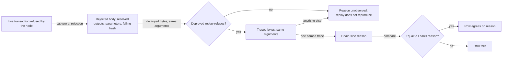

# See why the chain refused, beside the reason Lean gives

As a reader of the conformance book, I want each refusal the live chain returns
to show the reason the refusing validator actually reached, observed by running
a traced build of the same validator source on the very transaction and ledger
state the chain refused, so I can check it against the reason the Lean model
gives instead of trusting a compiled test suite.

Today the book says only *that* a script refused: the deployed validators are
built without traces, so a live phase-2 refusal carries no reason and the
same-reason claim rests on the compiled Aiken suite (book limit "Live refusal
reason not observed", issue #287).

## Stories

- **S1 — reason observed.** Given a live step the model refuses with a reason
  and the chain refuses, when the run replays the refused transaction with
  traced bytes, then the step shows the chain-side reason, both script hashes
  and the captured transaction, and agrees only if that reason equals Lean's.
- **S2 — the comparison can fail.** Given the same refused step with Lean's
  reason deliberately replaced by a different reason, the row fails and names
  both reasons; without the replacement the same row passes.
- **S3 — honest limits.** Given a refusal whose replay cannot produce an
  admitted reason, the step says so with the cause, and the book keeps a limit
  naming it; the book drops "Live refusal reason not observed" only when no such
  step remains among the rows it claims.

## Narrowed acceptance (operator rulings 2026-10-02)

Settled for the final delivery, integrated with main `13f2b2e` (#320's
validators, #344's batch questions):

- A traced chain reason is compared with Lean's for every refusal Lean models.
- CG11 (empty fold), CG19 (crossed refunds, and its rejected-floor control) and
  the CG21 two-key batch whose mint disagrees per key are compared through the
  driver's batch questions: `foldBatch` for a fold, `rejectBatch` judged on the
  refunds the transaction pays for a reject. CG09's control, a reject paying its
  owner one lovelace short, is compared as the reject batch of that one
  request.
- CG10, CG12 and CS04 have no counterpart in Lean. Each is published as an
  unmet model comparison beside its traced chain evidence or its absence:
  CG10 lambdasistemi/singular#346, CG12 lambdasistemi/singular#345, CS04
  lambdasistemi/singular#347. CG12 is never narrated as agreeing with the model.
- CG09 stays `unmet-by-ruling` (operator 2026-10-01): its reject is accepted by
  the chain (#320) and by the model, while the consumer requires it refused; its
  receipt, the book and CI keep it non-passing.
- The book's "live refusal reason not observed" limit is dropped only where
  every claimed refusal has a traced replay receipt; CS04's state and request
  scripts keep it.
- A wrong-reason control that fails stays in CI.
- Limit: the chain settles a reject's refunds by position (`refundFault`), the
  model by the sum of every output at the owner's key (`settle`). A reject paying
  its owner short in the refund's position and the rest in another output at the
  same key is refused by the chain and accepted by the model. The compared
  rejects keep every other output away from their owners' keys, so their
  agreement holds for that shape only; the conflict is escalated to the user
  (extent.md, "A conflict the compared rejects avoid").

## Requirements

| ID | Requirement |
|---|---|
| FR-01 capture | At each live phase-2 validator rejection, before the next submission, the run records the rejected transaction's bytes, every output it spends or references (inputs, reference inputs, collateral) as the node resolves them, the protocol parameters with cost models, system start and era history, the node identity, and the failing script hashes the node reported; stored content-addressed and bound to the rejected transaction id. |
| FR-02 traced build | A test-owned flake output builds the registry validators from the same `onchain` source tree, compiler and dependency pins as the deployed build, differing only by `--trace-filter user-defined --trace-level verbose`. No change to `onchain/`, its flake or lock, or any deployed script hash. |
| FR-03 toolchain correspondence | A check rebuilds the validators with that same test-owned toolchain without traces and requires every hash in `onchain/script-identity.json`; it requires the traced and untraced blueprints to name the same validators with the same parameter schemas. Failing either admits no traced replay. |
| FR-04 same parameters | The traced script receives the parameter values of the deployed application. It is admitted only when the same values applied to the untraced code reproduce exactly the failing hash the node reported. |
| FR-05 same context | The traced run evaluates the script arguments (datum, redeemer, script context) the ledger derives from the captured transaction and outputs for the failing purpose, with the deployed hash as that purpose's identity. No resubmission, rebuilt, re-signed or re-balanced transaction and no altered context. |
| FR-06 deployed reproduction | Before a traced reason is admitted, the deployed bytes on the same arguments and declared budget must fail as a validator failure. A replay that succeeds, or fails on budget, admits nothing. |
| FR-07 reason | The traced run must fail with exactly one user-defined trace; its text, verbatim, is the chain-side reason. Any other result is recorded as unobserved with its cause (FR-08). |
| FR-08 evidence classes | Four classes are kept apart: chain refusal (node, phase 2, failing hash); deployed replay reproduction; traced reason; Lean reason. None of these earns a traced reason: setup or compile failure, phase-1 rejection, budget exhaustion (deployed or traced), timeout, client exception, a traced run that succeeds, a failure with no or several user traces, a reason read from the model or typed by hand. |
| FR-09 comparison | For a step where model and chain both refuse and the model names a reason: an admitted traced reason equal to Lean's agrees; a different admitted reason fails the row, and the step's model reason, chain reason and comparison are written to the replay index before the row fails; an unobserved reason does not fail the row: the step keeps today's outcome agreement, its receipt is written with no chain-side reason, and the replay index names the cause. |
| FR-10 extent classes | Every discovered live refusal is classified against Lean and against its executing consumer (`extent.md`). Class A is mechanical, never assigned: a refusal whose step carries an executed model reason is A and must be compared. Otherwise, from the committed table: A modeled with a consumer, B modeled without one, C outside the model's vocabulary, D in conflict. Every refusal records its traced reason or its unobserved cause; attribution rows use their existing validator-branch field and keep their "no named validator branch" limit until a reason is admitted. Only A is compared with Lean; B, C and D stay in the denominator as published, unmet model comparisons, and C and D are escalated as user stories. |
| FR-11 receipt | Every refused step's `chain.refusal` and every attribution row's refusal carry one optional, additive `replay` object: `deployedHash`, `tracedHash`, the observed `reason` or the named unobserved `cause` (never both, never invented), and `captureId`; each receipt carrying a `replay` object also carries, once, the traced/deployed correspondence it relied on (source, compiler, trace flags, digest of the untraced hashes). Receipts without it still load; a receipt claiming a traced reason without a complete `replay` object is rejected by the loader. Operator ruling 2026-10-01, verbatim: "One self-contained receipt: includes both validator hashes and the observed reason; requires allowing the receipt format to grow." |
| FR-12 wrong-reason control | A CI step replaces the model reason of one live refused step with a different valid reason and requires the row to fail with a diagnostic naming both; the unaltered run of that row passes. |
| FR-13 accepting control | For each refusing script role, one accepted live step's transaction replays with both deployed and traced bytes; both must succeed, recorded in the replay index as an accepting-control entry that the CI extent check (G10) requires. |
| FR-14 discovered extent | CI counts every refusal across every live receipt it produces, requires the count to be non-zero, requires each to appear once in the replay index with an admitted reason or a named cause, requires every refusal whose step carries a model reason to be recorded as class A and to agree or be uncompared with a named cause, requires every other refusal to be listed in `extent.md` as B, C or D, and fails on any refusal that is neither. |
| FR-15 book | The book's generator drops "Live refusal reason not observed" only when every discovered refusal has an admitted traced reason in CI at the head (the book is derived from receipts only after #225); it states the method (traced re-evaluation of the refused transaction; the deployed bytes carry no traces; both hashes named) and keeps separate limits naming every refusal whose reason is unobserved and every B, C and D refusal whose model comparison is missing. It never claims that refusal reasons are observed or compared universally while any refusal remains uncovered. |
| FR-16 fence | No edit to `onchain/`, `naming-onchain/`, `applications/`, Lean, model, corpus, constitution or deployed script bytes; no receipt change beyond FR-11's additive object. |

## Success criteria

- SC-01: every CI-run class-A refused step shows an admitted traced reason
  equal to Lean's, both hashes and a capture identity; every other refusal
  shows its reason or cause and its class (FR-09, FR-10, FR-14).
- SC-02: the FR-12 control fails for the stated reason and its restoration
  passes, both in CI at the pushed head.
- SC-03: the FR-03 check and FR-13 control pass; a deliberately mismatched
  toolchain or parameter set admits no replay.
- SC-04: root local CI and the conformance workflow commands pass at the head;
  `onchain/script-identity.json` hashes unchanged.

## Clarifications

- A refusal row whose runner only attributes is not thereby outside Lean: it is
  classified (FR-10, `extent.md`), and its missing comparison is a published gap
  (NOTE-001 from the epic).
- CG09, ruled by the operator 2026-10-01, verbatim: "Allow rejection before the
  retraction deadline: keep Lean's current rule and repair the validator."
  Lean stays; the validator repair landed separately (#320), and #287's
  traced/untraced correspondence is rebound to it by construction (FR-03 at the
  head). CG09's reject is now accepted by both; the consumer requirement it
  carries stays unmet by ruling.
- The receipt grows by one optional object (FR-11), a narrow exception to the
  epic's receipt wire-format exclusion granted by the operator's ruling; the
  replay index and capsules remain supporting proof, not a substitute.
- Constitution rows `retract`/`settle`, `docs/theorems.md` and a comment in
  `onchain/validators/registry/refusal.ak` state the limit or its premise. Ruled
  (A-002): the fence holds; after T026/T027 evidence the ticket owner prepares
  the D287-DOC residual for the epic (stale wording, path, revision, reader
  claim, executed evidence, proposed repair, authority needed).
- Open validity intervals stay a named non-goal; this ticket adds no model
  comparison.

## Authority and evidence

Issue #287 under epic #209; base `3f04e50`, integrated with main `13f2b2e`
(constitution 1.12.0); Lean and corpus unchanged by this ticket. Lean's refusal names are the oracle; replay evidence is
ledger-script execution evidence on captured context, distinct from the chain's
own execution of the deployed bytes (constitution III), and the book says so.
