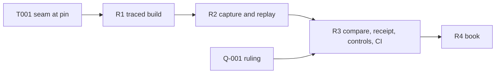

# Tasks: traced refusal reasons

Dependency order top to bottom. Tier in brackets (plan.md schedule). Each slice
opens with its RED bundle and closes with its acceptance line; each is a
`REVIEW-REQUESTED` checkpoint for the persistent auditor.

## Setup

- [ ] T001 [C] Read the pinned cardano-node-clients (`offchain/cabal.project`
  tag `0e73121d`) and ledger sources: name the value that carries one
  purpose's script and ledger-built arguments on a validation failure and how
  to evaluate other bytes on it with logs. Record `path:line` in the coder's
  intake; a missing seam is a placement challenge (modules-model M3).

## R1 — traced build (FR-02, FR-03)

- [ ] T010 [N] RED: the correspondence check (M1) fails on the base because the
  output does not exist; and, once present, fails when fed a build that differs
  from the deployed recipe by a compiler input other than the trace flags.
- [ ] T011 [N] Traced blueprint output from `../onchain`, packages staged as the
  deployed recipe stages them, flags `--trace-filter user-defined --trace-level verbose`.
- [ ] T012 [N] Correspondence check: untraced rebuild reproduces every
  `onchain/script-identity.json` hash; traced and untraced name the same
  validators and parameter schemas; provenance file (D2).
- [ ] T013 [N] Carrier: the conformance app sets `REGISTRY_TRACED_BLUEPRINT`
  by default, as it sets `NAMING_BLUEPRINT`.
- [ ] T014 CI step for G8 (CI change in this ticket). Acceptance: G2, G3, G4,
  G8 green; `onchain/` untouched; G5 green.

## R2 — capture and replay (FR-01, FR-04–FR-08)

- [ ] T020 [C] RED: table-driven unit cases for `admitReason` and
  `compareReason` over every D5 cause and D6 outcome, failing against a stub.
- [ ] T021 [C] `Conformance.Replay` (M2) turns T020 green.
- [ ] T022 [C] `captureCapsule` at every validator rejection, driver steps and
  attribution rows, before the next submission; incomplete resolution is
  `capture-incomplete` (unit RED on a transaction whose reference input is
  left unresolved).
- [ ] T023 [C] `purposeArguments` from the capsule through the T001 seam.
- [ ] T024 [C] `applyDeployedParameters`; `parameters-mismatch` when the
  untraced application does not hash to the failing hash (unit RED with a
  wrong parameter value).
- [ ] T025 [C] `evaluateBytes` and `replayRefusal`; capsule files per
  `contracts/replay-evidence.md`.
- [ ] T026 [D] Premise run on CG07: record the deployed replay's logs. If the
  deployed bytes emit the named user trace, stop and file `BLOCKED` (the
  traced build would be unnecessary; the ticket owner escalates).
- [ ] T027 [D] Run CG22, CG23, CG07 and the generic session with capture on;
  report each rejection's class from `replay/index.json`. Acceptance: G2, G3,
  G4 green; no receipt or comparison change yet; every class observed is
  admitted or its cause named.
- [ ] T028 [C] From the T027 receipts and replay index, discover the complete
  refusal extent and classify each against Lean clauses and executing
  consumers (`extent.md` classes); replace the leads; return every C or D as a
  user story to the ticket owner (C/D escalation), with receipt and trace.

## R3 — comparison, receipt, controls, CI (FR-09–FR-14) — needs Q-001

- [ ] T030 [C] RED: a refused-refused step with a differing admitted reason
  compares `differs`, and one with an unobserved reason `uncompared`. Then wire
  D6 at the sites that today decide and throw: `compareStep`
  (`conformance/app/Conformance/Run/Live.hs:2599`, failure at `:2635`) and
  the rows that require `agrees` before writing their receipt (CG07
  `CgRows.hs:470-479`, CG21 `:1602-1611`, CG22 `:1677-1689`, CG23 `:1745`):
  the index entry with `modelReason` and comparison is written first;
  `differs` fails the row; `uncompared` keeps outcome agreement and the row
  writes its receipt. Unit RED: a `differs` run leaves the index entry.
- [ ] T031 [C] Attribution rows fill `branch` from an admitted reason and keep
  the limit otherwise; every refusal carries its extent class (FR-10).
- [ ] T032 [C] Receipt fields per the Q-001 ruling; the loader rejects claimed
  but incomplete replay evidence (unit RED).
- [ ] T033 [C] Wrong-reason control mode (M8); unit RED that the altered step
  cannot compare `agrees`.
- [ ] T034 [D] Accepting control: per refusing script role one accepted
  step's transaction replays on deployed and traced bytes and is written as an
  `accepting-control` index entry (FR-13); G10 fails when either run does not
  succeed or a refusing role has no entry (unit RED on a fixture index).
- [ ] T035 G6: extend the CG22, CG23, CG07 steps' jq (CI change in this ticket).
- [ ] T036 G7: extend generic and serialization steps' jq.
- [ ] T037 G9: control step, altered leg non-zero naming both reasons, restored leg zero.
- [ ] T038 G10: extent over every receipt, non-empty guard, each refused step
  once in `replay/index.json`. Acceptance: T035–T038 each seen red on the
  base or the altered leg, then green locally [D ≤ 4 runs].

## R4 — book (FR-15)

- [ ] T040 [C] Restate the limit in `Conformance.Book`: method, both hashes,
  deployed bytes carry no traces, remaining unobserved refusals by row.
- [ ] T041 [N] Regenerate `conformance/BOOK.md` with its generator only.
- [ ] T042 [C] Update `Conformance.Story.Usage` to the restated text.
- [ ] T043 [C] Prepare the D287-DOC residual for the epic from T026/T027
  evidence (A-002): stale wording, path, revision, reader claim, evidence,
  proposed repair, authority needed. No edit outside the fence. Acceptance: G1–G10 green at the head (pre-push checkpoint).
