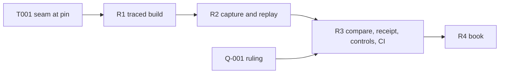

# Tasks: traced refusal reasons

Dependency order top to bottom. Tier in brackets (plan.md schedule). Each slice
opens with its RED bundle and closes with its acceptance line; each is a
`REVIEW-REQUESTED` checkpoint for the persistent auditor.

## Setup

- [x] T001 [C] Read the pinned cardano-node-clients (`offchain/cabal.project`
  tag `0e73121d`) and ledger sources: name the value that carries one
  purpose's script and ledger-built arguments on a validation failure and how
  to evaluate other bytes on it with logs. Record `path:line` in the coder's
  intake; a missing seam is a placement challenge (modules-model M3).

## R1 — traced build (FR-02, FR-03)

- [x] T010 [N] RED: the correspondence check (M1) fails on the base because the
  output does not exist; and, once present, fails when fed a build that differs
  from the deployed recipe by a compiler input other than the trace flags.
- [x] T011 [N] Traced blueprint output from `../onchain`, packages staged as the
  deployed recipe stages them, flags `--trace-filter user-defined --trace-level verbose`.
- [x] T012 [N] Correspondence check: untraced rebuild reproduces every
  `onchain/script-identity.json` hash; traced and untraced name the same
  validators and parameter schemas; provenance file (D2).
- [x] T013 [N] Carrier: the conformance app sets `REGISTRY_TRACED_BLUEPRINT`
  by default, as it sets `NAMING_BLUEPRINT`.
- [x] T014 CI step for G8 (CI change in this ticket). Acceptance: G2, G3, G4,
  G8 green; `onchain/` untouched; G5 green.

## R2 — capture and replay (FR-01, FR-04–FR-08)

- [x] T020 [C] RED: table-driven unit cases for `admitReason` and
  `compareReason` over every D5 cause and D6 outcome, failing against a stub.
- [x] T021 [C] `Conformance.Replay` (M2) turns T020 green.
- [x] T022 [C] `captureCapsule` at every validator rejection, driver steps and
  attribution rows, before the next submission; incomplete resolution is
  `capture-incomplete` (unit RED on a transaction whose reference input is
  left unresolved).
- [x] T023 [C] `purposeArguments` from the capsule through the T001 seam.
- [x] T024 [C] `applyDeployedParameters`; `parameters-mismatch` when the
  untraced application does not hash to the failing hash (unit RED with a
  wrong parameter value).
- [x] T025 [C] `evaluateBytes` and `replayRefusal`; capsule files per
  `contracts/replay-evidence.md`.
- [x] T026 [D] Premise run on CG07: record the deployed replay's logs. If the
  deployed bytes emit the named user trace, stop and file `BLOCKED` (the
  traced build would be unnecessary; the ticket owner escalates).
- [x] T027 [D] Run CG22, CG23, CG07 and the generic session with capture on;
  report each rejection's class from `replay/index.json`. Acceptance: G2, G3,
  G4 green; no receipt or comparison change yet; every class observed is
  admitted or its cause named.
- [x] T028 [C] From the T027 receipts and replay index, discover the complete
  refusal extent. Refusals with an executed model reason are class A by fact.
  Classify each remaining refusal against Lean clauses and executing consumers
  into the committed B/C/D table in `extent.md` (the ticket owner commits it);
  return every C or D as a user story to the ticket owner, with receipt and
  trace.

## R2 repairs (E209 A-006, A-007)

- [x] T029a [C] CG22: exclusion proof via the fallback of `storyProofs`.
  Live evidence (D-006) shows it does not reach the story's path; superseded
  by T029d and kept only if T029d makes it the route, else removed as dead.
- [x] T029b [D] CG09 declares the accepting control's units; new refused
  transaction captured, budget-refused predecessor kept (D-006).
- [x] T029c [C] Witness route: `witness.witness` replayed with the captured
  registry id and kind; admitted only when the untraced application hashes to
  the failing witness policy. D5 split into `no-replay-route`,
  `parameters-mismatch`, `unidentified-script`, each produced by an executed
  unit case through the classifier, spellings equal to D5. An offline
  `replay-capsule` run replays the retained CS04 capsule through the same core
  from its saved transaction, outputs, protocol parameters and era data,
  recomputes its captureId, and writes its outcome beside, never over, the
  original. A candidate-hash test alone does not show the captured script was
  replayed.
- [x] T029d [D] CG22 on the executed per-request speculative path: for a
  non-insertion on a key the speculative trie does not hold, the exclusion
  proof is computed without walking or mutating that key; a unit case on that
  executed path; one live `run CG22` shows a non-empty proof in the rebuilt
  redeemer, deployed replay `validator-failure`, traced admitted exactly
  `key-unknown`.

## R3 — comparison, receipt, controls, CI (FR-09–FR-14) — R3a done; R3b (T032, T035–T038) released by the Q-001 ruling

- [x] T030 [C] RED: a refused-refused step with a differing admitted reason
  compares `differs`, and one with an unobserved reason `uncompared`. Then wire
  D6 at the sites that today decide and throw: `compareStep`
  (`conformance/app/Conformance/Run/Live.hs:2599`, failure at `:2635`) and
  the rows that require `agrees` before writing their receipt (CG07
  `CgRows.hs:470-479`, CG21 `:1602-1611`, CG22 `:1677-1689`, CG23 `:1745`):
  the index entry with `modelReason` and comparison is written first;
  `differs` fails the row; `uncompared` keeps outcome agreement and the row
  writes its receipt. Unit RED: a `differs` run leaves the index entry.
- [x] T031 [C] Attribution rows fill `branch` from an admitted reason and keep
  the limit otherwise; every refusal carries its extent class (FR-10).
- [x] T032 [C] Receipt replay object (FR-11, data-model): written by every
  refusal path, step and attribution; loader accepts legacy receipts without
  it, rejects an incomplete or contradicting one (unit REDs: a missing
  `tracedHash` with `reason`; `reason` and `cause` both; a `trace` disagreeing
  with `replay.reason`); size: measure the largest live receipt with the
  object, set `maxReceiptBytes` and the CI margins from that measurement with
  stated headroom, and keep a negative control over the cap. A permissive
  decoder is not evidence a consumer receives the data: the book/report path
  reads it in a test.
- [x] T033 [C] Wrong-reason control mode (M8); unit RED that the altered step
  cannot compare `agrees`.
- [x] T034 [D] Accepting control: per refusing script role one accepted
  step's transaction replays on deployed and traced bytes and is written as an
  `accepting-control` index entry (FR-13); G10 fails when either run does not
  succeed or a refusing role has no entry (unit RED on a fixture index).
- [x] T035 G6: extend the CG22, CG23, CG07 steps' jq (CI change in this ticket). The jq
  requires, per refused step with a model reason, `replay.reason` equal to
  `model.reason`, the two hashes, the `captureId`, and the receipt's
  `replayCorrespondence`.
- [x] T039 Retention at the CI boundary (E209 NOTE-003 recut of review 003):
  each dedicated CG07, CG22 and CG23 step publishes its receipts path to the
  workflow's always-run `conformance-receipts` upload before invoking the row;
  on the row's non-zero exit the step keeps that exit status and leaves a
  durable replay index with the `differs` or `uncompared` entry for the
  upload. A control executes the committed step's own script (the same
  wrapper and path resolution CI runs) with a failing row invocation and
  asserts both the original non-zero exit and the retained index at the
  published path; the control is falsified by disabling the path publication
  or the retention and observing it fail. Reviewed with the R3 implementation
  checkpoint and its real control receipt, not as a separate prose round.
- [x] T036 G7: extend generic and serialization steps' jq.
- [x] T036a [C] CG05 executing consumer (E209 A-011): CG05 runs as a story through the
  generic interpreter (new `conformance/lib/Conformance/Edge/Occupied.hs`,
  `runCG05` → the shared live runner): its occupied starting state is created
  by real accepted connected actions and readbacks, the original occupied-insert
  case is kept (insertAbsent on the occupied key), and the actual setup,
  config and request reach the generic Lean question. Accepted control and the
  refused insert reach deployed replay, traced replay, Lean comparison and the
  receipt replay object. No new oracle, adapter, typed expected reason, Lean,
  driver or rows.json change. Evidence: the R3b generic-session run, after the
  CG05 checkpoint review; the generic step's CI assertions read the story
  receipt (refused step model `key-exists`, trace `key-exists`, comparison
  agrees, connected accepted control).
- [x] T036b [C] CS04 offline compiler diagnostic (E209 A-012): a second test-owned
  build of the same registry source, compiler and pins with
  `--trace-filter all --trace-level verbose`, checked against the same untraced
  twin; offline only, from the retained CS04 capsule, with the captured
  arguments, the deployed parameters (reproducing the captured deployed hashes)
  and the declared budget; deployed reproduction still required; evaluated only
  for purposes the user-defined replay left `no-user-trace`; written to
  `replay-diagnostic/<txid>/outcome.json` with `kind: compiler-diagnostic`
  beside the untouched `replay-offline` outcome; never admitted, never a reason,
  never compared, never in a receipt or the index. Controls: a mismatched
  blueprint or parameter set is refused before any diagnostic; a successful,
  budget-failing, silent or generic diagnostic keeps its category.
- [x] T037 G9: control step, altered leg non-zero naming both reasons, restored leg zero.
- [x] T038 G10: extent over every receipt, non-empty guard, each refusal once
  in `replay/index.json`; a refusal with a model reason not class A, or not
  agreeing or uncompared with a cause, fails; a refusal without one absent from
  the committed B/C/D table fails as unclassified (unit RED: a driver refusal
  relabelled B, and an unlisted attribution refusal). Acceptance: T035–T038 each seen red on the
  base or the altered leg, then green locally [D ≤ 4 runs].

## R4 — book (FR-15)

- [x] T040 [C] Restate the limit in `Conformance.Book`: method, both hashes,
  deployed bytes carry no traces, remaining unobserved refusals by row.
- [x] T040a [C] CG05 in the book (E209 A-013): the book run executes and renders the
  occupied-key story beside the five existing chapters and the sequence, from one
  declared book-story extent used for execution, rendering and completeness;
  `conformance/app/Main.hs` changes only in `runBook`'s row selection, receipt
  filter, required-row completeness and count, and the directly needed Book
  import(s). Negative witnesses: a missing story receipt is rejected; a renderer
  that omits the occupied-key refusal fails. CS04 stays a limits row with its
  appendix diagnostic; no constructor story.
- [x] T041 [N] Regenerate `conformance/BOOK.md` with its generator only.
- [x] T042 [C] Update `Conformance.Story.Usage` to the restated text.
- [ ] T043 [C] Prepare the D287-DOC residual for the epic from T026/T027
  evidence (A-002): stale wording, path, revision, reader claim, evidence,
  proposed repair, authority needed. No edit outside the fence. Acceptance: G1–G10 green at the head (pre-push checkpoint).

## Final delivery (narrowed acceptance, 2026-10-02)

Integrated with main `13f2b2e`; acceptance narrowed by the operator's rulings of
2026-10-02 (spec.md). T043's documentation residual is tracked by
lambdasistemi/singular#321, outside this branch.

- [x] T050 Merge main `13f2b2e` into the branch as a merge commit, its history
  unrewritten; the replay capture moves behind `Conformance.Run.Node`, the one
  module that opens the harness's node (#326), and the replay module joins the
  node-confinement allowlist with its reason.
- [x] T051 Rebind the traced/untraced correspondence to #320's validators: the
  FR-03 check at the head reproduces the new `onchain/script-identity.json`.
- [x] T052 A batch the model's batch questions answer is compared on its reason
  too: the refused batch's traced reason for the state script meets the model's,
  recorded in the replay index first, failing the row naming both when it
  differs; a reject batch carries the refunds through which the chain settles
  what it owes, judged by `settle`.
- [x] T053 The story language's fold batch takes a tamper, `mint-on-first-key`;
  the registration chapter folds two registrations minting both at the first
  key, refused by the chain and the model for the same reason.
- [x] T054 CG11's empty fold, in a registry of its own, and CG19's crossed
  refunds are compared with `foldBatch` and `rejectBatch`; their receipts carry
  the batch records, which the loader validates.
- [x] T055 CG09's short reject control and CG19's rejected-floor control are
  compared with the reject batch; their owners are wallets other than the one a
  fold returns its change to.
- [x] T056 CG24 runs through the dedicated-row wrapper, its refused steps carry
  their traced replay, and its receipts join the extent.
- [x] T057 CG10, CG12 and CS04 are published as unmet model comparisons with
  their traced evidence (lambdasistemi/singular#346, #345, #347): the extent
  table, the book's limits and the rows' narration, CG12 no longer said to agree
  with the model.
- [x] T058 Re-render `conformance/BOOK.md` with its generator from a book run at
  the integrated head; restamp this directory's speech companions.

## Rulings of 2026-10-02 on the escalations (A-001)

- [x] T059 Reject refund, "Record now, fix later": CG09 submits a reject paying
  its owner one lovelace short at the refund's position and the remainder in
  another output at the owner's key; the chain refuses it `deposit-returned`,
  the model accepts, and the row records the disagreement in its receipt, never
  as a pass (extent class D; book, spec and plan limits;
  lambdasistemi/singular#361).
- [x] T060 CG10, CG12 and CS04 receipts carry the verdict `unmet-by-ruling`,
  naming lambdasistemi/singular#346, #345 and #347, in the non-passing debt
  report beside CG09; the CS session reports its unmet row like the CG
  session; CI's verdict and debt assertions move with them.
