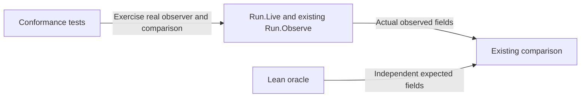

# Preserve the observation boundary

As a maintainer, I want this fix at the existing observation boundary without another interpreter or a refactor.

## Responsibilities

The existing live observer owns ledger reads and their translation. The comparator owns equality and existing permitted floors. The Lean oracle owns expectations. Preserve this direction and existing public entry points. Tests may depend on the actual observation implementation; the implementation must not depend on tests. No module relocation is authorized.
