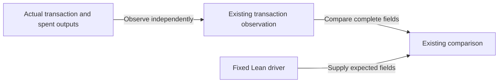

# Repair datum observation without moving responsibilities

As a contributor, I want one bounded repair that preserves the registry interface and existing evidence pipeline.

## Delivery

Keep observation in its existing Conformance responsibility. Bind distinct datum values at the observer's actual input boundary, retain behavioral RED evidence, repair the observed values, then verify connected cases and current CI. Keep model-derived expectations separate from observed facts.

One implementation slice, with RED, GREEN and pre-push checkpoints. The ticket owner freezes CI commands; the coder owns tests, code and local commits; an independent reviewer checks committed checkpoints. No extra seats. One task produces one final implementation commit after its evidence is retained.

The retained state input is bound through the data contract. The custody case uses a delivering fold, so its physical carrier exists. The witness is spent only by folds that deliver nothing, so its GREEN and every destination row of a fold delivering nothing wait on the ruling in #304; the observer neither reports an invented datum there nor drops the row. A delivered output the builder books without a datum differs from Lean's inline form; that difference is reported, not hidden, and holds acceptance until it is ruled.

## Boundary

Production writes are limited to `conformance/app/Conformance/Run/Live.hs` and, only if necessary for the existing observation responsibility, `conformance/app/Conformance/Run/Observe.hs`. Tests stay under `conformance/test/`; `conformance/conformance.cabal` may only wire those tests and existing observation modules. No module moves or new observation framework. Any needed extension is returned before editing.

Do not edit offchain/onchain, Lean, root gates/workflows, shared docs or generated books. Those surfaces can overlap independent work. This slice does not remove the constitution's broader named limit by hand. Parent rechecks overlap at dispatch and integration and serializes any affected work.

## Verification limits

Use existing conformance tests, existing connected devnet cases, root Build Gate and exact-head CI. Unit fixtures establish observation behavior, not acceptance of a malformed transaction by deployed scripts. Record failures and uncovered cases without changing expected results.
