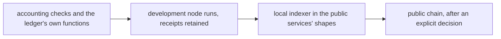

# Evidence mapping for the preprod demonstration

## The story

As a reviewer, I want each requirement of issue 300 tied to the model statement it rests on, the code that carries it and the kind of evidence that will establish it, so that I can see which claims are proved, which are executed on a development node, and which wait for the public network.

The application model is read at `de34300540223ccedf1ca85216b131fd09a148b4` under constitution 1.11.0. No Lean, statement, corpus, validator or conformance-ledger file changes in this work.

## The collateral correction, with its evidence

Earlier preparation notes said that folds and updates put the wallet's largest output up as collateral with no return. The source and the retained bodies say otherwise for folds and updates, and confirm it for the booking.

The transaction builder the folds and updates use is `Cardano.Tx.Build` at `cardano-tx-tools` revision `7bfe95bf5ef3bfa846e62bcae94cf377b66ad0d0`. Its balancer, `balanceTxWith` in `src-tx-build/Cardano/Tx/Balance.hs`, fills the total collateral and the collateral return when the transaction has a redeemer and a collateral input, and it does so by cases. It computes the required total as the fee times the collateral percentage, rounded up. If the input cannot cover that total it refuses the transaction. If what remains after the required total is zero or under the minimum output, it takes the entire input as the total collateral and states no return. Otherwise it states the required total and returns the rest. The booking is assembled by hand in `Singular.Registry.TxBuilder.Edges` with a fixed fee and did not go through that balancer; the measured booking now does, and refuses the no-return case so that it never collateralises a whole funding output.

The twelve bodies below show the ordinary case the balancer produces and the booking's absence of the two fields; they do not show the two other cases, which are read from its source. The following table decodes the body map of twelve transactions submitted by one development run of the ordinary commands, reading the fee, the collateral inputs, the total collateral and the collateral return. Fee 696101 gives 1044152, the fee times one and a half rounded up.

| transaction | command and step | fee | collateral inputs | total collateral | collateral return |
|---|---|---|---|---|---|
| `14f5a536db78edf07cce4812d3914faad256e398f5c77e436904678f5c7939f2` | update | 696101 | 1 | 1044152 | present |
| `99856b4439e2f1e7bcded22aad81d4f5930dac73dafa17cb3b20a2cea32f9442` | update | 696761 | 1 | 1045142 | present |
| `63a7abd587ad5ac6e8b9bb7e56e2153dec8e2e342c53c26e627665f2fe354a54` | insert, fold | 1959474 | 1 | 2939211 | present |
| `1a305c82fbbd33c183aaf520dec88f6b96c92610dfb088ec7247e3995dae5072` | terminate, fold | 2039231 | 1 | 3058847 | present |
| `c4805e506aa59cd53f5bfe622a045b59b2b09e30b224fad2167da04bc311f7aa` | create, boot | 899932 | 1 | 1349898 | present |
| `7ab34321deca46ffae9320523622ac8f5bec75ed564a1499a302f66b9e806364` | insert, booking | 2000000 | 1 | absent | absent |
| `26e281b312bed1d9f9ca686b2af738370e3751e7cb0ee68ede436926171598ab` | terminate, booking | 2000000 | 1 | absent | absent |

The five publication transactions of the create command use no collateral. The twelve body files, the decoder and its output are retained with their digests by the author; the decoding reads body-map keys 2, 13, 16 and 17 and needs only a CBOR reader.

The retract builder assembles its transaction by hand and balances it with the shared balancer. Whether it declares collateral fields is a hypothesis the new accounting checks will settle before any repair.

Each requirement below is established by the first form that can establish it; a later form is not implied by an earlier one.

## Requirements and their evidence

Each row states the requirement of issue 300, the model statement or contract it rests on, the entry points, and the form of evidence that will establish it. A row is not covered until its receipts exist.

| requirement | model statement or contract | entry points | evidence form |
|---|---|---|---|
| Consume the accepted application and command-line revisions and pin the archive | application model revision above; release identity manifest | release assembly and the archive check | archive integrity and identity checks on the downloaded archive |
| Prepare the release path and the actual instructions | none; carrier requirement | archive run page, flake checks, workflow | archive check from outside the checkout |
| Present the complete commands, allowance and readback before public writes | none; operator decision record | read-only preparation route in the command-line tool | preview receipt from a development node and from public inputs only |
| One permanent registry, fresh key per take, separate accounting | `insertion_holding_inline` and the registry create contract | create command, registry directory, receipts | development-node journey; public receipts after the decision |
| Insert, controller update, fresh inspect, terminate with deposit return | `insertion_holding_inline`, `update_keeps_registry`, `update_payload_free`, `release_burns_atomically` | insert, update, inspect and terminate commands | development-node journey; confirmed public receipts after the decision |
| Four refusals with accepting controls | `update_requires_controller`, `only_fold_releases`, `duplicate_refused_by_registry`, `resurrection_refused_by_registry` | controls attached to the permanent registry | generated development-node runs; public receipts after the decision |
| Two independent public indexers from policy and name | none; read-only contract | readback tool carried in the archive | recorded public responses, a local mock server with negative controls, then live reads |
| Partial, failed and stale outcomes kept distinct, no automatic retry | the command-line tool's stop contract | journal, receipts, reclaim action | existing stop controls plus the reclaim control |
| Public manifests and a recording of actual commands | none; documentation contract | documentation pages with their speech companions | presentation and site checks; the recording waits for the decision |

## The duplicated token carrier

The duplicated-carrier case of the update statement stays a non-live case with its model and validator tests and its conditional argument. It is distinct from the same-key duplicate insertion and the post-Terminal insertion above, which are required and run against the registry.
