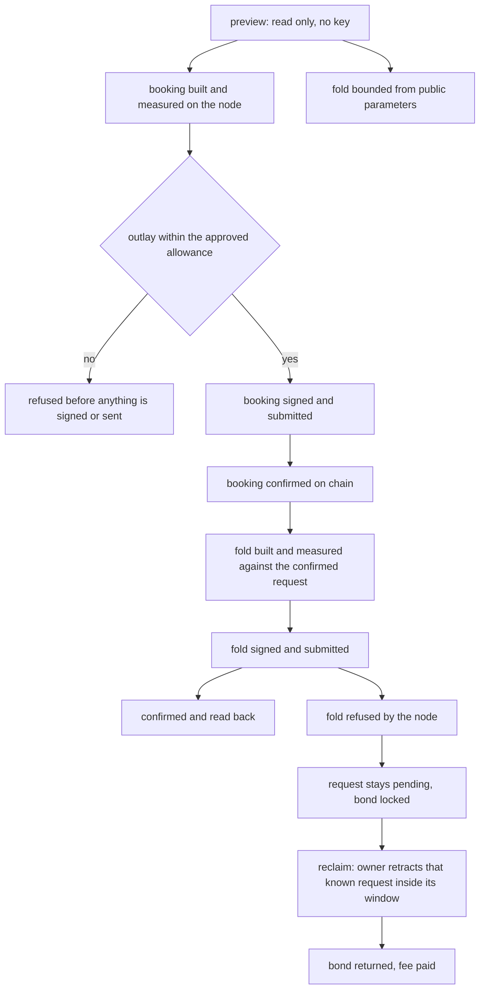

# Delivery plan for the preprod demonstration

## The story

As a reviewer, I download the released archive and check one registry and one fresh key on the public preprod network: the key is inserted, its payload is changed by its controller, it is found again through two independent public indexers, four attacks are refused at their script boundaries, and the key is terminated with its protected deposit returned. Every claim rests on a confirmed transaction or a fresh read, never on local state.

This page plans the source changes that make that journey measurable and replayable. It runs nothing on the public network. Signing, submission, publication and recording each wait for a separate decision by the operator.

## What is wrong today

Four things stand between the merged command-line tool and that journey.

- **The booking's fee and units are declared, not measured.** The booking that every insert and terminate makes states a fixed two-ada fee and fixed execution units of fourteen million memory and one billion steps. Nothing evaluates them against the network the command is pointed at.
- **The booking states no total collateral and no collateral return.** Decoding the transactions a development run submitted shows that the two bookings name one collateral input and state neither a total collateral nor a return, while its folds, updates and boot state a total collateral of one and a half times their fee and return the rest of the input. The balancer that builds those does so in cases, not always: it refuses an input that cannot cover the required total, and when what remains is zero or under the minimum output it takes the whole input as the collateral and returns nothing. A booking whose collateral is not stated puts its whole funding output at risk. The evidence and the cases are on the evidence mapping page.
- **The refusal controls build their own registries.** They create a fresh registry per case and stop their own node for the node-lost case. They cannot act on one named permanent registry and a fresh key through a node someone else runs.
- **No public indexer is asked from policy and name.** Nothing retrieves the current token output and its payload from two named public services and compares them with the node's own reading.

One consequence of the registry's windows matters for repeats. A request phase lasts one hundred and twenty seconds and the owner's retract window thirty seconds after it. A refused duplicate or post-Terminal insertion leaves its request pending, and the registry's fold takes every pending request. On a permanent registry that leftover must be reclaimed in its window, or a later take cannot fold.

## What changes

Each step ends at its own commit and its own checks.

- **Measured booking.** A booking evaluates through the node, declares the units the evaluator measured, pays the ledger's fee for the final body including the reference scripts it reads, and states its total collateral and the return of the rest of its funding output. A funding output that cannot leave a return of at least the minimum output is refused before anything is submitted, never collateralised whole. The fixed booking stays for the development journeys and serves as the control the new judgement must find unmeasured.
- **Read-only preparation.** Insert, update and terminate accept a preview switch. It builds and evaluates the transactions, submits and journals nothing, and prints the selected outputs, fees, units, collateral and protocol-parameter digest. A fold cannot exist before its booking confirms, so the preview bounds it from public parameters and the command measures it after the booking confirms and before it submits. A public address can stand in for the signing key, and an outlay allowance refuses a run whose measured cost exceeds it.
- **Refusals on the permanent registry.** The controls attach to a declared registry directory and key through an externally supplied node. They never create a registry and never start, stop or reset a node. They run the unauthorized update, the early withdrawal, the same-key duplicate insertion and the post-Terminal insertion, each beside its accepting control. The take also asks two public indexers for the Active key between its final update and its termination, and stops before its next write when either is missing, unreachable, behind or in disagreement; it refuses a wallet that cannot fund every action before it writes. A named reclaim action carries the request the run's own insertion named and the readback that saw it pending, and retracts that request inside its window only while the registry still reads as that readback did; a missing, replaced or another owner's request is refused and none is substituted. The run requires an explicit collateral allowance before any write, and stops at any outcome its step does not name or any requirement that does not hold.
- **Public indexer readback.** A read-only tool carried in the archive starts from policy and asset name, asks Koios and Blockfrost, and compares the output reference and datum hash with the tool's own inspect receipt. Credentials are named by reference and never appear in arguments, logs, receipts or recordings.
- **Carrier and documents.** The archive, its run page, the flake checks, the workflow and the documentation carry the above, with the limits stated.

## The flow of one write

An insertion or a termination is two transactions, and the second cannot exist until the first is on chain. That fixes where each measurement stops.

The preview covers the first row only: the booking is measured, the fold is a bound. The allowance is judged on the measured booking and the bound. A refusal is the node's answer to the fold, and what it leaves behind is reclaimed by an explicit action on a request the run itself observed pending, never by a repair of an unknown submission.
## How it is checked

The checks are commands a reviewer can run from a clean checkout. The offchain suite and lint run from the offchain directory, the conformance suites from the conformance directory, and the archive journey and controls from the repository root as `nix run --quiet .#demo1-cli-check` and `nix run --quiet .#demo1-cli-controls`. The repository's full check is `nix develop --quiet -c just ci`. The presentation check selects README.md, the documentation pages, the protocol specification and these two pages, and its receipt says which pages it traversed.

Accounting checks state their expected values from the evaluator's reading, the wallet the generator drew and the ledger's own functions under the public preprod parameters, never from the code under test. They cover a funding output with no room for a return, a zero return, the minimum output rule, the percentage rounded up, the units the evaluator measured for the booking's purpose, and a final fee that includes the actual reference inputs. Each check is shown failing on a controlled alteration before it is trusted.

## What this does not establish

Nothing here is a preprod confirmation. The live preprod cost models are read as public inputs, and a development node's evaluation is not preprod execution. A node refusing a submission and a node collecting collateral are different events, and the plan reports them separately. The duplicated-token-carrier case stays unrun on a live chain, distinct from the same-key duplicate and post-Terminal refusals that are required.
