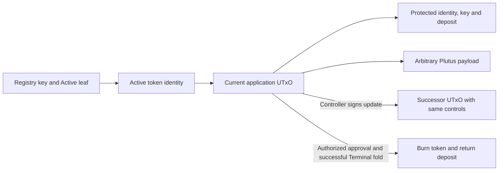

# Open-datum application

## The controller's story

As the controller, I want my registry token to carry arbitrary Plutus data at an application contract, so I can change the data with my Cardano key while my original deposit remains protected until I terminate that token.

The data is the payload of a protected envelope, which the delivered output carries inline: the payload is any valid Plutus data, and the envelope's control fields — controller key, registry, key and deposit — are required and cannot be edited through a payload update ([the envelope ruling](ruling-envelope-datum-20260929.md)).

## Protected control and a free payload

Insertion binds the registry state asset, active token asset/key, controller payment key and original insertion deposit in protected control data. The payload is separate and accepts valid Plutus constructors, maps, lists, signed integers and bytes. A payload edit preserves every control field, the token at the governing contract, the deposit floor and the registry lifecycle commitment. MPFS commits the key's lifecycle, not every later external payload hash.

## Authority, custody and release

The key authorizes updates and termination approval. Registry folds retain their existing empty required-signer obligation. Booking termination leaves the token/deposit locked. Release requires an accepted same-registry/key updateTerminal fold, actual active-token burn and Terminal commitment in the same transaction. Reject, retract, deleteActive, unrelated evidence and a bare burn do not authorize release.

## Additive payments

Payments sum the original application deposits and the distinct registry/request refunds owed to each controller. A payment that meets each floor individually but falls short of their sum is refused. Multiple releases to the same controller also sum. Tips, fees, surplus and minimum-output funding remain separate; protected deposits cannot fund them.

## Required controls

Successful update and termination have accepting controls. Unauthorized update, altered protected controls, token escape, premature withdrawal, unrelated registry/key/approval, short additive settlement, duplicate insertion and same-identity post-Terminal resurrection need reached refusal controls. Client or setup failure never establishes a ledger refusal. The generic registry's laws are imported unchanged; #304's destination-output correspondence remains E209-owned and held.

## Sources and current phase

Authority: [epic301](https://github.com/lambdasistemi/singular/issues/301), [ticket310](https://github.com/lambdasistemi/singular/issues/310), and the full operator rulings beside this specification. Latest application-deposit-lock ruling supersedes earlier wallet custody. The application now imports the registry model at main a0770318f5037e79e815e7831cfa539213f2853e, and its guards, delivery and termination behaviour are proved against that root. The earlier pin — registry source 502cb9329fc7a6615b722102516d8d3d9e20d806 and Lean subtree f1e6a0edcaf9edce7369fd42add8b3677ddabeb2 — is historical: the baseline this work started from. Importing a0770318 is not full acceptance of the #304 producer change it contains; that acceptance is separate and still open. New application definitions are prospective until independently reviewed and bound to an exact commit.

## The token's path

## What this phase delivers

Current delivery phase is executable model, intended statements and exact transition inversions. No working application validator, compiled identity, builder, CLI command, archive journey or public-chain demonstration is claimed by this plan.
