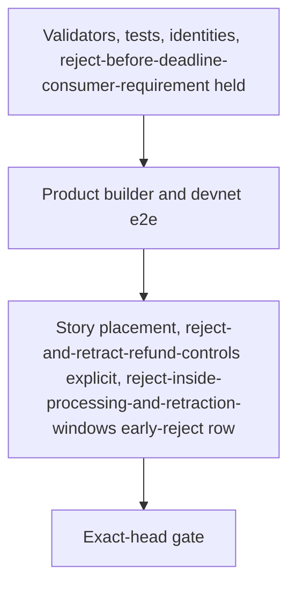

# Plan: repair the validators, then the builder, then the evidence

## Strategy

Three bisect-safe slices on one branch, one pull request. Each slice ships its own checks and documentation. The validator slice also moves reject-before-deadline-consumer-requirement's expectation, because the chain's answer to reject-before-deadline-consumer-requirement changes in that commit. The conformance session must stay green at every commit.

## Constitution check

| Principle | How this plan meets it |
|---|---|
| I. Lean is the authority | Code moves to `exitAdmission .reject = none`. Lean is untouched. |
| II. Errors and conflicts go to the user | The consumer conflict over forbids-early-rejection-singular-s-lean-allows is already escalated and stays held. The fold-timing discrepancy is owned by a separate ticket. Its correspondence claim stays held. |
| III. Whole claimed behaviour | Compiled tests cover both purposes and every refund-floor refusal. A connected devnet journey goes through the product builder. Model-compared live steps run through the story language. Each evidence class is named, never substituted for another. |
| IV. Evidence and gaps preserved | RED on the base, GREEN at the exact head, measured sizes and costs, named limits. |
| V. Forward repair | History, receipts and the published book are not rewritten. |
| VI. Suite as public evidence | The early-reject claim is reject-inside-processing-and-retraction-windows, said in the story language and rendered by the book. reject-and-retract-refund-controls loses only the timing words the model does not have. reject-before-deadline-consumer-requirement stays published as unmet and held. No row's state is typed. |

## Slices

| Slice | Delivers | Invariants | RED (on the unrepaired code) | GREEN |
|---|---|---|---|---|
| validators-identities-reject-before-deadline-consumer-requirement | state-script-accepts-rejected-action-for-request–rejection-leaves-state-datum-root-value-as, consumer-requirement-that-forbids-early-rejection-cardano (reject-before-deadline-consumer-requirement held), compiled-script-identity-repair-moves-regenerated-by, fold-update-stays-processing-window-state-script–other-fold-rule-signer-rule-token-identity | state-purpose-admits-rejected-in-processing-window–identity-moved-hash-equals-its-regenerated-manifest, reject-before-deadline-consumer-requirement-consumer-requirement, compiled-sizes-state-request-scripts-execution-units, workflow-carries-acceptance-checks-step-bodies-byte (body-generic-rows-reject-before-deadline-consumer) | the new and restated Aiken tests for early state and request rejection fail on the base validators, naming `not-rejectable` or the request expectation, not a setup or decoding error. The request-purpose tests include two requests with their actions in both orders, so admitting on any reject or on the first action fails them. The new naming-hash comparison is seen failing on the stale naming pin. | onchain and naming-onchain suites and identities green; deployed identity both ways; reject-before-deadline-consumer-requirement held in the generic session (body-generic-rows-reject-before-deadline-consumer) |
| product-builder | off-chain-reject-builder-builds-accepted-rejection | reject-continues-state-unchanged-mints-nothing, product-reject-builder-s-transaction-accepted-on | the new e2e window cases fail at the base builder ("no rejectable requests"). Run only if the slice's budget allows; the compiled RED of validators-identities-reject-before-deadline-consumer-requirement is the required one. | devnet e2e: processing- and retraction-window rejects accepted, refund and state read back; the phase-3 case unchanged (product-builder-on-devnet) |
| evidence-in-story-language | published-conformance-evidence-shows-early-rejections-accepted | model-bound-early-rejections-agree-lean-untampered, reject-retract-refund-controls-keeps-its-evidence, workflow-carries-acceptance-checks-step-bodies-byte (body-reject-inside-processing-retraction-windows-early, rows) | the retained refused processing-window transaction `2d39d638…` (ticket 287) is the live defect. evidence-in-story-language adds no RED campaign. | reject-and-retract-refund-controls (body-reject-retract-refund-controls-unchanged) unchanged; reject-inside-processing-and-retraction-windows (body-reject-inside-processing-retraction-windows-early) agrees with the model on every step; the book (conformance-unit-suite-running-book) renders every placement and six chapters |

The behavioural RED this ticket requires is validators-identities-reject-before-deadline-consumer-requirement's compiled one. Setup and decoding failures count as neither RED nor GREEN.

## Path fence

Writable, by slice. Anything else is a placement challenge before editing.

| Slice | Paths |
|---|---|
| validators-identities-reject-before-deadline-consumer-requirement | `onchain/validators/{registry/fold.ak, request.ak, shared.ak, cage.ak, types.ak, cage.props.ak, cage_reject.tests.ak, cage_contribute.tests.ak, deposit_exits.tests.ak, cage_fixtures.ak, witness.ak, open_datum.tests.ak}`, `onchain/script-identity.json` (generator only), `naming-onchain/validators/{naming.ak, application.ak, fixtures.ak}` (pins only), `naming-onchain/script-identity.json` (generator only), `offchain/test/Singular/Application/OpenDatum/EnvelopeSpec.hs` (pin only), `offchain/deployment-identity-check.sh` (the naming-hash comparison only; added to the fence at the validators-identities-reject-before-deadline-consumer-requirement release), `conformance/app/Conformance/Run/CgRows.hs` (reject-before-deadline-consumer-requirement; comments elsewhere that state the old rule as fact; another row's declared execution units only if a run shows the repaired request script exhausting them), `.github/workflows/conformance.yml` (body-generic-rows-reject-before-deadline-consumer body only), `docs/consumer-conformance.md` (reject-before-deadline-consumer-requirement row), `docs/onchain-validator-owners.md`, and their speech companions `docs/consumer-conformance.speech.json` and `docs/onchain-validator-owners.speech.json` (the speech of the changed sections and the generated `_source` binding only) |
| product-builder | `offchain/lib/Singular/Registry/TxBuilder/Reject.hs`, `offchain/lib/Singular/Registry/Wire/Request.hs` (documentation of `requestPhase` only), `offchain/e2e-test/Singular/Registry/E2E/CageSpec.hs` (new cases; "rejects a phase-3 request" keeps its name), `.github/workflows/registry.yml` (e2e comment only) |
| evidence-in-story-language | `conformance/lib/Conformance/Story/Live.hs`, `conformance/app/Conformance/Run/Live.hs`, `conformance/lib/Conformance/Edge/Exit.hs`, `conformance/lib/Conformance/Edge/EarlyReject.hs` (new), `conformance/lib/Conformance/Book.hs`, `conformance/lib/Conformance/Receipt.hs` (reject-inside-processing-and-retraction-windows's step-completeness case only), `conformance/lib/Conformance/Rows.hs` (count and description), `conformance/app/Main.hs` (book chapters), `conformance/app/Conformance/Run.hs`, `conformance/app/Conformance/Run/Control.hs`, `conformance/app/Conformance/Run/CgRows.hs` (reject-and-retract-refund-controls comment, reject-inside-processing-and-retraction-windows runner), `conformance/conformance.cabal`, `conformance/test/**`, `conformance/rows.json` (the exact two-row change in the gate page), `conformance/README.md` (row count), `docs/consumer-conformance.md` (row count and range) and its speech companion on the same terms as validators-identities-reject-before-deadline-consumer-requirement, `.github/workflows/conformance.yml` (body-reject-inside-processing-retraction-windows-early body and its comment only) |
| all | `specs/320-early-request-rejection/**` |

Forbidden: `lean/**`, `.specify/**`, every `flake.lock` and `aiken.lock`, any receipt field, constructor or encoding, every `rows.json` row other than reject-and-retract-refund-controls's two sentences and the appended reject-inside-processing-and-retraction-windows, `conformance/BOOK.md`, `conformance/review/**`, historical fixtures, and any application behaviour.

## Gate

The full gate, with the verbatim command or step body for every row, its falsification and its nested accounting, is the [gate](gate.md) page. It has fourteen rows: the path fence; the onchain, naming and deployed identity checks; the off-chain lint, build, unit and vector checks; the devnet e2e through the product builder; the running book; reject-and-retract-refund-controls unchanged; the generic rows with reject-before-deadline-consumer-requirement held; reject-inside-processing-and-retraction-windows; the release assembly; and root CI with stdin closed. One complete run at the exact head forecasts N83 and D6. The generic-rows step alone is N45, because it runs `jq` through `nix run` three times per row.

The register journey also calls the reject builder on resume. Its scenario only rejects requests already past their windows, so it is left to the pushed head's CI.

## Execution schedule

The implementation phase is not released by this plan. Forecast, per invocation:

| Step | C | N | D |
|---|---|---|---|
| validators-identities-reject-before-deadline-consumer-requirement RED: aiken-suite-properties-format-registry-identity at the base with the new tests, the base blueprint for sizes | 4 | 2 | 0 |
| validators-identities-reject-before-deadline-consumer-requirement GREEN: formatter, blueprint, registry regeneration, two naming regenerations, aiken-suite-properties-format-registry-identity–deployed-identity-both-ways-naming-scripts-embedded (deployed-identity-both-ways-naming-scripts-embedded first seen failing on the stale naming pin), `cage-tests` for the envelope pin | 8 | 23 | 1 |
| validators-identities-reject-before-deadline-consumer-requirement pairing mutations: admit on any reject, admit on the first action; each one aiken-suite-properties-format-registry-identity run that must fail the two-request request-purpose test, then restored | 2 | 2 | 0 |
| validators-identities-reject-before-deadline-consumer-requirement reject-before-deadline-consumer-requirement: `run reject-before-deadline-consumer-requirement` alone and its receipt read | 1 | 3 | 1 |
| product-builder: component build, unit suite, lint, product-builder-on-devnet | 8 | 5 | 1 |
| evidence-in-story-language: `run reject-inside-processing-and-retraction-windows`, `run reject-before-deadline-consumer-requirement` alone, conformance format and lint, conformance-unit-suite-running-book | 8 | 10 | 3 |
| exact-head gate once–nix-develop-quiet-c-just-ci-standard, once | 2 | 83 | 6 |
| one bounded repair round | 10 | 15 | 2 |
| total | 43 | 143 | 14 |

If the pushed head's CI is the gate, the exact-head row becomes CI plus a local once and nix-develop-quiet-c-just-ci-standard (N3), and the forecast drops to C41/N63/D8. Nothing is repeated without a new change or failure.

## Team

The operator-approved team runs in sequence. The ticket owner (Claude Opus 5.5, high) owns this mandate, the gate and acceptance and writes no product code. One commit owner (Claude Opus 5.5, high) writes the RED tests, the code and the commits. One persistent independent auditor (Grok 4.7, high) answers every checkpoint. No other seat.
