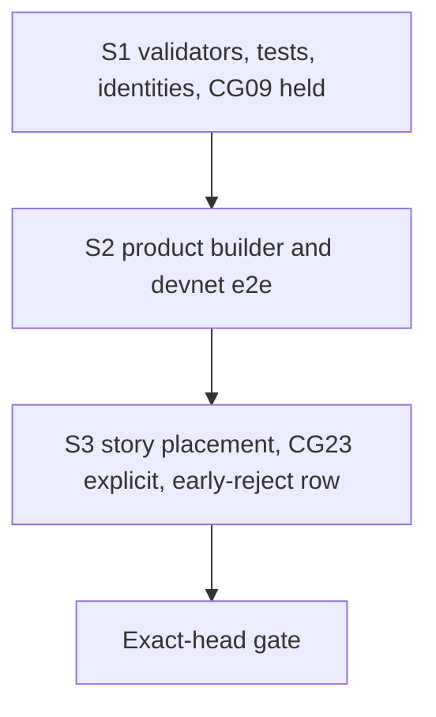

# Plan: repair the validators, then the builder, then the evidence

## Strategy

Three bisect-safe slices on one branch, one pull request. Each slice ships its own checks and documentation. The validator slice also moves CG09's expectation, because the chain's answer to CG09 changes in that commit. The conformance session must stay green at every commit.

## Constitution check

| Principle | How this plan meets it |
|---|---|
| I. Lean is the authority | Code moves to `exitAdmission .reject = none`. Lean is untouched. |
| II. Errors and conflicts go to the user | The consumer conflict over R9 is already escalated and stays held. The fold-timing gap is recorded, not resolved here. |
| III. Whole claimed behaviour | Compiled tests cover both purposes and every refund-floor refusal. A connected devnet journey goes through the product builder. Model-compared live steps run through the story language. Each evidence class is named, never substituted for another. |
| IV. Evidence and gaps preserved | RED on the base, GREEN at the exact head, measured sizes and costs, named limits. |
| V. Forward repair | History, receipts and the published book are not rewritten. |
| VI. Suite as public evidence | The early-reject claim is said in the story language. CG09 stays published as unmet and held. No row's state is typed. |

## Slices

| Slice | Delivers | Invariants | RED (on the unrepaired code) | GREEN |
|---|---|---|---|---|
| S1 | FR-01–FR-04, FR-07 (CG09 held), FR-08, KR-01–KR-03 | INV-01–INV-08, INV-11, INV-13 | the new and restated Aiken tests for early state and request rejection fail on the base validators, naming `not-rejectable` or the request expectation, not a setup or decoding error | onchain and naming-onchain suites and identities green; deployed identity both ways; CG09 held in the generic session |
| S2 | FR-05 | INV-05, INV-09 | not required live: the base builder refuses to build a processing-window reject ("no rejectable requests"), shown by the new e2e case's failure if the slice's budget runs it | devnet e2e: processing- and retraction-window rejects accepted, refund and state read back; the phase-3 case unchanged |
| S3 | FR-06 | INV-10, INV-12 | the early-reject story on the base validators would disagree with the model. The live defect is already witnessed by the retained refused transaction `2d39d638…`, so S3 adds no RED campaign. | CG23 receipt assertion unchanged; the early-reject row agrees with the model on every step; the book renders every placement |

The live early-reject RED is that retained transaction. The compiled RED in S1 is the required behavioural RED for this ticket. Setup and decoding failures count as neither.

## Path fence

Writable, by slice. Anything else is a placement challenge before editing.

| Slice | Paths |
|---|---|
| S1 | `onchain/validators/{registry/fold.ak, request.ak, shared.ak, cage.ak, types.ak, registry/refusal.ak, cage.props.ak, cage_reject.tests.ak, cage_contribute.tests.ak, deposit_exits.tests.ak, cage_fixtures.ak, witness.ak, open_datum.tests.ak}`, `onchain/script-identity.json` (generator only), `naming-onchain/validators/{naming.ak, application.ak, fixtures.ak}` (pins only), `naming-onchain/script-identity.json` (generator only), `offchain/test/Singular/Application/OpenDatum/EnvelopeSpec.hs` (pin only), `conformance/app/Conformance/Run/CgRows.hs` (CG09), `.github/workflows/conformance.yml` (generic-rows expectation), `docs/consumer-conformance.md` (CG09 row), `docs/onchain-validator-owners.md` |
| S2 | `offchain/lib/Singular/Registry/TxBuilder/Reject.hs`, `offchain/lib/Singular/Registry/Wire/Request.hs` (documentation of `requestPhase` only), `offchain/e2e-test/Singular/Registry/E2E/CageSpec.hs`, `.github/workflows/registry.yml` (e2e comment) |
| S3 | `conformance/lib/Conformance/Story/Live.hs`, `conformance/app/Conformance/Run/Live.hs`, `conformance/lib/Conformance/Edge/Exit.hs`, `conformance/lib/Conformance/Book.hs`, `conformance/test/**` (story-language and rendering tests); if the row fence opens: `conformance/lib/Conformance/Edge/EarlyReject.hs` (new), `conformance/app/Conformance/Run/CgRows.hs`, `conformance/app/Conformance/Run.hs`, `conformance/conformance.cabal`, `conformance/rows.json` (one new row, CG23's text; nothing else), `.github/workflows/conformance.yml` (new row step) |
| all | `specs/320-early-request-rejection/**` |

Forbidden: `lean/**`, `.specify/**`, every `flake.lock` and `aiken.lock`, the receipt format (`conformance/lib/Conformance/Receipt.hs` wire), the consumer-sourced rows of `conformance/rows.json`, `conformance/BOOK.md`, `conformance/review/**`, historical fixtures, and any application behaviour.

## Gate

Every row is the verbatim command of the CI job that checks it, run from the stated directory at the exact head. Tier: N counts every `nix` invocation including nested ones. D counts every command invocation that boots one or more devnets.

| Row | Checks | Command (directory) | Workflow | Exit | N | D |
|---|---|---|---|---|---|---|
| G0 | path fence | `git diff --name-only <base>..HEAD` and the working set against the fence above (repo root) | ticket-owner check | 0 | 0 | 0 |
| G1 | Aiken suite, properties, format, registry identity | `nix flake check` (`onchain`) | `registry.yml:168-170` | 0 | 1 | 0 |
| G2 | naming suite and identity | `nix flake check` (`naming-onchain`) | `registry.yml:77-79` | 0 | 1 | 0 |
| G3 | naming value refusals | `blueprint="$(nix build --quiet --no-link --print-out-paths ../naming-onchain#plutus-blueprint)"; NAMING_BLUEPRINT="$blueprint" nix run --quiet .#record-value-tests` (`offchain`) | `registry.yml:80-84` | 0 | 2 | 0 |
| G4 | build gate | `nix build --quiet .#build-gate` (root) | `ci.yml:33` | 0 | 1 | 0 |
| G5 | deployed identity both ways | `nix shell --quiet nixpkgs#jq nixpkgs#diffutils -c bash offchain/deployment-identity-check.sh` (root) | `ci.yml:45` | 0 | 9 | 1 |
| G6 | off-chain lint, build, unit, vectors | `(cd offchain && nix run --quiet .#lint)`; `nix build --quiet .#component-build` (`offchain`); `nix run --quiet .#cage-tests` (`offchain`); `nix develop --quiet --command just vectors-check` (`offchain`) | `ci.yml:64`, `ci.yml:96`, `registry.yml:413-414`, `registry.yml:193-194` | 0 each | 4 | 0 |
| G7 | product builder on a devnet | `blueprint="$(nix build --quiet --no-link --print-out-paths ../onchain#plutus-blueprint)"; REGISTRY_BLUEPRINT="$blueprint" nix run --quiet .#cage-tests-e2e` (`offchain`) | `registry.yml:305-309` | 0 | 2 | 1 |
| G8 | conformance unit suite and running book | `nix run --quiet .#conformance-tests` (`conformance`) | `conformance.yml:144-146` | 0 | 2 | 1 |
| G9 | CG23 exit row | the step body at `conformance.yml:236-290`, unchanged | same | 0 | 4 | 1 |
| G10 | generic rows, CG09 held | the step body at `conformance.yml:337-526` with CG09's expected verdict `held-q002` and the held set `CG09 CG11 CG12 CG19` (CI change in this ticket) | same | 0 | 13 | 1 |
| G11 | early-reject row (if the row fence opens) | a new step beside G9: blueprint, `run <row>`, receipt assertions for INV-10 (CI change in this ticket) | new | 0 | 4 | 1 |
| G12 | release assembly | `nix run --quiet .#release-artifacts -- "$dir"` (root) | `ci.yml:308` | 0 | 1 | 0 |
| G13 | root CI | `nix develop --quiet -c just ci` (root) | `ci.yml:255` | 0 | 3 | 0 |

One complete exact-head run is N47 and D6 (N43/D5 without G11). The register journey (`registry.yml:310-347`) also calls the reject builder on resume. Its scenario only ever rejects expired requests, so it is left to the pushed head's CI and not repeated locally.

Falsification. G1 is red on the base with S1's new tests. G1, G2 and G5 are red on any unregenerated pin, because the existing identity checks compare pins with the built blueprint. G10 at the base already exits non-zero for any CG09 verdict other than its expected one. G7, G8 and G11 are proved by their GREEN steps and the retained historical refusal. No bespoke instrument is added.

## Execution schedule

The implementation phase is not released by this plan. Proposed, counted per invocation:

| Step | C | N | D |
|---|---|---|---|
| S1 RED (G1 on the base with new tests) | 4 | 1 | 0 |
| S1 GREEN incl. blueprint, both regenerations, G1–G5 | 8 | 17 | 1 |
| S2 build, unit, e2e (G6 subset, G7) | 8 | 4 | 1 |
| S3 story build/tests, CG23, CG09, new row runs | 8 | 10 | 3 |
| exact-head gate G0–G13 once | 2 | 47 | 6 |
| one repair round, bounded | 10 | 10 | 2 |
| total proposal | 40 | 89 | 13 |

If the operator's standing rule applies (the pushed head's CI is the gate), the exact-head row becomes CI and the local schedule drops to C38/N42/D7. Either way, nothing is repeated without a new change or failure.

## Team

The operator-approved team runs sequentially. The ticket owner (Claude Opus 5.5, high) owns this mandate, gate and acceptance and writes no product code. One commit owner (Claude Opus 5.5, high) writes RED, code and commits. One persistent independent auditor (Grok 4.7, high) answers every checkpoint. No other seat.
