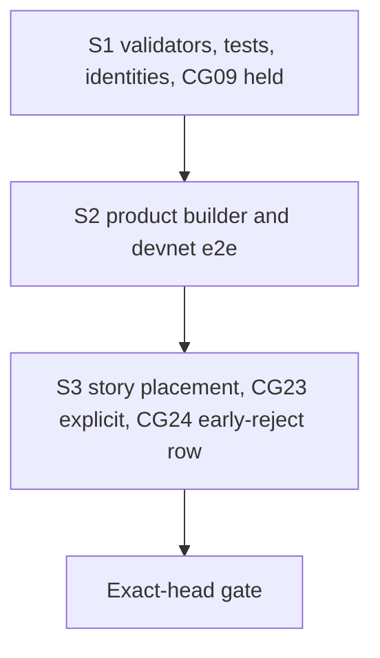

# Plan: repair the validators, then the builder, then the evidence

## Strategy

Three bisect-safe slices on one branch, one pull request. Each slice ships its own checks and documentation. The validator slice also moves CG09's expectation, because the chain's answer to CG09 changes in that commit. The conformance session must stay green at every commit.

## Constitution check

| Principle | How this plan meets it |
|---|---|
| I. Lean is the authority | Code moves to `exitAdmission .reject = none`. Lean is untouched. |
| II. Errors and conflicts go to the user | The consumer conflict over R9 is already escalated and stays held. The fold-timing discrepancy is owned by a separate ticket. Its correspondence claim stays held. |
| III. Whole claimed behaviour | Compiled tests cover both purposes and every refund-floor refusal. A connected devnet journey goes through the product builder. Model-compared live steps run through the story language. Each evidence class is named, never substituted for another. |
| IV. Evidence and gaps preserved | RED on the base, GREEN at the exact head, measured sizes and costs, named limits. |
| V. Forward repair | History, receipts and the published book are not rewritten. |
| VI. Suite as public evidence | The early-reject claim is CG24, said in the story language and rendered by the book. CG23 loses only the timing words the model does not have. CG09 stays published as unmet and held. No row's state is typed. |

## Slices

| Slice | Delivers | Invariants | RED (on the unrepaired code) | GREEN |
|---|---|---|---|---|
| S1 | FR-01–FR-04, FR-07 (CG09 held), FR-08, KR-01–KR-03 | INV-01–INV-08, INV-11, INV-13, INV-14 (G10) | the new and restated Aiken tests for early state and request rejection fail on the base validators, naming `not-rejectable` or the request expectation, not a setup or decoding error | onchain and naming-onchain suites and identities green; deployed identity both ways; CG09 held in the generic session (G10) |
| S2 | FR-05 | INV-05, INV-09 | the new e2e window cases fail at the base builder ("no rejectable requests"). Run only if the slice's budget allows; the compiled RED of S1 is the required one. | devnet e2e: processing- and retraction-window rejects accepted, refund and state read back; the phase-3 case unchanged (G7) |
| S3 | FR-06 | INV-10, INV-12, INV-14 (G11, rows) | the retained refused processing-window transaction `2d39d638…` (ticket 287) is the live defect. S3 adds no RED campaign. | CG23 (G9) unchanged; CG24 (G11) agrees with the model on every step; the book (G8) renders every placement and six chapters |

The behavioural RED this ticket requires is S1's compiled one. Setup and decoding failures count as neither RED nor GREEN.

## Path fence

Writable, by slice. Anything else is a placement challenge before editing.

| Slice | Paths |
|---|---|
| S1 | `onchain/validators/{registry/fold.ak, request.ak, shared.ak, cage.ak, types.ak, registry/refusal.ak, cage.props.ak, cage_reject.tests.ak, cage_contribute.tests.ak, deposit_exits.tests.ak, cage_fixtures.ak, witness.ak, open_datum.tests.ak}`, `onchain/script-identity.json` (generator only), `naming-onchain/validators/{naming.ak, application.ak, fixtures.ak}` (pins only), `naming-onchain/script-identity.json` (generator only), `offchain/test/Singular/Application/OpenDatum/EnvelopeSpec.hs` (pin only), `conformance/app/Conformance/Run/CgRows.hs` (CG09), `.github/workflows/conformance.yml` (G10 body only), `docs/consumer-conformance.md` (CG09 row), `docs/onchain-validator-owners.md` |
| S2 | `offchain/lib/Singular/Registry/TxBuilder/Reject.hs`, `offchain/lib/Singular/Registry/Wire/Request.hs` (documentation of `requestPhase` only), `offchain/e2e-test/Singular/Registry/E2E/CageSpec.hs`, `.github/workflows/registry.yml` (e2e comment only) |
| S3 | `conformance/lib/Conformance/Story/Live.hs`, `conformance/app/Conformance/Run/Live.hs`, `conformance/lib/Conformance/Edge/Exit.hs`, `conformance/lib/Conformance/Edge/EarlyReject.hs` (new), `conformance/lib/Conformance/Book.hs`, `conformance/lib/Conformance/Receipt.hs` (CG24's step-completeness case only), `conformance/lib/Conformance/Rows.hs` (count and description), `conformance/app/Main.hs` (book chapters), `conformance/app/Conformance/Run.hs`, `conformance/app/Conformance/Run/Control.hs`, `conformance/app/Conformance/Run/CgRows.hs` (CG23 comment, CG24 runner), `conformance/conformance.cabal`, `conformance/test/**`, `conformance/rows.json` (the exact two-row change in the gate page), `conformance/README.md` (row count), `docs/consumer-conformance.md` (row count and range), `.github/workflows/conformance.yml` (G11 body and its comment only) |
| all | `specs/320-early-request-rejection/**` |

Forbidden: `lean/**`, `.specify/**`, every `flake.lock` and `aiken.lock`, any receipt field, constructor or encoding, every `rows.json` row other than CG23's two sentences and the appended CG24, `conformance/BOOK.md`, `conformance/review/**`, historical fixtures, and any application behaviour.

## Gate

The full gate, with the verbatim command or step body for every row, its falsification and its nested accounting, is the [gate](gate.md) page. It has fourteen rows: the path fence; the onchain, naming and deployed identity checks; the off-chain lint, build, unit and vector checks; the devnet e2e through the product builder; the running book; CG23 unchanged; the generic rows with CG09 held; CG24; the release assembly; and root CI with stdin closed. One complete run at the exact head forecasts N83 and D6. The generic-rows step alone is N45, because it runs `jq` through `nix run` three times per row.

The register journey also calls the reject builder on resume. Its scenario only rejects requests already past their windows, so it is left to the pushed head's CI.

## Execution schedule

The implementation phase is not released by this plan. Forecast, per invocation:

| Step | C | N | D |
|---|---|---|---|
| S1 RED: G1 at the base with the new tests | 4 | 1 | 0 |
| S1 GREEN: blueprint, registry regeneration, two naming regenerations, G1–G5 | 8 | 21 | 1 |
| S2: component build, unit suite, lint, G7 | 8 | 5 | 1 |
| S3: `run CG24`, `run CG09` alone, conformance format and lint, G8 | 8 | 10 | 3 |
| exact-head gate G0–G13, once | 2 | 83 | 6 |
| one bounded repair round | 10 | 15 | 2 |
| total | 40 | 135 | 13 |

If the pushed head's CI is the gate, the exact-head row becomes CI plus a local G0 and G13 (N3), and the forecast drops to C38/N55/D7. Nothing is repeated without a new change or failure.

## Team

The operator-approved team runs in sequence. The ticket owner (Claude Opus 5.5, high) owns this mandate, the gate and acceptance and writes no product code. One commit owner (Claude Opus 5.5, high) writes the RED tests, the code and the commits. One persistent independent auditor (Grok 4.7, high) answers every checkpoint. No other seat.
