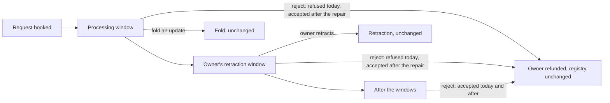

# A folder may reject a request before the retraction deadline

## The folder's story

As a folder, I turn away a pending request while it is still inside its processing window, or inside its owner's retraction window. The owner gets the deposit back (what the request holds minus the tip), the registry is left exactly as it was, and every existing payment, signer and token rule still applies.

The model already says this. `Singular.exitStep` with `Exit.reject` carries no admission. `Singular.exitAdmission` gives a reject `none`, and `Singular.obligations .reject` owes the owner the deposit. The deployed validators say otherwise. The state script refuses a reject until the retraction window has closed (`not-rejectable`). The request script admits its own spend only in the processing window or once rejectable. So a phase-2 reject stays refused even if only the state script is repaired. This ticket repairs the code to match the model. The model does not change.

## Authority and model binding

- Operator ruling, 2026-10-01: allow rejection before the retraction deadline; keep Singular's Lean and repair the validator. Issue [320](https://github.com/lambdasistemi/singular/issues/320), parent [209](https://github.com/lambdasistemi/singular/issues/209).
- Lean at `lean/Singular/Model.lean` blob `9c75b37380d5e6f56691345bcc50b60d3faf184b`, base commit `3f04e50d293b80360a3234ebf3114abc8172d851`. Definitions: `Exit` (:965), `obligations` (:989), `settle` (:1038), `exitStep` (:1068), `txOfExit` (:1110), `exitAdmission` (:1201), `admittedExitStep` (:1208), `admittedTxOfExit` (:1216). Statements: `admitted_exit_is_the_exit` (:1713), `built_transaction_settles` (:1602), `no_exit_strands_the_deposit` (:1552), `only_retract_owes_the_tip` (:1564).
- The constitution's `reject` row already reads "It carries no admission". No constitution change is needed.

## What changes for the user

| Requirement | Statement |
|---|---|
| FR-01 | The state script accepts a `Rejected` action for a request whatever the transaction's validity range: processing window, retraction window, after both, or a request dated in the future. |
| FR-02 | The request script, spent by `Contribute`, accepts when the state's fold rejects that same request, in any window. It still accepts in the processing window as today. |
| FR-03 | A rejection still owes the owner `held − tip`, positionally and by payee. A refund one lovelace short, to another key, to a script or missing is refused in every window, for `deposit-returned`. |
| FR-04 | A rejection leaves the state datum, root and value as they were and mints nothing. |
| FR-05 | The off-chain reject builder builds an accepted rejection for a request in its processing window and in its retraction window. Its refund is `held − tip`, topped up to the output minimum as today. |
| FR-06 | The published conformance evidence shows early rejections accepted by the chain and by the model, and refused tampered refunds, through the suite's own story language. |
| FR-07 | The consumer requirement that forbids early rejection (cardano-keri `R9_reject_needs_rejectable`, row CG09) is preserved word for word and reported unmet: the chain now accepts, and that row is held, never counted as passing. |
| FR-08 | Every compiled script identity the repair moves is regenerated by its own generator and checked in both directions. |

## What stays exactly as it is

| Requirement | Statement |
|---|---|
| KR-01 | A fold of an update stays processing-window only: the state script refuses it `not-phase1` outside that window, and the request script refuses a `Contribute` outside that window whose own action is an update. This validator rule has no counterpart in Lean today. It is preserved as it is, not claimed as model correspondence (see Limits). |
| KR-02 | Retraction is unchanged: insertion or read only, owner-signed, inside the retraction window, never beside a spent state, returned through an output bound to the request's own reference. |
| KR-03 | Every other fold rule, signer rule, token identity, settlement and state-continuation guard is unchanged. |
| KR-04 | The Lean model, the constitution, the receipt format, the consumer's requirement rows and the dependency locks are unchanged. |

## Invariants

Each invariant has one executable check at the layer where it could fail. RED means the check was seen failing on the unrepaired code for the stated reason. A setup or decoding failure is never RED.

| ID | Invariant | Layer | Fails when |
|---|---|---|---|
| INV-01 | State purpose admits `Rejected` in the processing window, the retraction window, after both, and for a future-dated request. | compiled Aiken | the state script halts `not-rejectable` or any timing reason on a reject |
| INV-02 | Request purpose admits a `Contribute` whose matching state action is `Rejected` in the processing and retraction windows. | compiled Aiken | the request script refuses that spend |
| INV-03 | Update timing preserved: the state refuses an update outside the processing window `not-phase1`. The request refuses a `Contribute` outside it whose matching action is an update. | compiled Aiken | either purpose admits it |
| INV-04 | Refund floor held in early windows: short, other key, script and missing refunds are refused `deposit-returned` in the processing and retraction windows. | compiled Aiken | an early reject with a bad refund is admitted |
| INV-05 | A reject continues the state unchanged and mints nothing. | compiled Aiken, devnet readback | state datum, root or value differ, or a mint appears |
| INV-06 | Retraction refusals and acceptance are unchanged. | compiled Aiken (existing suite) | any existing retraction test changes outcome |
| INV-07 | No dead guard: the old rejectability predicate is gone together with its last callers. No property or test still asserts that an honest early request is not rejectable. | compiled build, source fence | a caller or property of the old rule survives |
| INV-08 | Identity: each moved hash equals its regenerated manifest entry, and every hand-carried pin equals the regenerated hash. | identity checks | a manifest or pin disagrees with the built blueprint |
| INV-09 | The product reject builder's transaction is accepted on a devnet in the processing window and in the retraction window, with owner refund and unchanged state read back from the ledger. | devnet e2e | the builder refuses to build, or the ledger refuses |
| INV-10 | Model-bound early rejections agree with Lean. Untampered: accepted by both, owner paid at least the deposit, state unchanged. Tampered: refused by both, model reason `deposit-returned`, refusal attributed to the state script. | devnet conformance story | any comparison disagrees |
| INV-11 | CG09 consumer requirement unchanged. Its run reports the chain accepting with a held verdict, never `agrees-with-model`, and the session's held set is exactly CG09, CG11, CG12, CG19. | devnet conformance CI step | CG09 reports agreement, or the held set moves otherwise |
| INV-12 | CG23 keeps its evidence: its rejects are placed after the windows explicitly, and its CI assertion is unchanged. | devnet conformance CI step | CG23's receipt shape or verdict moves |
| INV-13 | Compiled sizes of the state and request scripts, and the execution units of both purposes on a reject, are recorded before and after. | measurement receipt | missing measurement |

## Holds and limits

- **Consumer conflict.** Cardano KERI at `0e638fadc987f0cd98f839edd3e3ecd5a09a1b91` (`RegistryGoals.lean` blob `d38e81c0b5d8f1137853439b83ff99281d5fa99f`) promises `R9_reject_needs_rejectable`: no early rejection. After this repair that promise is unmet. Whether the consumer is aligned or keeps the promise as an unmet integration requirement is not decided. Under constitution II, acceptance of the affected consumer integration stays held. This repair never changes CG09's requirement or counts it as passing.
- **Fold timing outside Lean.** Lean admits a fold in every window. The validator admits an update only in the processing window. This repair keeps that rule unchanged and makes no claim about it. A phase-2 update appears only as a compiled refusal, never as a model-compared step, because the model would accept it.
- **Published book.** `conformance/BOOK.md` states the code revision it was generated at. This repair does not hand-edit it.
- **Refusal reasons on chain** are not observed live: the deployed validators carry no traces. Each refusal's reason is established by the compiled Aiken tests that name it. Live refusals are attributed by script hash.
- **Follow-up.** Ticket 287 is rebound to the landed source afterwards. No receipt from before the repair proves the repaired scripts.

## Success

A folder can build, with the product's own builder, a rejection of a request booked moments earlier, submit it, and see it accepted. The owner is paid the deposit and the registry state is unchanged. The suite publishes that, compared with the model, beside refused tampered refunds. The consumer row that forbade it stays visible as unmet.
