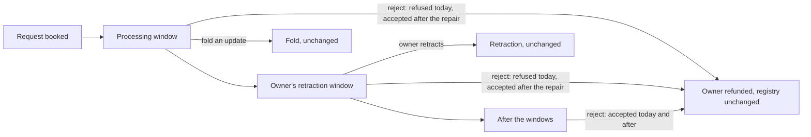

# A folder may reject a request before the retraction deadline

## The folder's story

As a folder, I turn away a pending request while it is still inside its processing window, or inside its owner's retraction window. The owner gets the deposit back (what the request holds minus the tip), the registry is left exactly as it was, and every existing payment, signer and token rule still applies.

The model already says this. `Singular.exitStep` with `Exit.reject` carries no admission. `Singular.exitAdmission` gives a reject `none`, and `Singular.obligations .reject` owes the owner the deposit. The deployed validators say otherwise. The state script refuses a reject until the retraction window has closed (`not-rejectable`). The request script admits its own spend only in the processing window or once rejectable. So a phase-2 reject stays refused even if only the state script is repaired. This ticket repairs the code to match the model. The model does not change.

## Authority and model binding

- Operator ruling, 2026-10-01: allow rejection before the retraction deadline; keep Singular's Lean and repair the validator. Issue [320](https://github.com/lambdasistemi/singular/issues/320), parent [209](https://github.com/lambdasistemi/singular/issues/209).
- Lean at `lean/Singular/Model.lean` blob `9c75b37380d5e6f56691345bcc50b60d3faf184b`, base commit `3f04e50d293b80360a3234ebf3114abc8172d851`. Definitions: `Exit` (:965), `obligations` (:989), `settle` (:1038), `exitStep` (:1068), `txOfExit` (:1110), `exitAdmission` (:1201), `admittedExitStep` (:1208), `admittedTxOfExit` (:1216). Statements: `admitted_exit_is_the_exit` (:1713), `built_transaction_settles` (:1602), `no_exit_strands_the_deposit` (:1552), `only_retract_owes_the_tip` (:1564).
- The constitution's `reject` row already reads "It carries no admission". No constitution change is needed.

## What changes for the user

| Requirement | Statement |
|---|---|
| state-script-accepts-rejected-action-for-request | The state script accepts a `Rejected` action for a request whatever the transaction's validity range: processing window, retraction window, after both, or a request dated in the future. |
| request-script-spent-by-contribute-accepts-state | The request script, spent by `Contribute`, accepts when the state's fold rejects that same request, in any window. It still accepts in the processing window as today. |
| rejection-still-owes-owner-held-tip-positionally | A rejection still owes the owner `held − tip`, positionally and by payee. A refund one lovelace short, to another key, to a script or missing is refused in every window, for `deposit-returned`. |
| rejection-leaves-state-datum-root-value-as | A rejection leaves the state datum, root and value as they were and mints nothing. |
| off-chain-reject-builder-builds-accepted-rejection | The off-chain reject builder builds an accepted rejection for a request in its processing window and in its retraction window. Its refund is `held − tip`, topped up to the output minimum as today. |
| published-conformance-evidence-shows-early-rejections-accepted | The published conformance evidence shows early rejections accepted by the chain and by the model, and refused tampered refunds, through the suite's own story language: a new row, reject-inside-processing-and-retraction-windows, sourced from Singular's model. reject-and-retract-refund-controls's requirement drops the old timing words, and its rejects stay explicitly placed after the windows. |
| consumer-requirement-that-forbids-early-rejection-cardano | The consumer requirement that forbids early rejection (cardano-keri `R9_reject_needs_rejectable`, row reject-before-deadline-consumer-requirement) is preserved word for word and reported unmet: the chain now accepts, and by operator ruling 2026-10-01 the row carries the verdict `unmet-by-ruling`, never counted as passing. |
| compiled-script-identity-repair-moves-regenerated-by | Every compiled script identity the repair moves is regenerated by its own generator and checked in both directions. |

## What stays exactly as it is

| Requirement | Statement |
|---|---|
| fold-update-stays-processing-window-state-script | A fold of an update stays processing-window only: the state script refuses it `not-phase1` outside that window, and the request script refuses a `Contribute` outside that window whose own action is an update. This validator rule has no counterpart in Lean today. It is preserved as current validator behaviour outside Lean, never called Lean conformance (see Limits). |
| retraction-unchanged-insertion-or-read-owner-signed | Retraction is unchanged: insertion or read only, owner-signed, inside the retraction window, never beside a spent state, returned through an output bound to the request's own reference. |
| other-fold-rule-signer-rule-token-identity | Every other fold rule, signer rule, token identity, settlement and state-continuation guard is unchanged. |
| lean-model-constitution-consumer-s-requirement-rows | The Lean model, the constitution, the consumer's requirement rows and the dependency locks are unchanged. The receipt format gains one verdict value, `unmet-by-ruling`, for reject-before-deadline-consumer-requirement by operator ruling 2026-10-01; its fields are unchanged. |

## Invariants

Each invariant has one executable check at the layer where it could fail. Where the base violates an invariant (state-purpose-admits-rejected-in-processing-window and request-purpose-admits-contribute-whose-matching-state in the processing and retraction windows, refund-floor-held-in-early-windows-short in those windows, product-reject-builder-s-transaction-accepted-on, model-bound-early-rejections-agree-lean-untampered), RED means the check was seen failing on the unrepaired code for the stated reason. The others are preservation or identity checks: green at the base, and able to fail in the way their row names. A setup or decoding failure is never RED.

| ID | Invariant | Layer | Fails when |
|---|---|---|---|
| state-purpose-admits-rejected-in-processing-window | State purpose admits `Rejected` in the processing window, the retraction window, after both, and for a future-dated request. | compiled Aiken | the state script halts `not-rejectable` or any timing reason on a reject. At the base this happens in the processing and retraction windows only; the other two ranges are preservation. |
| request-purpose-admits-contribute-whose-matching-state | Request purpose admits a `Contribute` whose matching state action is `Rejected` in the processing and retraction windows. Its matching action is the one the state's fold pairs with it: with two requests and their actions in either order, only the rejected one is admitted outside the processing window. Two mutations, admitting on any reject and admitting on the first action, are each seen failing that test. | compiled Aiken, two mutation runs | the request script refuses that spend, or either mutation survives |
| update-timing-preserved-state-refuses-update-outside | Update timing preserved: the state refuses an update outside the processing window `not-phase1`. The request refuses a `Contribute` outside it whose matching action is an update. | compiled Aiken | either purpose admits it |
| refund-floor-held-in-early-windows-short | Refund floor held in early windows: short, other key, script and missing refunds are refused `deposit-returned` in the processing and retraction windows. | compiled Aiken | an early reject with a bad refund is admitted |
| reject-continues-state-unchanged-mints-nothing | A reject continues the state unchanged and mints nothing. | compiled Aiken, devnet readback | state datum, root or value differ, or a mint appears |
| retraction-refusals-acceptance-unchanged | Retraction refusals and acceptance are unchanged. | compiled Aiken (existing suite) | any existing retraction test changes outcome |
| no-dead-guard-old-rejectability-predicate-gone | No dead guard: the old rejectability predicate is gone together with its last callers. No property or test still asserts that an honest early request is not rejectable. | compiled build, source fence | a caller or property of the old rule survives |
| identity-moved-hash-equals-its-regenerated-manifest | Identity: each moved hash equals its regenerated manifest entry, and every hand-carried pin equals the regenerated hash. The naming scripts' compiled code carries the registry's current state hash, and the application's carries the current retirement-custody hash. That is checked mechanically by the deployed identity check, which has no such check today. | identity checks (aiken-suite-properties-format-registry-identity, naming-suite-identity, deployed-identity-both-ways-naming-scripts-embedded) | a manifest or pin disagrees with the built blueprint, or a naming script still embeds a superseded hash |
| product-reject-builder-s-transaction-accepted-on | The product reject builder's transaction is accepted on a devnet in the processing window and in the retraction window, with owner refund and unchanged state read back from the ledger. Its validity interval is finite, starts at the current tip, is bound to no deadline, and lies inside the named window, read from the request datum and the state. The existing case keeps its name, "rejects a phase-3 request", which reject-after-window's evidence cites. | devnet e2e (product-builder-on-devnet) | the builder refuses to build, the interval lies outside the window, or the ledger refuses |
| model-bound-early-rejections-agree-lean-untampered | Model-bound early rejections agree with Lean. Untampered: accepted by both, owner paid at least the deposit, state unchanged. Tampered: refused by both, model reason `deposit-returned`, refusal attributed to the state script. | devnet conformance story | any comparison disagrees |
| reject-before-deadline-consumer-requirement-consumer-requirement | reject-before-deadline-consumer-requirement consumer requirement unchanged. Its run first submits the request's processing-window reject refunding the owner one lovelace short, refused and attributed to the state script. It then submits the untampered reject with full-fold execution units, accepted and reported with the verdict `unmet-by-ruling`, never `agrees-with-model` and never `held-q002`. The session's held set is exactly empty-fold, surplus-fold-actions, request-value-and-refund-routing and its unmet set exactly reject-before-deadline-consumer-requirement. | devnet conformance CI step (gate body-generic-rows-reject-before-deadline-consumer) | reject-before-deadline-consumer-requirement reports agreement or a hold, its refused control is missing, or the held or unmet set moves otherwise |
| reject-retract-refund-controls-keeps-its-evidence | reject-and-retract-refund-controls keeps its evidence: its rejects are placed after the windows explicitly, and its CI assertion is unchanged. | devnet conformance CI step | reject-and-retract-refund-controls's receipt shape or verdict moves |
| compiled-sizes-state-request-scripts-execution-units | Compiled sizes of the state and request scripts, and the execution units of both purposes on a reject, are recorded before and after. | measurement receipt, checked by the owner at acceptance (no gate row) | the receipt is missing a figure; not a RED invariant |
| workflow-carries-acceptance-checks-step-bodies-byte | The workflow carries the gate's body-generic-rows-reject-before-deadline-consumer and body-reject-inside-processing-retraction-windows-early step bodies byte for byte, and body-reject-retract-refund-controls-unchanged's unchanged. `rows.json` changes only reject-and-retract-refund-controls's two timing sentences and appends reject-inside-processing-and-retraction-windows. | gate once and extraction compare | a step body or another row differs |

## Holds and limits

- **Consumer conflict.** Cardano KERI at `0e638fadc987f0cd98f839edd3e3ecd5a09a1b91` (`RegistryGoals.lean` blob `d38e81c0b5d8f1137853439b83ff99281d5fa99f`) promises `R9_reject_needs_rejectable`: no early rejection. After this repair that promise is unmet. Operator ruling 2026-10-01: the promise is kept as a visible unmet consumer requirement; reject-before-deadline-consumer-requirement carries the verdict `unmet-by-ruling`, and alignment is lambdasistemi/cardano-keri#468. This repair never changes reject-before-deadline-consumer-requirement's requirement or counts it as passing.
- **Fold timing outside Lean.** Lean admits a fold in every window. The validator admits an update only in the processing window. That is a separate discrepancy between the code and the model, to be repaired by its own ticket. This repair keeps the update rule unchanged in its bounded diff. A phase-2 update appears only as a compiled refusal labeled current validator behaviour outside Lean, never as a model-compared step, because the model would accept it. Any claim that fold timing conforms to Lean stays held.
- **Builder selection.** The reject builder rejects every pending request of its registry, now including fresh ones. One unprocessable request (a deposit that does not match) makes any builder reject refuse `deposit-mismatch`, as it already did for expired requests. Choosing a subset is out of scope.
- **Published book.** `conformance/BOOK.md` states the code revision it was generated at. This repair does not hand-edit it.
- **Refusal reasons on chain** are not observed live: the deployed validators carry no traces. Each refusal's reason is established by the compiled Aiken tests that name it. Live refusals are attributed by script hash.
- **Follow-up.** Ticket 287 is rebound to the landed source afterwards. No receipt from before the repair proves the repaired scripts.

## Success

A folder can build, with the product's own builder, a rejection of a request booked moments earlier, submit it, and see it accepted. The owner is paid the deposit and the registry state is unchanged. The suite publishes that, compared with the model, beside refused tampered refunds. The consumer row that forbade it stays visible as unmet.
