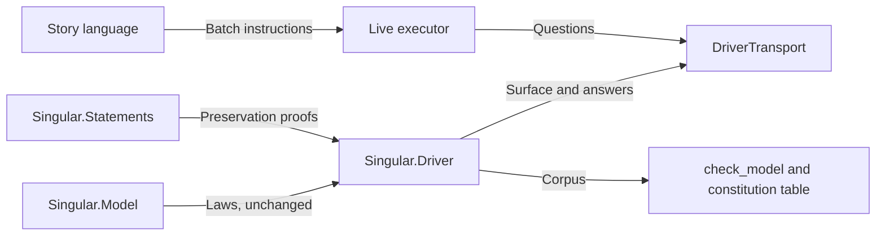

# Keep the driver the only translator

As a maintainer, I want the batch questions inside the existing driver, transport and story responsibilities.

## Responsibilities

The model owns the laws and stays unchanged. The driver owns the batch questions, their outcomes and observation extents; nothing outside it composes `foldBatch`, `obligations` or `settle` into an answer. The transport only carries questions. The story language owns the instructions; the executor owns submission and the question it asks. Dependencies keep this direction.
