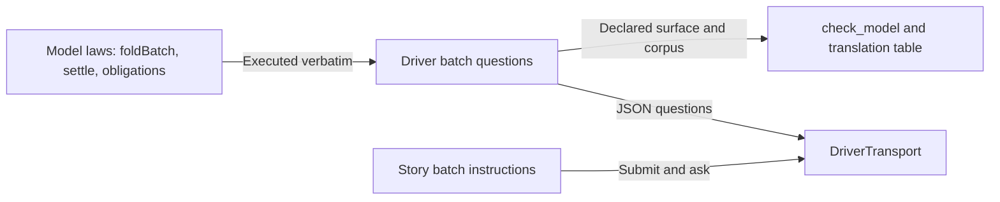

# Expose two batch questions

As a contributor, I want the batch laws reachable through the driver, its transport and the story language in one reviewed change.

## Delivery

Two slices, in order, by one coder, with RED, each acceptance line GREEN and pre-push checkpoints reviewed by the persistent auditor.

### Slice S1: the driver answers both questions

Driver, statements, transport, corpus, `tools/check_model.py`, translation table and every consumer of the moved surface digest, theorem manifest and Lean mirror. Delivers INV-344-FOLD, REJECT, PRESERVE, SURFACE and CONTROLS.

### Slice S2: the story language says a batch

Story instructions, their validation, rendering and execution, and the model question the executor asks. Delivers INV-344-STORY. No conformance row changes state; the CG11, CG19 and CG21 comparisons and receipts belong to #287.

## Boundary

`lean/Singular/Model.lean` stays byte-identical. A preservation statement that is false as written is returned with its counterexample, never weakened. Offchain, onchain and conformance rows are outside the writable scope.

## Verification limits

The model check and corpus establish what Lean answers; they do not establish that a chain agrees. Story execution establishes that a batch is submitted and asked, not that the comparison holds.
