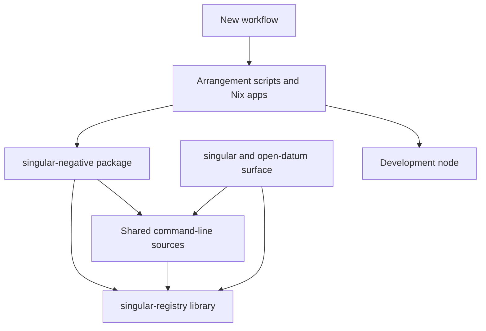

# Host components

As a maintainer, I want the bypass to live in one package that nothing ordinary depends on, so that installing `singular` never installs it and a reviewer can see that from the build.

## Responsibilities

The arrow points from the user of a thing to the thing. Nothing points into the host except the arrangement scripts that run it. The ordinary executables point only at the shared sources and the library.

| Component | Responsibility |
|---|---|
| `offchain/negative/` (new package `singular-negative`) | The executable and the host modules: the three negative-only command forms, the crafted transaction shapes, unevaluated submission, the verdict classifier, the before and after reads, the receipts. Its source directories name `app`, `src` and `../cli/src`; it depends on the registry library. |
| `offchain/cli/src` (existing, not edited) | Command parsing, registry attachment, session, funding, journal, receipts and the root composition. Shared by name, compiled into the host exactly as `cage-tests` compiles it. |
| `offchain/lib` (existing, not edited) | The production transaction builders and the open-datum application modules the host builds with. |
| `nix/negative-host.nix` (new) | The Nix apps: discovery of the pairs, one pair on the archive and a fresh node, the mutant run, the ordinary-executables check. |
| `tools/negative_host_*.sh` (new) | Arrangement only: assemble and extract the release archive, build the host and the node from the archive's own offchain flake, start the node, fund the wallets, run one part, judge every clause from the receipts. |
| `.github/workflows/negative-host.yml` (new) | The pair jobs, the mutant job and the ordinary-executables job, nix-only, one concurrency group per pull request. |

## Shared modules the host reads and does not change

The host takes `Singular.CLI.Command` for parsing, `Singular.CLI.Attached`, `Singular.CLI.Live` and `Singular.CLI.Session` for attaching to a registry and for the node session, and `Singular.CLI.Root` and `Singular.CLI.Finish` for composition and exit. It builds with `Singular.Registry.TxBuilder` and `Singular.Application.OpenDatum` modules.

One finding, recorded for the plan review: `Singular.CLI.Plan.planUpdate`, `planTerminate` and the handlers in `Singular.CLI.Entry` fuse the controller check with planning, so the host cannot reuse them with the check off. It does not need to: the host's own handlers call the library builders directly for the forbidden forms and call the shared attach and session code for everything common. No ordinary module gains a parameter, flag or hook. If the coder finds a shared function without a reachable lower entry point, it stops and the ticket owner asks.

## Dependency direction and fences

- The host depends on shared code; shared code never names the host. The ordinary executables' stanzas stay unchanged.
- No host module is copied into the shared sources, and no shared module is copied into the host package; a duplicated module name is a failure.
- The host's modules are the only place a refusal is skipped. The other way round, a control reads the built ordinary executables and fails if any host module is in them.
- The conformance package is not edited. Its harness keeps its copy of the crafting until the command-line split; the duplication is named as a residual and the gate still proves the shipped ordinary binaries hold no copy and no bypass.

## Files the slice touches

Existing files, added lines only, one line each except the inventory (a named desk exception):

| File | Change | Shared surface |
|---|---|---|
| `offchain/nix/project.nix` | one line naming the new package directory in the Nix project (the cabal project file stays untouched, because the conformance build rewrites only its `  .` line) | nix |
| `offchain/flake.nix` | one line exposing the host package beside `singular` | nix |
| `flake.nix` | one line importing `nix/negative-host.nix` into the apps | nix apps |
| `mkdocs.yml` | one navigation line for the new page | documentation |
| `tools/code_inventory.py` | 35 added lines, none changed: two policies and one rule mapping `offchain/negative/**/*.hs` to the host's own lint app | code inventory |

All other changes are new files: the package under `offchain/negative/`, `nix/negative-host.nix`, `tools/negative_host_*.sh` with their controls, `.github/workflows/negative-host.yml`, `docs/negative-host.md` with its speech companion, and this specification directory. The release archive copies the `offchain`, `tools` and `conformance` partitions whole, so the new files ship without editing the archive definition or its checker. None of the touched or new files is a validator, a Lean file, a fold-builder module, a state-directory or session module, a funding module or any create, inspect or preview module.
