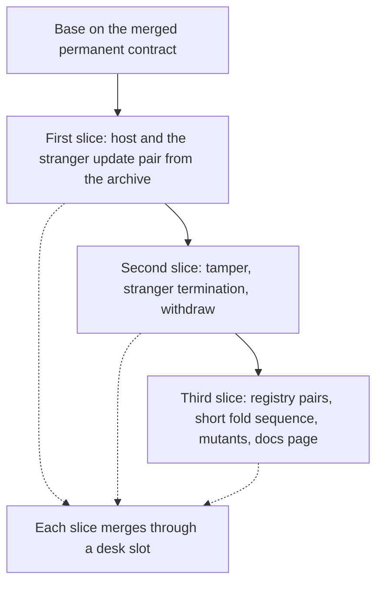

# Deliver the host in three slices

As a contributor, I want the host delivered in cuts that each close within an afternoon and each leave the repository releasable, so that the first pair runs from the release archive early and the rest follow on the same host.

## Bound facts

Worktree `/code/singular-issue-358`, branch `feat/358-singular-adversary`, base: origin/main at the merge of the permanent two-edge contract (the branch was rebased onto it once, without conflict). Constitution 1.14.0. The ordinary `singular` is one executable built from `offchain/cli/src`, which is not a library. The crafted forbidden transactions exist today only in the conformance harness (`conformance/app-cli/Conformance/Cli/Backend.hs`); no command line reaches them.

A build check in a scratch copy shows the shape works: a second package whose source directories are its own `app` and the shared `../cli/src`, depending on the registry library, builds under the project's Nix Haskell setup, and the executable prints the shared parser's usage. Naming the package in `offchain/cabal.project` would break the conformance build, which derives its merged project by rewriting only the line `  .` of that file, so the package is named from the Nix project instead. The cost in shared files is one line in `offchain/nix/project.nix` and one line in `offchain/flake.nix`.

Each box is one pull request on this branch, merged with a merge commit in the desk's queue (slot 7) once every checkpoint is approved and the exact head's hosted checks are green, including the end-to-end Demo 1 jobs.

## Decisions

| Chosen | Reason |
|---|---|
| The host is its own package with its own cabal file | One line in the Nix project instead of a stanza in the shared cabal file; the component inventory gate reads only the existing package file and is untouched. |
| The code inventory gets a dedicated rule for the host | The inventory refuses any Haskell file under `offchain` that no checker visits and the off-chain lint does not visit the host, so mapping the host to the off-chain policies would state a false enforcement. A named desk exception allows about thirty added lines in `tools/code_inventory.py`: two policies and one rule whose carrier is the host's own lint app, no existing line changed. |
| Source sharing by directory, no library cut | Epic owner ruling A-001; the command-line split (528) later changes only the host's build stanza. |
| Crafting written once, in the host | Acceptance names it; the harness copy stays and is a named residual until 528's cleanup. |
| Every pair part builds the host from the extracted release archive | The pair must run through the archive; a part that used the checkout's build would not. |
| Judge computed from receipts, in arrangement scripts | The conformance modules are not edited; each clause must change when a receipt is altered, which the part's own controls show. |
| Mutants and the docs page last | They need the pairs they are about; a mutant job that grows with each slice would be edited three times. |
| New workflow file and new Nix file | The release condition allows one line in a shared file; pair jobs, mutant job and ordinary-executables job are many lines. |

## Slices

| Slice | Delivers | Left for later |
|---|---|---|
| first | the package and executable on the shared sources and library; the three negative forms parsed; the holding-spend crafting moved out of the harness into the host; the stranger-updates pair (forbidden and control) on a fresh node from the extracted archive; the ordinary-executables check; the key-bytes scan; the new workflow with discovery and one pair part | the other pairs, mutants, docs page |
| second | the tamper family as one pair per tampered field, the stranger termination booking, the withdraw, each with its control, as new parts | registry pairs, short fold, mutants, docs |
| third | the four registry pairs through booking and unevaluated fold, the connected short-fold sequence, the mutant validators and their job for every pair, the docs page, the residual list | none |

A slice that will not close within an afternoon of coder time is cut again before dispatch and the cut is asked as a question. Rejection pairs are not in any slice; they are named pending until protected rejection lands.

## Verification and delivery

The frozen gate is the table of commands in the gate record, bound to the CI that exists plus the CI this ticket adds in its own new files. The commit owner runs, per candidate, the narrow legs: the host's incremental build, the off-chain lint and format checks, the whole-repository lint for the new shell, Nix and YAML files, the command-run examples of the ordinary suite, the ordinary-executables app and the documentation check. It runs the aggregate `just ci` once, on the final candidate of a slice. The archive pair jobs and the mutant job are hosted-only; a hosted failure is one repair commit.

Only reviewed candidates are pushed; specification commits travel with the first candidate. The pull request is created as a draft, labeled and assigned, and its body describes the diff and its limits in the template's four sections. Commits carry no attribution of any kind; the range is searched for trailers before every push. The pull request is a patch stack with no journey commits.

## Evidence the ticket produces

Per pair: the forbidden receipt naming the refusing script by hash and role, the control's accepted receipt, and the two reads. Per slice: the hosted run of each part on the exact head. For the third slice: the mutant runs, one per pair. Left uncovered and named in the pull request: rejection pairs; the harness copy of the crafting; the pairs on the permanent contract until it lands; any pair the model cannot state.

## Budget and staffing

One team for this epic: the ticket owner, one commit owner (Muse through the pi harness) given the whole slice with a terminal condition of green, blocked or at capacity, and one mute persistent auditor (GLM through the pi harness) launched beside it. No nudges, no run counting, no extra seat, no draft tool. If the permanent-contract branch or the command-line split changes the layout under this branch, the ticket owner follows the desk's order and rebases only at a safe boundary.
