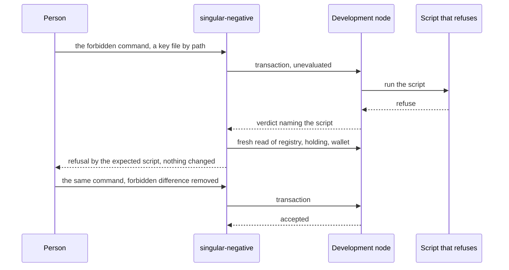

# Forbidden moves refused by the chain

As a person evaluating Singular, I type under `singular-negative` the same registry command I type under `singular`, for example `singular-negative registry terminate --key alice-1 --wallet-skey bob.skey`. The host sends it to the node with no local safeguard. The chain refuses it and names the script that did, and a fresh read shows the registry, the key's holding and my wallet unchanged. Beside it, the same command with the one forbidden difference removed is accepted.

## User stories

The ordinary `singular` stops these moves before the node sees them, so a reader cannot tell whether the chain or the polite client held the line. `singular-negative` removes the client from the argument: it builds the transaction the person asked for, signs with any key the person names, skips every local check and local script evaluation, and submits.

The sequence shows one pair. The ticket delivers every pair in the table of the data model, each run on a generated development node from the extracted release archive.

## Rulings in force

These are quoted, not referenced. Where a ruling is not yet landed, the text says what the host does meanwhile.

- Operator ruling of 8 October 2026, issue 528: "the application binary links Singular up to the command-line layer so Singular's flags pass through; the only Singular CLI is `registry`; M1." The planning ruling of 9 October states what it means for this host: "the CLI split (#528: build against the library's request and fold, not the open-datum envelope)". Issue 528 has not landed; the host's one spelling is `singular-negative registry insert|update|terminate|withdraw|fold|inspect`, and its flags are the shared flag group, so they do not change when 528 lands.
- Host shape, epic owner ruling A-001 of 9 October: "`singular-negative` is its own executable in the release archive. Host-only modules (crafting, skipped client checks, unevaluated submission, any signer, the three negative-only forms) live only in the host's own source directory and component." and "the host executable shares `offchain/cli/src` exactly the way `cage-tests` already does — by naming it in its `hs-source-dirs` — plus the existing `singular-registry` library (`offchain/lib`) for building." and "no ordinary module gains a parameter, flag or hook that switches a refusal off". No library is cut from the command-line layer by this ticket.
- Inline request datum, operator ruling of 9 October as recorded on issue 529: "the request keeps carrying its datum inline and the application decides its size (2026-10-09); batch capacity is measured and raised in #530". Constitution 1.13.0 states the law: "A request carries the datum value it names for its delivered output, or none". The host sets no size cap and builds the booking through the shared builders.
- Request tag, issue 529: "A request is a Singular request only if its output carries one token minted by Singular's request policy in the transaction that created it." When that lands the shared builders mint the tag; the host books through them and needs no change. A booking crafted to omit the tag is a protected-rejection control, not a row here.
- Staffing ruling of 9 October: ticket owner Claude Sonnet 5.5 at extra-high effort; commit owner Muse through the pi harness (`/home/paolino/.local/bin/muse --approve`); mute persistent auditor GLM through the pi harness (`/code/llm-settings/pi/glm --approve`); "gate authors | the ticket owner and the auditor seat". No other seat, no draft tool, no Codex.
- Release condition of 9 October, 08:05 UTC: this ticket runs as a third lane "on the condition that #358 is almost conflict-free: new files for the host and its controls, at most one line in each shared file (nix apps, the workflow, the cabal file), no edit to modules the live slices touch (CLI create, inspect, preview, the funding and session layers, validators, Lean)". Merge only through the desk's queue; this ticket is slot 7.
- Lean authority, constitution 1.14.0, Principle I: "The accepted, revision-bound Lean model MUST govern the simulator, on-chain validators, off-chain transaction construction, and conformance expectations." If the model is wrong or silent on a claimed pair, the pair is held and escalated as a user story; an expectation is never weakened to match the code.

## Requirements

| Requirement | Meaning | Severity |
|---|---|---|
| host-is-its-own-executable | `singular-negative` ships in the release archive as its own executable in its own package; no ordinary executable links a host module. | BLOCKING |
| shared-parsing-and-building | Command-line parsing, registry attachment, session, funding, journal and receipts come from the shared command-line sources and the registry library; nothing is copied. | BLOCKING |
| crafting-lives-once | The crafted transactions are written once, in the host's package. The conformance harness keeps its own copy for now, recorded as a residual. | BLOCKING |
| every-pair-through-the-archive | Every pair in the data model runs on a generated development node from the extracted release archive. | BLOCKING |
| refusal-credited-by-node-verdict | A refusal counts only when the node's own verdict names the expected script. Client, setup and encoding failures are reported as such and never counted. | BLOCKING |
| honest-control-accepted | Each pair's accepting control, the same command with the one forbidden difference removed, is accepted. | BLOCKING |
| mutant-validator-fails-the-row | For each pair, a validator that permits the forbidden behavior makes that pair's forbidden check report failure. | BLOCKING |
| connected-short-fold-sequence | A booked termination, then `fold --pay-short 1` refused with the request still pending and the deposit held, then the honest fold of the same request, form one connected run over one request. | BLOCKING |
| nothing-changed-after-refusal | After every refusal a fresh read shows the registry, the key's holding and the wallet unchanged. | BLOCKING |
| ordinary-cannot-reach-the-bypass | The ordinary executables refuse the bypass spellings as unknown and contain no host module, read from the built executables. | BLOCKING |
| keys-by-path-only | Keys are given by path; no key material appears in any receipt, output or error. | BLOCKING |
| docs-page | A page "What `singular-negative` shows" gives each command, the refusal it expects, the ordinary command it mirrors today and after 528, and the limit. | BLOCKING |

## Model and limits

Lean authority is the active model at the repository base, the two-edge law (constitution 1.14.0); the application model revision the conformance evidence is compiled against is de34300540223ccedf1ca85216b131fd09a148b4. The statements the pairs rest on exist in the open-datum application model: `duplicate_refused_by_registry`, `resurrection_refused_by_registry`, `update_requires_controller`, `update_preserves_custody`, `bookTerminate_inversion`, `only_fold_releases`, `fold_settles_additively`. This ticket changes no validator, no Lean file and no model rule.

A refusal shows the rule held for that transaction on that chain. The general guarantee is carried by the model statements and the validator tests, not by these runs. Rejection pairs wait for protected rejection (issues 498 and 529) and are named pending until that rule lands; they are neither credited nor dropped. The harness copy of the crafting in the conformance package remains until the command-line split (528) cleans up; it is a residual, not a pass.

Out of scope, by number: 528 (command-line split), 523 and 505 (permanent two-edge contract), 498, 494, 495, 506 and 529 (protected rejection), 359 (preprod demonstration that consumes this host), 518, 519 and 496 (fold builder), 485, 477 and 493 (state directory and session), 471, 406, 478, 479 and 491 (funding and publication), 530 (batch capacity), 300 and 301 (preprod registry and packaging).
