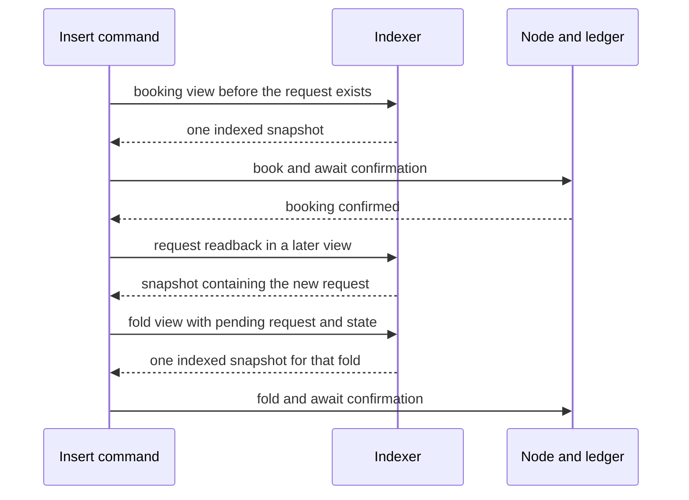

# Decisions for persistent registry reads

As a registry user, I want the read source and its limits to be explicit, so I
can distinguish an indexed answer from an incomplete view or a ledger refusal.
These decisions accompany the [specification](spec.md) and [plan](plan.md).

## Recorded operator rulings

| User story | Chosen behavior | Alternative excluded and reason |
| --- | --- | --- |
| As a user, I stop paying for replay on each command. | Replace the in-memory `indexer` backend; make the socket backend the default. | Adding another backend or keeping an `indexer` alias retains the obsolete path. Authority: the epic-owner brief's replace ruling. |
| As a writer, I can use the faster source before node pinning is available. | Within each source, reads share its acquired state; the node stays acquired at tip. Document mixed moments and name spent-input rejection. | Requiring equality between source points, pinning or automatic retries belongs to #376 and upstream #218. Authority: the brief's interim atomicity ruling and #377's Reads section. |
| As a reviewer, I can inspect the contract from the first push. | Commit these user stories, plan, research inventory and stamped speech companions before implementation. | Machine-local plans alone provide no repository review surface. Authority: the brief's repository-specs ruling. |
| As an operator, I keep public networks untouched. | Public-network activity is reads only. | Transactions, new public registries and secret access are outside the brief. |

## Proposal for snapshot scope across a command

As a user inserting a key, I want the fold to see the request my booking just
created, so one ordinary command can complete. At the bound revision,
`CLI.Entry.book` confirms the booking and reads the request in a later view;
`foldAndCommit` acquires another view, requires that request to be pending,
and builds its fold there. Create likewise publishes, confirms, then reads
new references and state. [The view map](plan.md#commands-and-their-acquired-views)
records these phases.

**Intake scope, pending the operator's ruling:** atomicity is per acquired view. Views
after confirmation may advance; all lookups inside any one view share its
indexed point. Node operations inside that view share one node acquisition,
without node/indexer equality. A view frozen before booking cannot
serve a later fold's request. The intake does not design a command-wide alternative.

#377's Reads section already says “within one acquired view”; #371's goal
and child text say all reads of one command share a snapshot. The epic owner's answer on 2026-10-02 permits this recommended scope for intake,
but records that the ruling is pending above with the operator through the
parent Demo 1 owner. The epic owner cannot settle the per-command wording.
Affected implementation stays parked until a note forwards that operator
ruling and reconciles the parent contract. The underlying Lean transitions
remain unchanged.

## Proposal for the node address-read exception

As a developer starting a fresh chain, I need to spend genesis funding before
any block contains it. `offchain/devnet/Main.hs:fund` reads `genesisAddr` and
submits funding transactions before printing the socket; those transactions
create the ordinary journey wallets. A block-replay index cannot observe the
original genesis output. The existing journey also calls
`singular registry create --preview` against that genesis wallet and checks that
the node can identify its seed while the old index refuses coverage.

**Intake direction accepted by the epic owner on 2026-10-02:** retain node address reads for the devnet
bootstrap and the explicit `registry create --preview --backend node`
genesis diagnostic. Keep socket reads as the default for the ordinary registry
journey. Other registry commands have no demonstrated need for node address
reads; remove their selection path when that boundary is accepted. No automatic
fallback may silently combine node address reads with an indexed view.

This is source evidence, not a fresh genesis experiment. The epic owner checks
this justification at intake acceptance. Genesis-only reads use the named node
path; the socket journey uses transaction-funded wallets. There is no request
for an upstream genesis mechanism. Document that origin block replay does not
include initial genesis outputs; no silent fallback makes that coverage whole.

## Socket protocol and pending choices

As an integrator, I want to consume the protocol upstream actually publishes.
The inspected upstream revision is
`1b3bf8b03d44de7db073b766c4a18b1065febfcf`. Its
[usage documentation](https://github.com/lambdasistemi/cardano-node-clients/blob/1b3bf8b03d44de7db073b766c4a18b1065febfcf/docs/usage/utxo-indexer.md)
documents one request per connection and library `readView`; it does not
publish the socket multi-query request. Separate
`utxos_at`, `ready` and `utxos_with_asset` calls do not establish atomicity.

| Choice | Current disposition |
| --- | --- |
| Compose every view's address and asset questions in one request. | Settled by the operator's atomic-composition note on 2026-10-02: upstream library `readView` is the mechanism; the socket form carries the same composition. No held session or lazy per-address socket call. The epic owner confirmed on 2026-10-02 that the socket release is not published and will be forwarded as an inbox note. Wait for that wire and revision; do not invent fields or refusal spellings. |
| How the default backend obtains its socket path. | Proposed explicit `--indexer-socket PATH`; omit it and refuse by name. Epic intake acceptance must approve this choice before implementation. |
| Indexed point versus node point in receipts and phase logs. | Both must be distinguishable; existing `viewPoint` and journal text currently describe one node point. The accepted contract must not relabel it as proof of a common point. Exact fields await the published protocol. |
| How a confirmed request becomes available to the next indexed view. | Preserve the connected journey and named failures; do not add a retry that claims to align node and indexer. Published readiness/confirmation semantics must be bound before dispatch. |

No commit owner, auditor, gate author or other worker is launched for intake.
After head-bound intake acceptance, the brief authorizes only its named commit
owner and auditor, in the ticket window. No additional seats are inferred from
skill recipes. The next action is the epic owner's intake review and socket
release, not implementation or upstream polling.
