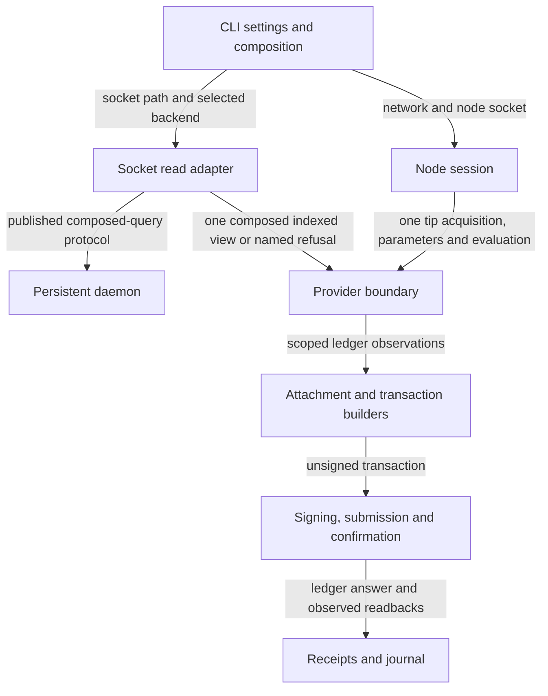

# Plan the persistent read boundary

As a contributor, I want to replace the slow read source while preserving each
registry journey and refusal, so reviewers can judge the change from a bounded
contract and executable evidence. This plan is bound to
`3b7a06bee8850ad6745f61ff5be7631fb8274909`; [decisions](decisions.md) names the
unresolved scope and upstream contract. This commit changes documentation only.

## Architecture and ownership

The adapter belongs with node composition, never individual builders. The
daemon owns persistence and snapshot consistency. `Provider` owns scoped
observations; the node retains ledger operations. The implementation must
separate indexed and node points without weakening view lifetime checks or
the command's receipt/journal evidence. Each view gathers its complete lookup extent into one composed request, as
settled by the operator's atomic-composition note on 2026-10-02. Exact library
signatures and socket fields remain unfrozen until the release.

## Commands and their acquired views

The complete parsed command extent is `Help`, `Create`, `Insert`, `Update`,
`Terminate`, `Inspect` in `CLI.Command` (five registry commands plus help).
The following is a source-derived map of acquisition phases, not observed
query counts. Conditional paths, repeated references and unresolved journals
change the lookup extent. A later implementation must discover all addresses
actually needed, including reference and reconciliation addresses, rather than
hard-code this table as a test denominator.

| Command and phase | Views in temporal order | Address/asset lookups within each view |
| --- | --- | --- |
| Help; local inspect with no node | None. | None. |
| Create public preview | One view in `runCreate`. | Caller wallet for seed and funding assessment. |
| Create preview holding a wallet key | Session setup, then one preview view. | Funding wallet during session admission; preview wallet for seed. |
| Create submit | Setup; seed selection; existing state-reference check; optional state-reference publication build; reference readback; boot build; boot readback; five reference-publication builds each followed by readback. | Setup/seed/existing reference: wallet. Publication/boot builds: payer wallet. Boot readback: registry state address. Reference readbacks: reference address (currently wallet). A reused state reference is also read back. |
| Insert preview | One whole preparation view. | Saved reference addresses and state via `attachLive`; wallet via measured booking. |
| Update or terminate preview | One whole preparation view. | Saved references, state, application holdings and funding wallet. |
| Insert submit | Setup; attach/reconcile; booking build; booking readback; fold build; post-fold attachment/root readback; application readback. | Setup: funding wallet. Attach: journal-dependent addresses, reference addresses, state. Booking: references, state, wallet. Booking readback: request address. Fold: request, state, wallet and context-dependent cage/holder addresses. After fold: references/state, then application holdings in a separate view. |
| Terminate submit | Same phase order as insert. | Booking additionally reads application holdings; fold uses the selected live holding. Final application readback checks the consumed holding is absent. |
| Update submit | Setup; attach/reconcile; update build; application readback; attachment/root readback. | Attach as above. Update: references, state, application holdings, wallet. Later views read the new application output and references/state respectively. |
| Inspect with a saved registry and node | One view, including reconciliation and attachment. | Journal-dependent addresses, saved references, state, application holdings. Authenticated leaf is read from the local mirror checked against state, not proved by the index. |
| Inspect interrupted create with node | One reconciliation view. | Addresses derived from saved transaction bodies, publication expectations and pending identity. |

Cross-cutting acquisitions: `Node.Session.awaitConnection` queries the initial
point; `Node.Funding.checkFunding` acquires a wallet view; confirmation's
validity/deadline conversions acquire node views; phase logging optionally
adds a point-only view at submission. They must not accidentally trigger empty
multi-query reads or node address fallback. `CLI.Session.submitBuilt` releases
its building view before signing and submission. Current asset selection is
local filtering over returned address outputs; the provider has no standalone
asset-query method. Any added asset lookup still belongs to the same indexed
snapshot as its view's address lookups.

Source anchors: `CLI.Create.runCreate/boot/observeReference`,
`CLI.Entry.attached/reading/book/foldAndCommit/runInsert/runUpdate/runTerminate`,
`CLI.Preview.runPreview`, `CLI.Inspect.inspectSaved/inspectIncompleteCreate`,
`CLI.Reconcile.liveReader`, `Deployment.Attach.resolveReferenceScripts/resolveStateUtxo`,
`TxBuilder.Update.Context`, and `CLI.Session.submitBuilt/tipAtSubmission`.

## Slices and release prerequisites

| Slice | Observable deliverable | Release prerequisite |
| --- | --- | --- |
| Intake | Spec, plan, decisions, quantified inventory, speech companions and factual draft PR. | This is the only authorized phase now. Stop after reporting its PR and head. |
| Freeze the shared contract | Record the operator ruling on snapshot scope, forwarded by the epic owner, exact released upstream revision/docs, completeness semantics and the justified node-only genesis boundary, points, lifetime and refusal mapping for one composed request per view. | Head-bound intake acceptance and upstream #210 slice 2 release. Planning may continue only under a new instruction. |
| Replace composition and migrate dependencies | Socket backend, final flags/default, decode and refusal behavior; delete obsolete in-memory address path, migrate shared confirmations and their tests, bump dependency in the same bisect-safe implementation change. | Frozen contract. Deletion alone cannot build against the new API or leave confirmations broken. |
| Prove view and ledger behavior | Real adapter checks for snapshot consistency, scoped lifetime, complete empty answers and named incomplete/unavailable answers; spent-input ledger failure through ordinary submission. | Released daemon and migrated composition. All atomicity checks carry controlled-fault RED receipts. |
| Prove the connected journey and publish evidence | Persistent daemon on devnet; socket-only ordinary address reads throughout create/insert/update/terminate/inspect; updated archive, help, docs and evidence; exact-head CI and auditor trail. | Prior slices. No public-network deployment or transaction. |

The implementation may combine the last two slices if separating them would
leave a failing or unobservable intermediate commit. No slice bypasses an
acceptance line. The [research inventory](research.md) is the initial deletion
denominator; rediscover it on each final candidate to catch orphaned callers,
declarations, docs, speech, packaging and tests.

## Gate commands and acceptance mapping

These commands are current CI carriers, not a frozen implementation gate or
claimed RED/GREEN results. No gate-author seats are authorized at intake.
Paths and commands below are runnable from a clean repository checkout.

| Acceptance line | CI carrier and expected successful exit | Required evidence added by this ticket |
| --- | --- | --- |
| Socket selection, default and old flag removal | `nix run --quiet .#cli-flags-check`, `nix run --quiet .#cli-flags-controls`, and `(cd offchain && nix run --quiet .#lint)`; exit 0. | Parser/help behavior, omitted backend choosing the socket, required socket-path refusal, old `indexer` spelling rejected. Updated flag docs and archive. |
| In-memory path removal and dependency bump | `(cd offchain && nix build --quiet .#component-build)`; exit 0. | New pin includes the released socket read; all affected components and surviving confirmations compile and run. Inventory is a source completeness aid, not behavioral evidence. |
| Every lookup in a view uses one snapshot; incomplete answers refused | `(cd offchain && nix flake check)` and `(cd offchain && nix run --quiet .#contract-tests)`; exit 0. | Extend the current CI suites in this ticket: a real socket view, at least two content-dependent lookups, a controlled daemon advance between reads, deliberate broken composition exposing mixed contents, and named coverage/readiness/transport cases. Mark as CI changes in this ticket until wired and run. |
| A spent output produces the named failure | `nix run --quiet .#demo1-cli-check`; exit 0. | Extend this CI journey with a deliberately spent input and a live accepting control; assert ledger rejection, CLI `ledger-refusal`, exit 11 and rejected journal entry. A setup failure or generic exception cannot count. |
| Devnet journey uses the socket backend | `nix run --quiet .#demo1-cli-check`; exit 0, carried by `.github/workflows/registry.yml`'s Demo 1 job. | Replace the old second in-process-index pass with the persistent daemon path. Capture actual socket answers/points and discover all executed view lookups; prove an omitted backend also uses it. Retain identity, root, controller, deposit and refusal assertions over the connected journey. |
| Specs, speech and declared limits | `nix run --quiet .#docs-check`; exit 0. Also run `python3 tools/check_presentation.py --front specs/377-utxo-indexer-socket/spec.md specs/377-utxo-indexer-socket` inside `nix develop`. | The repository-wide presentation command currently scans selected spec roots, so the focused intake check explicitly includes this directory. Add a CI carrier covering these pages during implementation, or escalate a missing carrier. |
| Whole repository | `nix develop --quiet -c just ci`; exit 0, `.github/workflows/ci.yml` development-shell job. | Exact implementation head, alongside every required CI job. Root CI does not itself execute the devnet journey; both are required. |

The implementation gate must include every required repository CI check, not
only this focused table. Its manifest must bind command, system, candidate,
expected exit and fault evidence. New cases must be reachable from existing
CI jobs or land with their CI wiring in this ticket. Atomicity falsification
must expose mixed content through the real protocol and consumer, not inspect
source spelling or manufacture different labels without different outputs.

## Intake handoff and verification limits

Budget ceilings for intake pages are 64 KiB and 650 Markdown lines together;
compiled worker packets will be bounded before later dispatch. Native token
and cost measurements are unavailable and remain unknown. Durable questions
and verification receipts live with the ticket owner's runtime, while every
review-relevant contract and source finding lives in these committed pages.

After the draft PR exists, journal its URL and exact head as `INTAKE-READY`
and stop. The epic owner must accept that head in an inbox note before any
implementation or auditor launch. The user-supplied brief controls staffing;
skill recipes cannot add gate authors or substitute models.
