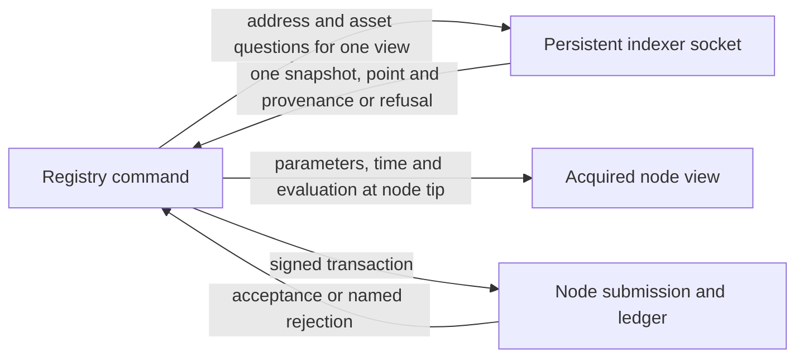

# Read a registry through a persistent indexer

As a registry user, I want address and asset reads to come from an already
running indexer, so preparing a command does not replay the chain or perform
slow node address queries. This is the intake for [#377](https://github.com/lambdasistemi/singular/issues/377),
under [#371](https://github.com/lambdasistemi/singular/issues/371). It describes
proposed work; no socket backend has been implemented or accepted here.

## Stories and observable outcomes

| Story | Required outcome and refusal |
| --- | --- |
| As a user, I select the persistent daemon. | `--backend utxo-indexer --indexer-socket PATH` is the proposed final spelling. The socket backend is the default. A missing socket setting or unavailable daemon fails by name before a command can treat a missing answer as an empty wallet or registry. Intake acceptance must settle socket-path resolution; no guessed path or environment variable is a contract. |
| As a user, I read one coherent indexed state. | Every address and asset lookup within one acquired view uses one materialized composed multi-query answer, with its indexed slot and block hash. Independent calls to an advancing index cannot satisfy this requirement. Snapshot scope across views awaits the operator's ruling through the epic owner in [decisions](decisions.md). |
| As a user, I rely on a complete answer. | Coverage starting after origin, filtered or unknown address coverage, catching-up or otherwise unusable freshness, unavailable asset indexing and unreadable responses are named refusals, never successful empty answers. A complete empty answer is distinct. Readiness and provenance must describe the read being consumed; a separate earlier `ready` call is insufficient. Genesis-only reads use a named node path, with the source limit described in [research](research.md#why-genesis-needs-a-separate-read). |
| As a writer, I still use the node for ledger work. | Parameters, fees, time conversion, script evaluation and submission remain node operations. Each build uses one acquired node view at its tip. No equality between node and indexed points, retry loop or node pinning is promised. A submitted transaction spending an output already spent on chain fails with `ledger-refusal` and a reason identifying the rejected step; the planned CI case must exercise that rejection. |
| As a returning user, I have one indexed backend. | Delete the in-process address-index follower path, `--backend indexer`, its active documentation and tests in the same implementation change as the dependency bump. The old spelling is refused, with no alias. Preserve confirmations and unrelated public-indexer readback controls when removing shared machinery. |
| As a developer, I run the connected journey. | CI starts one persistent daemon alongside a generated node, funds ordinary wallets through transactions, and runs create, insert, inspect, update, inspect, terminate and inspect through the socket backend. Receipt-bound results and controlled faults establish the requirements; starting processes or compiling tests alone does not. |

## Read and trust boundaries

The index reports ledger outputs, not registry membership or Terminal proofs.
Authenticated registry evidence remains the mirror checked against the state
output. Indexer and node may describe different moments; read-only answers are
not guaranteed current at the node tip. A spent-input rejection protects that
specific spend, not every consequence of a mixed read.

## Model binding and preservation

The intake binds repository and model revision
`3b7a06bee8850ad6745f61ff5be7631fb8274909`, constitution 1.12.0.
[Singular.Model](../../lean/Singular/Model.lean) defines `Singular.step`,
`Singular.exitStep`, `Singular.txOfExit`, `Singular.txOf`,
`Singular.retractAdmission` and `Singular.admittedExitStep`.
`Singular.step` refuses through `refusal` before `applyEdge`; `txOfExit`
preserves the exit's inputs, output roles, mint, signers and refunds. The
open-datum model at the same revision governs insertion, controller update
and retirement through `OpenDatumApplication`'s accepted actions.

This ticket refines how ledger observations reach existing builders. It must
preserve authorization, token identity, datum bytes, state/root effects,
custody, refunds and witnesses. It does not amend a model transition or turn
a node/indexer transport error into a Lean refusal. The model supplies no
socket protocol or claim that the node and indexer share a block: those
engineering requirements come from the issue and operator rulings.

The implementation mapping is composition in `Singular.CLI.Node` and
`Singular.Registry.Node.Session`, observation through `Singular.Registry.Provider`,
attachment in `Deployment.Attach` and `CLI.Live`, and the existing transaction
builders and `CLI.Session.submitBuilt`. Each implementation slice must bind
the actual candidate and check both successful journeys and relevant refusals.
If this refinement changes a model-observable outcome, hold acceptance and
escalate the concrete story before changing Lean or expectations.

## Acceptance evidence and limits

Every issue acceptance line remains open at intake. [The plan](plan.md) maps
them to CI carriers, the command-by-view extent and controlled faults.
`nix develop --quiet -c just ci` and the socket-backed devnet journey must
both be green in CI on the exact implementation PR head. Each atomicity
check needs behavioral RED under its controlled fault and GREEN without it.
The public conformance suite must say product claims in its description
language, compute state from receipts and retain uncovered rows; machinery
evidence belongs in its marked appendix. A requirement that the language
cannot express is escalated, not replaced by a raw product assertion.

This intake establishes source facts and a plan only. It claims no performance
measurement, daemon deployment, socket behavior, ledger run, audit, merge or
release. Public networks are read-only; no public transaction, key access or
registry creation is authorized. Node-to-indexer pinning is [#376](https://github.com/lambdasistemi/singular/issues/376).
