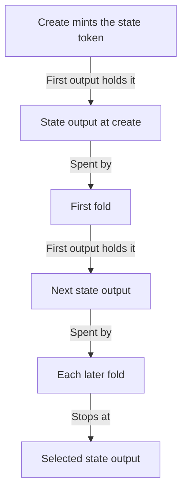
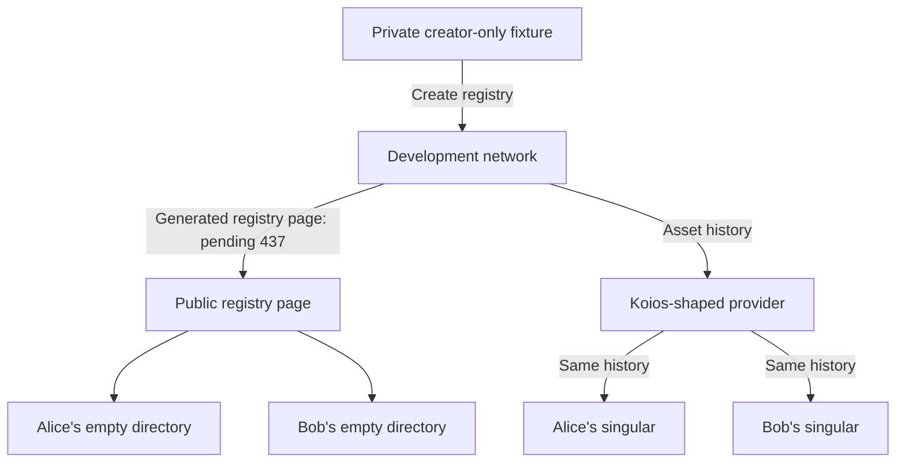

# Rebuild every registry trie from its public lineage

As a maintainer, I want one trie-state backend that rebuilds a registry's trie
from its full public history at every selection, so that commands get the
chain's trie without any actor's local copy. Read the [stories](spec.md) first,
then the [decisions](decisions.md). The pure replay, the exclusion of failed
transactions and the named refusals are on main
([PR 391](https://github.com/lambdasistemi/singular/pull/391)). The commands slice
starts from main at `2cafe6b2`, where the provider ticket published
`Session.history` ([PR 410](https://github.com/lambdasistemi/singular/pull/410)).

## The contract consumed

As this backend's author, I implement the provider ticket's `TrieState m` and
`TrieSnapshot m` and call its `Session w m` history, as published on main.
Nothing here changes them.

| Consumed from the provider ticket | Used for |
| --- | --- |
| `history :: Asset -> HistoryRange -> m (Either HistoryFailure (HistoryStream m))` | The state token's transactions from `create`, as whole blocks in ascending height: transaction CBOR with resolved spent, reference and created outputs |
| `withTrieState :: TrieSelection -> (TrieSnapshot m -> m a) -> m (Either TrieFailure a)` | Replay to the selected state output, then serve one snapshot |
| `leafAt`, `membership`, `nonMembership`, `speculateEdges` | Read from, and speculate over, the rebuilt in-memory trie |
| `trieCoverage :: CompleteFromCreate` | Built only after a replay reaches the selection from `create` |
| `HistoryIncomplete`, `RootDoesNotChain`, `UndecodableRequest` and the wrong-registry and stale-root refusals | The replay's named failures |
| `acceptObservedFold` | Nothing persists; the next selection replays the fold from history |

The backend is built from one acquired session. A selection whose session id
differs from that session's is refused. Each slice starts with a fit check
against the published code. Any of these is a question to the epic owner, never
a change made here: `HistoryRange` cannot ask for the history from `create`; a
named failure cannot carry the registry and the transaction; or the
composition builds trie state outside a session.

## How the lineage is found and ordered

As a reader of a rebuilt trie, I need the lineage ordered by what the chain
fixes, not by the provider's listing order or its pages.

The history call streams the transactions that carried the state token as whole
blocks in ascending height. Within a block, a transaction that spends an
asset-carrying output created in the same block follows its creator; a cycle, a
missing in-block parent and a double spend are the provider's named refusals.
Pages never reach the replay. The replay still chains the transactions by what
they spend:

- **Create** is the one transaction that mints the token under `Minting(seed)`,
  spends that seed, and names the token `assetName(seed)`. Its first output
  holds the token, and its state datum root is the empty trie's root.
- **Each fold** spends the previous state output. Its first output holds the
  token and carries the next state datum.
- **The walk stops** at the selected state output, whose root must equal the
  selection's root. Transactions after it on the same chain are ignored, so a
  provider ahead of the outputs answer is not an error.

A transaction's identifier is computed from its own CBOR, never taken from the
listing. Byte-identical repeats of one transaction count once.

## How actions pair with requests

As a replay author, I mirror the validator's walk exactly. The fold's
`Modify` redeemer is the one attached to the state input's spend. The spending
inputs are walked in ledger order, and each resolved output is tested with the
chain's request predicate (the [rules table](spec.md#registry-rules-the-replay-must-follow)).
Each matching request takes the next action:

- `Rejected` leaves the trie unchanged;
- `UpdateAction` walks the request datum's key and edge with `walkEdge`, on the
  trie the previous requests of the same fold produced.

The brief cited `walkEdge` at `TxBuilder/ConnectedFold.hs:264`. That line is
the connected fold's call; the definition is at
`TxBuilder/Internal/Edges.hs:116`. The replay reuses the definition and adds no
second edge table.

## The root check at every fold

After each fold the rebuilt root must equal the root in that fold's first
output's state datum. Create is checked against the empty root. The first
mismatch refuses the registry, naming its token and the transaction. No later
fold is applied and no partial trie is served.

## Coverage and named failures

As a command user, I either get a trie with coverage complete from `create`,
or one named refusal. Never an empty registry.

| Situation | Refusal |
| --- | --- |
| No create transaction, a gap before the selection, an unresolved spent input, or a history page missing | `HistoryIncomplete` |
| A state output spent by two different transactions, or a transaction that touches the token outside the chain | `HistoryIncomplete`, naming the transaction |
| A rebuilt root that differs from a fold's state datum root, or a non-empty root at create | `RootDoesNotChain`, naming the registry and the fold |
| A redeemer that is not `Modify`, or as many actions as matching requests not decodable | `UndecodableRequest` |
| A create whose token or policy is not the selection's | the wrong-registry refusal |
| A selected root that differs from the root at the selected output | the stale-root refusal |

## The two-actor journey

As a demonstration reviewer, I watch two actors share nothing but the chain,
through the provider ticket's Koios-shaped development-network provider.

A private creator-only fixture makes the registry. Alice and Bob both start
with empty homes and registry directories, using only the registry page generated
from the chain and Koios. Token joining is owned by #437, under the updated
[decision](decisions.md#joining-a-registry-from-public-data). Every step below is
published pending until that integration runs, with no copied identity or
simulated joined directory:

1. Bob inspects his key, proving its absence, and books and folds its
   insertion. Alice's directory is hashed before and after, and never read.
2. Alice inspects Bob's key and finds it active, from her own replay.
3. Bob books the termination of his own key; Alice folds it, with the
   membership proof from her own replay and no envelope. Alice books the
   termination of her own key; Bob folds it likewise. Bob's update and
   termination attempts on Alice's key stay refused as not the controller.
4. Alice inserts and folds her own key. Whether another actor can fold her
   insertion waits for [issue 419](https://github.com/lambdasistemi/singular/issues/419).
5. Rejection and reclaim run across actors, as today.
6. After every fold, both actors' inspect roots equal the fold's state root.

The harness starts Alice and Bob with separate empty `HOME` and registry
directories and traces creator processes so any attempted actor-directory read
fails. Once #437 supplies the real joining interface, actor processes are traced
and foreign directories are hashed before and after every step as well. The current
mirror-dependent controls become history controls: the provider withholds one
fold, then serves an altered request edge, and each refusal is named.

## Vertical slices

As the epic owner, I receive runnable slices. Each leaves the journey green
and stacks on the provider ticket's published slices.

| Slice | Runnable outcome | Starts after |
| --- | --- | --- |
| Pure replay and chain oracles | The replay over the ledger's own transactions, rebuilding into the trie interface `walkEdge` takes, with every named refusal. Development-network checks: root at every fold, mixed fold, input-order pairing, dropped and forked history, and proofs at every fold. | Intake acceptance; nothing unpublished is consumed |
| Commands run on the replay | The lineage backend replaces the mirror instance in the terminal. Mirror and saved-root files are no longer written or read. The journey's single shared directory passes on it. | The provider ticket's provider switch slice is published, with `Session.history` |
| Separate actors before token joining | Creator-only fixture; two empty independent users; public replay, controller and request-window unit controls; superseded statements corrected. The journey names joining and all subsequent CLI steps pending under #437, with cross-actor insertion folding also pending #419. | Commands run on the replay (merged in [PR 411](https://github.com/lambdasistemi/singular/pull/411)) |
| Separate actors integrated | Actual token/page-driven joining and the full two-user CLI journey, in a separate pull request. No creator identity file is shared. | #437 merged and its actual interface available |
| Published evidence | Folded into the separate-actors pull request: its description and this directory. | Separate actors |

Each slice deletes what it makes obsolete in the same diff: the mirror adapter
and its file handling leave with the commands slice; the pure fixture trie stays.
Internal commits may build toward a slice; only completed slices are pushed.

## Responsibilities and data flow

As a module maintainer, I keep interpretation in the terminal and transport in
the provider.

| Responsibility | Owner |
| --- | --- |
| Generic history, pagination and spent-output resolution | The provider ticket's adapters, unchanged |
| Ordering a lineage and pairing actions with requests | One new replay module, pure over the reconstruction material |
| Edge semantics | `walkEdge`, unchanged |
| The in-memory trie | The provider ticket's pure fixture trie representation, not a new one |
| The trie-state instance | One lineage backend over a session, chosen at terminal composition |
| Registry page and joining by state token | #437 under epic #301; integration point only in this slice |

## Invariant-to-test map and controlled faults

As a reviewer, I want every guarantee paired with the observation that would
contradict it. These are planned checks; none has run on an implementation.
Each must run red under its fault, from the subject itself, never from a build
failure.

| Guarantee in the user's words | Positive observation | Controlled fault that must turn it red |
| --- | --- | --- |
| The rebuilt root is the chain's root at every fold | Replay of the journey's history matches every fold's state datum root | Map one edge to another in the replay; serve one request with an altered edge |
| A mixed fold changes the trie by its applied requests only | A fold applying some requests and rejecting others, accepted by the state validator, replays to its root | Apply a rejected request too, as the MPFS reading does |
| Actions pair with requests in ledger input order | A fold of several requests whose listing order differs from ledger order replays correctly | Pair in listing order; skip the own-token filter; count a reference input |
| A history that does not chain is refused by name | Complete history yields coverage from create, and the same history served in another page order yields the same trie | Drop one fold; drop create; fork a state output |
| A history the provider is behind on is never an empty trie | A selection newer than the history refuses as incomplete | Serve an empty trie or the last replayed root instead |
| Proofs verify against the replayed root | At every fold, every journey key's membership or non-membership proof verifies against that fold's root, checked by the proof verifier, not the trie that made it | Prove against the previous fold's trie; corrupt one proof step |
| Identity comes from create | The create's seed, token name and policy match the selection | Select another registry's token; mint under another seed |
| No actor reads another's files | Bob's run never opens Alice's directory, checked by the hashes and an access trace | Point Bob at Alice's directory; let the fold read Alice's envelope |
| Speculation never commits | A fold's speculative walk leaves the snapshot's root unchanged | Commit the speculative trie into the snapshot |
| The lineage backend persists nothing | A second selection after a fold replays it from history | Serve the fold from process memory while the provider withholds it |

The CI carriers are the development shell's `nix develop --quiet -c just ci`,
the packaged two-actor journey, and the focused replay checks added to that
same surface. Every product claim is described in the public suite's language,
its state computed from receipts. Uncovered rows remain visible.

## Acceptance boundaries and phase stop

As the epic owner, I receive this intake before authorising execution. This
seat writes planning and PR metadata only; no code, tests or gates change here.
Each page has its speech extracted by mkdocs-speech and stamped against its
bytes, within 24 KiB and 300 lines. Each slice runs one commit owner and one mute
auditor in its own detached audit worktree, with the models the operator names
(see the [decisions](decisions.md#sequencing-and-staffing)), both in this
ticket's tmux window. No other seats are authorised. The epic owner verifies and merges.
