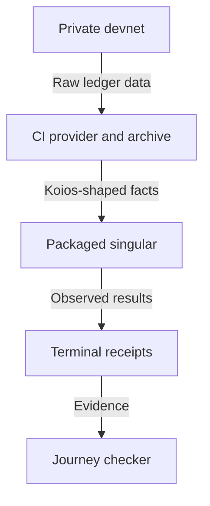

# Decisions for a provider-backed registry journey

As a registry user, I want the first provider replacement to keep the journey
working and state its trust limits honestly. The settled operator rulings and
the proposed engineering choices below carry different status. Intake
acceptance applies to the exact intake head before implementation is dispatched.
On October 4 the epic owner answered the four intake questions as recorded below.

## Stories settled by the operator

As a terminal user, I can build with unverified facts because Cardano checks
the submitted transaction. I can also inspect off-chain state, but its verdict
is printed. Demo 1 has no anchor and no ledger verification; matching a locally
rebuilt application root does not change this verdict.

As a provider author, I implement polymorphic capabilities that know nothing
of a registry. I supply optional abstract witnesses with facts; history is raw
reconstruction material. Common evaluation, pinned time and confirmation are
computed by singular. The old node read and in-memory indexer routes are
removed with command migration, under the operator's October 2–4 rulings in
the brief and the current ticket.

| Settled choice | Alternative rejected by the ruling | Consequence |
| --- | --- | --- |
| Koios, Unbound, NoWitness and unverified only | Keep a node instance or ship a partial verifier | Honest unverified receipts and off-chain answers. |
| Generic asset history | Registry-specific provider endpoints, plugins or hooks | All application interpretation stays in the terminal. |
| One common evaluator, time converter and bounded polling path | Adapter evaluation/time hooks and IO-fixed interfaces | Pure fixture exercises the same capabilities as Koios. |
| Replace reads and delete obsolete paths together | Add provider support beside permanent node/indexer routes | First replacement slice remains runnable without a node connection. |

## A CI provider independent of terminal receipts

As a demonstration reviewer, I need the ledger observations to come from the
development network, so that singular cannot write the answers it later uses
as evidence. Recommend a CI-only Koios-shaped facade over that devnet, using
an independent transaction/input archive for history. Preserve the existing
mock's disagreement controls, replacing its receipt-derived honest data source.
The [plan's endpoint table](plan.md#development-network-provider-and-complete-call-coverage)
accounts for every required call and the current gaps.

The facade must never read Terminal receipts. A real devnet supplies outputs,
parameters, inclusion and submission refusal. The independent archive resolves
spent outputs even after they disappear from the live UTxO set. The first
journey must exercise history calls even while full registry reconstruction
is deferred, so an unused facade history route cannot appear covered.

| Candidate | Disposition | Evidence and reason |
| --- | --- | --- |
| Koios-shaped devnet facade replacing the mock's data source | Accepted in A-001 | Existing mock has only tip and one asset_utxos answer; the full request map is known and real ledger refusal remains observable. |
| Extend the current receipt-driven mock as it stands | Reject as journey evidence | It needs a successful inspect receipt before answering and cannot supply funding, submission or independent history. |
| Yaci Store without a facade | Not selected | Its [upstream README](https://github.com/bloxbean/yaci-store) advertises essential Blockfrost-compatible APIs, not the Koios contract. No complete call-coverage demonstration was found or executed here. Adapting it adds a service and still requires a Koios facade. |

The epic owner accepted loopback-only Koios transport for independent packaged
processes in answer A-001. It is compiled into the CI test
composition, with a recorded adapter used for deterministic fixture tests.
Public HTTP URLs, production HTTP retries and rate limits remain the next
ticket. A test-only transport must not become a retained production node
adapter or a claimed live Koios client. The facade is test infrastructure and
may follow the generated node; singular never does. This resolves
Q-001-devnet-provider without claiming the facade has been implemented.

## Pinned time and independent node answers

As a requester with a finite validity interval, I need the same slot bounds
regardless of which provider supplies the ledger facts. Recommend packaged
network data selected by network identity: verified-source preprod genesis
and era-transition history, plus the devnet generator's exact genesis/start
time and Conway history materialized for that run. The network-data manifest
binds source revision, network magic, every genesis digest, transition slots,
era parameters, system start and supported conversion horizon.

Genesis hashes and network identity are checked before use. Invalid history,
unknown networks, times before genesis or beyond the declared horizon refuse
by name. Current protocol parameters are unverified provider facts, separate
from pinned network time. Changes to network data invalidate corresponding
fixtures; a hash refresh alone does not prove time preservation.

Node fixtures record independent floor, ceiling, slot-start and evaluation
results with exact transaction bytes, resolved spent/reference outputs,
protocol parameters and cost models. Include valid and refusing scripts and
times on both sides of slot/era boundaries. Synthetic fixture construction is
labelled fixture evidence; only actual recorded results can support the
differential claim. No such fixtures are captured during this intake.

| Proposed choice | Alternative | Status and reason |
| --- | --- | --- |
| Package reviewed preprod data and run-specific devnet data with content hashes | Ask each provider to convert time | Accepted in A-002; source revisions and fixtures must be frozen before implementing-slice acceptance. |
| Reuse pinned ledger libraries for evaluation with resolved dependencies | Ask a node or Koios to evaluate | Settled direction; preserve complete script context and compare actual recorded results. |
| Fail outside the declared time horizon | Estimate slots from wall-clock arithmetic | Accepted in A-002; no unsupported conversion may authorize a fold or retraction. |

Answer A-002 accepts this manifest boundary and assigns refresh ownership to
this repository. When preprod era history changes, a singular change refreshes
the manifest; the named horizon refusal signals that it is due. The devnet
manifest comes from the exact generator output of that run. This resolves
Q-002-network-data. Actual source revisions and fixtures must still be frozen
before the implementing slice is accepted; no network data was captured here.

## Raw facts missing from the endpoint list

As an application replayer, I need transaction CBOR and resolved spent outputs,
not a reconstructed subset of transaction fields. The current
[Koios transaction schema](https://github.com/cardano-community/koios-artifacts/blob/main/specs/fragments/paths/transactions.yaml)
exposes tx_cbor separately from tx_info. Its tx_cbor schema supplies the raw
cbor field; tx_info supplies transaction details. The ticket's eight named
fixture calls do not include tx_cbor. Answer A-003 accepts recorded tx_cbor
coverage, retaining all eight already required calls, and capturing the
published schema revision before fixtures are frozen.

As a deployment operator, I verify that a reward script credential is
registered without substituting false for unknown. At the intake base,
offchain/deployment/Deployment/Node.hs calls viewScriptRegistered at lines
120 and 215. Address/asset/transaction outputs alone do not supply that fact.
Answer A-003 accepts a generic evidenced registration query with a demonstrated
Koios endpoint mapping. Unknown registration is a named refusal, never false.
Exact endpoint coverage must be demonstrated before implementation acceptance;
silently leaving a node path is forbidden.

This resolves Q-003-extra-raw-facts. History resolves required spent and
reference outputs even outside the asset filter and refuses incomplete data
by name. Generic transport and dependency resolution belong to this ticket;
registry reconstruction remains the separate history-reconstruction ticket.

## Existing reject discrepancy is escalated outside this migration

As a folder, I want a request rejected according to the accepted model rather
than an unrelated client deadline. Lean exitAdmission returns no admission
refusal for Exit.reject. At the frozen base, CLI.RejectRules.rejectGate waits
until the request is past its retraction deadline, and the CLI command prose
says reject waits for both windows. The early-rejection repair specification
under specs/320-early-request-rejection already records this disagreement and
the operator's ruling to repair code rather than change Lean.

This is source evidence at recovery base 872c0ecf3c, not a newly executed refusal.
The provider replacement cannot call that preserved behavior Lean-conformant.
The bound consumer requirement that forbids early rejection remains visibly
unmet under its existing ruling; no provider receipt closes it.

Answer A-004 places this pre-existing discrepancy outside the provider ticket.
The validator repair is merged in [PR #338](https://github.com/lambdasistemi/singular/pull/338),
and [PR #374](https://github.com/lambdasistemi/singular/pull/374) adds the expired
request command. The epic owner has escalated the client scope question
to the Demo 1 owner with the evidence above. This lane does not repair it.

The migration preserves reject's current gate, refusals and receipts exactly,
and makes no Lean-correspondence claim for reject. The ticket intake proceeds;
the affected semantic story remains unresolved with its owning lane rather
than being accepted as a pass here. The PR's Limits name the discrepancy and
escalation. Any new discrepancy introduced by this migration is held and
escalated under the constitution. This applies answer A-004 and resolves this
lane's Q-004-reject-model-hold without deciding the client's semantic contract.

## Intake release and subsequent evidence

The operator also adds TrieState m to this ticket. Every command's trie reads,
leaf proofs and folds use that backend-neutral capability. Its identity comes
from create; state selection/root and complete-or-refused coverage are explicit.
The first adapter wraps the current local mirror, retaining its proof checks,
file format, speculative behavior and accepted updates. A genuinely pure
fixture trie exercises every edge's proof path. The name of the existing
IORef-backed Trie.Pure module does not establish pure-monad execution.

The mirror is not offloaded or replaced by an empty trie. Coverage cannot be
invented from a matching root: absent create/transition coverage refuses by name.
Local application proofs never upgrade provider facts to Verified. For Unbound
sessions the selected state output is an observation, not an atomic snapshot.
The full-public-lineage backend, applying accepted ordered actions and checking
every fold root, belongs to #381. Caching, persistence, a follower and a shared
service remain later backends of this same interface. This settles NOTE-003
without implementing or claiming the lineage backend during intake.

The operator's subsequent base instruction places this intake on
[PR #382](https://github.com/lambdasistemi/singular/pull/382), recovery head
`872c0ecf3c7cf1a10293793523c8521d5ef9aae9`, rather than main. Its reclaim
command and independent-wallet interrupted-fold controls join the first slice.
The constitution and Model, Statements and Driver blobs are unchanged between
the original main base and this recovery head. Source citations and deletion
discovery are rebound to the recovery head; this does not audit or accept #382.
If the recovery branch advances, rebase and refresh the evidence. If rewritten
or closed, hold and ask the epic owner. Never push to that branch.

As the epic owner, I can accept a concrete intake head or return a consolidated
decision batch. The ticket owner publishes the proposed spec, plan and
decisions with stamped speech from the first push, opens a draft PR with
Closes #383, journals INTAKE-READY with its URL and exact SHA, and stops.

An acceptance inbox note naming that SHA releases only the approved commit
owner and auditor arrangement. It does not establish implementation
correspondence, exact-head CI, merge or release. Final evidence still requires
the local gate, the devnet journey, controlled faults, honest public gaps and
the approved audit checkpoint trail. The epic owner verifies and merges.
