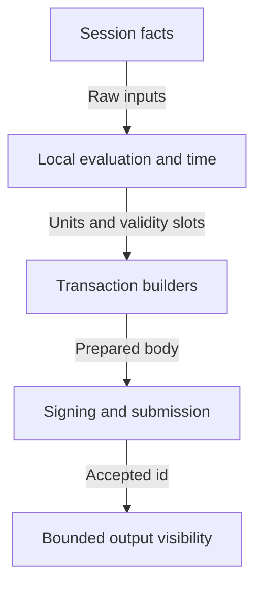

# Preserve the journey while replacing its interfaces

As a maintainer, I want runnable checkpoints that preserve the registry journey
while its trie and local computation move behind common capabilities, before
the node read path is replaced. Read the [stories](spec.md)
first, then the [decisions awaiting intake acceptance](decisions.md).
The frozen base is `872c0ecf3c7cf1a10293793523c8521d5ef9aae9`, the recovery
head of [PR #382](https://github.com/lambdasistemi/singular/pull/382).
This is a stacked intake against feat/362-recovery. Only this ticket's planning
commits sit above that base; after its merge, retarget to main and rebase.

## Proposed capability types

As a provider author, I need one effect-polymorphic contract rather than
transport-specific commands. These are proposed public shapes, not compiled
declarations. Ledger types reuse the current Conway representation. All
refusals are named algebraic values; adapter transport failures are handled
inside m. No interface mentions IO, sockets or nodes.

```haskell
data SessionBinding = Bound ChainPoint | Unbound
data ChainPoint = Genesis | At SlotNo BlockHeaderHash
data Acquisition = Latest Network | AtPoint Network ChainPoint
data Evidenced w a = Evidenced { value :: a, witness :: Maybe w }
data NoWitness
data Verdict a endorsement
    = Verified a endorsement
    | Unverified a Reason
newtype Verifier w m = Verifier
    { verifyFact :: forall a. Evidenced w a -> m (Verdict a Endorsement) }
data LedgerProvider w m = LedgerProvider
    { acquire :: forall a. Acquisition -> (Session w m -> m a)
        -> m (Either AcquireFailure a)
    , submitTx :: Network -> SignedTx -> m SubmitResult
    }
data Session w m = Session
    { sessionNetwork :: Network
    , sessionId :: SessionId
    , sessionBinding :: SessionBinding
    , outputs :: OutputQuery -> m (Either ReadFailure (Evidenced w Outputs))
    , protocolParameters :: m (Either ReadFailure (Evidenced w PParams))
    , tipObservation :: m (Either ReadFailure (Evidenced w Tip))
    , scriptRegistered :: ScriptCredential
        -> m (Either ReadFailure (Evidenced w Bool))
    , history :: Asset -> HistoryRange
        -> m (Either HistoryFailure ReconstructionMaterial)
    }
data OutputQuery
    = AtAddress Addr
    | HoldingAsset Asset
    | AtTxIn TxIn
    | AnyOf (NonEmpty OutputQuery)
    | AllOf (NonEmpty OutputQuery)
data HistoricalTransaction = HistoricalTransaction
    { transactionCbor :: TransactionCBOR
    , spentOutputs :: ResolvedOutputs
    , referenceOutputs :: ResolvedOutputs
    }
data RegistryIdentity = RegistryIdentity StatePolicyId AssetName
data StatePoint = StatePoint SessionId SessionBinding TxIn
data TrieSelection = TrieSelection RegistryIdentity StatePoint Root
data TrieState m = TrieState
    { withTrieState :: forall a. TrieSelection -> (TrieSnapshot m -> m a)
        -> m (Either TrieFailure a)
    , acceptObservedFold :: ObservedFold -> m (Either TrieFailure ())
    }
data TrieSnapshot m = TrieSnapshot
    { trieIdentity :: RegistryIdentity
    , triePoint :: StatePoint
    , trieRoot :: Root
    , trieCoverage :: CompleteFromCreate
    , leafAt :: Key -> m (Either TrieFailure Leaf)
    , membership :: Key -> Leaf -> m (Either TrieFailure MembershipProof)
    , nonMembership :: Key -> m (Either TrieFailure NonMembershipProof)
    , speculateEdges :: NonEmpty (Key, Edge)
        -> m (Either TrieFailure SpeculativeWalk)
    }
```

The network is separate from ChainPoint, as Lockness specifies. Bound records
an exact slot and header hash or the named genesis state; an acquisition
request cannot silently switch to another point. Demo 1 supplies only Unbound
sessions and refuses AtPoint requests by name. Session ids identify acquisition
scope, not trust or snapshot atomicity. AtPoint carries the future selection
request; a bound adapter's retention and rollback policies require a later
contract before implementation. This ticket supplies no bound adapter.

AnyOf is union and AllOf is intersection over exact output references, with
full policy-and-name asset identity. Duplicate references with conflicting
bytes refuse; empty NonEmpty compositions cannot be constructed. Resolved
outputs preserve address, value, datum form and bytes, and reference scripts.
Out-of-scope reads, unknown network, malformed bytes, missing input resolution
and incomplete advertised history are named refusals, never successful empty
answers. An honestly empty query result remains distinct from these failures.

Endorsement is abstract terminal-side information, with no witness format or
implementation in Demo 1. The optional witness attaches to facts, not history.
Submission returns the adapter's accepted transaction id or refusal reason;
acceptance for relay is separate from confirmation or settlement.

TrieState has no witness parameter: these are application proofs, not ledger
witnesses. Its immutable selection is the registry identity and state output/root
consumed in the caller's session. Bound must match the acquired point; Unbound
records an observation without inventing atomicity. CompleteFromCreate is
constructed from checked backend coverage, never a caller-supplied Boolean.
HistoryIncomplete, RootDoesNotChain and UndecodableRequest are named failures;
wrong registry, stale root, missing proof and incomplete local coverage also refuse.

The current-mirror adapter preserves its file format, authenticatedLeaf/root
checks, speculative walkEdge order and durable accepted-fold updates. It derives
local coverage from the saved create identity and existing accepted transition
records; a root match alone cannot invent missing lineage evidence. This is
local-mirror coverage, not independently reconstructed public history. Missing
coverage refuses. The pure State adapter uses fixture trie nodes, not the current
IORef-backed "Pure" wrapper. Both run membership, non-membership and ordered
edge proofs. Speculation never commits; acceptObservedFold preserves current
observation, root-continuity and exactly-once recovery rules. Commands receive
this capability instead of opening a mirror or manipulating TrieManager directly.

## Component responsibilities and data flow

As a command maintainer, I obtain ledger facts through one session and give
them to the common evaluator and time conversion. An adapter never evaluates
scripts or interprets registry events. Signing and durable file handling remain
at the executable boundary; confirmation uses injected clock and wait effects
so that its bounded behavior can also run in a pure state fixture.



Local time conversion also consumes the pinned genesis and era history.
Those reviewed network files are separate inputs to the common service.

Move shared Provider responsibilities out of the node-internal component.
Use one ledger-provider capability module, one evidence/verdict module, one
generic history representation, common local evaluator and time modules,
the recorded Koios adapter, TrieState with mirror and pure instances, and a
pure State provider fixture adapter. Replace CLI.Node
composition with terminal composition. Keep generic wallet/signing, transaction
builders, application proofs and receipt durability; move them to their stable
owners rather than retaining a node namespace as a compatibility shim.

Tip is a raw, evidenced provider observation needed by existing expiry and
recovery decisions; it is not a snapshot binding. Script-credential registration
is an additional raw fact used by deployment tools, authorized in answer
A-003. Its Koios endpoint mapping must be demonstrated before acceptance;
unknown registration refuses by name rather than returning False.

## Deletion inventory across the tracked tree

As a reviewer, I want a complete discovery extent, so that an obsolete caller
does not survive outside the obvious adapter files. The committed
[deletion inventory](deletion-inventory.json) scans all 2,459 tracked paths at
the frozen recovery base. It finds 258 paths and 1,605 distinct matching lines:
151 paths name node or indexer wiring, 172 name provider or derived calls, and
25 name the journey or mock, and 51 name trie/proof paths. These overlapping
categories are not summed; trie rows preserve the mirror behind the new interface.
Each row binds its path, content hash, matching line numbers and proposed
disposition. Lexical discovery establishes scope only, not successful deletion.

| Discovered surface | Replacement or preservation obligation |
| --- | --- |
| Node/View, Node/Indexer, Node/IndexerView, Node/IndexGate | Delete node reads and in-process chain following from the terminal. |
| Node/Memory and Provider's IO-only scopedProvider | Replace with a genuinely pure ledger-provider fixture; retain scope refusal as behavior. |
| Provider's evaluation, registration and two time calls | Move evaluation and time to common local services; supply the generic registration fact. |
| Node Session, Confirmation, Submit, Options, Funding, PhaseLog and Wait | Remove node connections and globals; preserve signed-only submission, bounded wait, loss handling and phase measurements through new capabilities. |
| CLI Node, Command, Session, Attached, Live, Recovery and Reconcile | Replace capability composition and node settings; preserve journalling, identity checks, recovery and input visibility. |
| CLI Create, Preview, Inspect, Entry, Fold, Reject and Reclaim | Move every command and preview path together; keep parser refusal before effects, reclaim owner/window/validity checks, and keys out of read commands. |
| Deployment/Node and retained example executables | Migrate all ledger reads and evaluation; move private devnet orchestration into test-only components. No retained production node adapter. |
| ContractSuite, ProviderSpec, OneViewSpec, IndexerViewSpec, StubView and builder tests | Preserve product obligations over the new pure and recorded adapters; delete indexer coverage mechanics and false snapshot assumptions for Unbound. |
| Registry Trie/TrieManager, CLI Proof, Inspect, Fold, Attached and mirror callers | Route all reads, proofs, speculation and accepted folds through TrieState; retain the mirror and its proof/root/durability rules inside the first adapter. |
| Cabal, component inventory, Nix, node-confinement checks and CI | Remove obsolete production modules/dependencies and test-only wiring; preserve test coverage and publish newly uncovered limits. |
| Demo journey, attach/recovery/deployment controls, release archive and docs | Replace node/indexer flags and archive instructions in the same replacement; regenerate paired speech and preserve historical decision evidence. |

At implementation, rediscover all callers from the tracked source tree and
compiler dependency graph. Quantify packaged command tests over the parser's
nonempty command extent and public component inventory. Exercise the packaged
binary with removed --backend and --node-socket settings and require a named
parser refusal before acquisition. A renamed import or grep without a real
binary check does not establish that a removed mechanism is unreachable.

## Runnable vertical slices

As a demonstration user, I retain a working journey at every checkpoint.
The epic owner's accepted slicing amendment places the behavior-preserving trie
and local-computation migrations before the provider switch. Neither adds a
second command route. Provider replacement and deletion still land together.

| Slice | Runnable outcome | Required observations |
| --- | --- | --- |
| TrieState first | Every command's trie reads, proofs, speculation and accepted folds use TrieState; the current mirror and a pure fixture instance supply it. Provider reads are unchanged. | Existing real devnet journey and recovery remain green; pure membership/non-membership and ordered-edge proofs, identity/root/coverage/refusal faults. |
| Local evaluation and pinned time | Common services replace viewEvaluateTx and both time calls while provider reads stay unchanged. Reviewed network manifests are frozen with independent recorded node comparisons. | Identical transaction/input/parameter comparisons, slot/era boundaries and refusal controls, unchanged devnet journey. |
| Switch the provider and delete old reads | Packaged create/preview, insert, inspect, update, terminate, fold, reject, reclaim and recovery run on pure and Koios-shaped adapters; CI facade, preprod fixtures and generic history are active; node/indexer command paths are deleted together. | Actual ledger journey without a socket passed to singular, exact output visibility, all facts Unverified, complete required call coverage and controlled failures. |
| Publish evidence and prepare handoff | Public suite and current docs describe receipt-computed guarantees and missing boundaries; exact-head local gate, CI journey and auditor checkpoint trail are bound to the candidate. | Immutable receipts, controlled-fault red/green, no stale narration, clean committed range and exact-head CI. |

Each slice is pushed only after its local gate is green and every persistent
auditor checkpoint is approved. The third slice remains indivisible at the
command boundary. If either earlier migration cannot be separated, ask the
epic owner with evidence instead of silently folding it into the switch.
Resource limits and immutable per-slice checks are frozen before child launch.
No additional seats are inferred.

## Development-network provider and complete call coverage

As a CI reviewer, I need a provider independent of singular's own receipts.
Recommend a CI-only Koios-shaped facade over the generated devnet, replacing
the receipt source in tools/demo1_mock_indexer.py. Its state comes from the
devnet ledger, captured submitted CBOR and an independent history/input store.
The existing readback disagreement modes stay as separate controls. The node
belongs to this test provider; the singular executable never connects to it.
The epic owner accepted loopback-only transport in the CI composition in
answer A-001. Production live Koios HTTP is outside this ticket.

| Koios call | Every journey consumer it must serve | Independent source and present gap |
| --- | --- | --- |
| tip | Acquisition, expiry/recovery and observation receipts | Devnet chain tip; existing mock waits for an inspect receipt and is not sufficient. |
| address_utxos | Funding, reference/state/request lookup, previews and recovery | Full devnet UTxOs including genesis funding; absent from current mock. |
| asset_utxos | Exact state-token and application-token lookup | Full devnet UTxOs filtered by policy and name; current mock serves one synthetic output only. |
| asset_txs | Generic asset history, including consumed and recreated state outputs | Independent transaction index considering both spends and outputs, with pagination and stable ordering; absent. |
| tx_info | Resolve txins, spent/reference inputs and confirmation outputs | Independent transaction/output archive; absent. Must distinguish a spent output from a live one. |
| epoch_params | Fee, collateral, minimum output, cost models and local evaluation | Actual devnet parameters and captured Koios shape; absent. |
| submittx | Every write and preserved refusal control | Raw signed CBOR relayed to the devnet with its actual rejection; absent. Never synthetic acceptance. |
| tx_status | Polling status hint and refusal/timeout controls | Devnet inclusion status; absent. Success still requires exact output visibility. |
| tx_cbor, accepted addition | Full raw transaction bytes in history | Independent CBOR archive; absent and required by the published Koios schema. |
| Registration facts, accepted addition | Deployment verification and reward credential checks | Existing deployment reads this from the node; a demonstrated Koios endpoint mapping is required before acceptance. |

Every call must have a captured request, response, source and hash, linked to
the consumer's effect trace. A required call returning 404, a synthetic empty
answer, or the facade reading terminal receipts fails the CI journey. This
table establishes required coverage; the facade is not implemented and no
runtime endpoint coverage is claimed at intake.

## Invariant-to-test map and controlled faults

As a reviewer, I want each claimed guarantee to name the observation that
would contradict it. These are planned checks. No row below has been executed
on a new implementation. Behavioral red evidence must come from the subject
running with a reachable fault, never a compiler or launcher failure.

| Requirement in the user's words | Executable boundary and positive observation | Controlled fault that must turn it red |
| --- | --- | --- |
| One transaction uses one session | Instrument provider acquisitions and every builder fact; require one session id and matching binding in the prepared receipt. | Reacquire midway or attribute one consumed fact to a second session. |
| Unbound really means no snapshot promise | Pure/recorded adapter permits changing tip between calls while retaining Unbound and honest receipts. | Turn the latest tip into Bound or claim all unbound reads share one ledger state. |
| Every fact is explicitly unverified | Discover every consumed fact from a nonempty journey effect trace and reconcile it with receipt verdicts and inspect output. | Omit one fact, stamp one Verified, erase the extent, or omit inspect's verdict. |
| Confirmation waits for the exact output | Publish status first and exact booking output later; next build starts only after visibility, with bounded clock receipts. | Treat status alone or another transaction's output as confirmed; bypass or remove the wait bound. |
| The requester reclaims only its eligible pending request | Preserve ReclaimRules ownership, edge, opening/closing and built-validity checks; compare actual returned deposit and unchanged state with model retract admission. | Admit another owner or an unsupported edge, cross a window boundary, change the refund, or spend the registry state. |
| A write recovers another wallet's interrupted fold once | Migrate PR #382's discovered fold hold points and lost-answer case; decode the saved signer and reconcile observed ledger, journal and mirror through the provider. | Substitute the requester as signer, omit a hold point, apply the edge twice, duplicate the observed event, resend the fold, or alter the ledger/mirror root. |
| Provider facts do not override ledger validation | Real devnet rejects a transaction using a spent funding input or a changed application proof with a recorded ledger refusal. | Facade reports synthetic acceptance, ignores ledger rejection, or the test replaces the submitted body. |
| Local evaluation has the same script context | Compare local units and script failures with recorded node answers on identical transaction/input/parameter bytes. | Corrupt a spent/reference output, cost model or transaction redeemer. |
| Pinned time preserves validity bounds | Compare floor, ceiling and slot-start conversion at era/slot boundaries with recorded node answers; require named out-of-range refusal. | Use another network's genesis, shift era start or swap floor and ceiling. |
| History is generic reconstruction material | Pure and recorded adapters return complete CBOR with matching resolved references, covering an asset spend and creation plus multiple pages. | Drop a middle page, spend-only transaction, resolved input or CBOR; invent an evidence verdict for history. |
| Composed queries preserve exact outputs | Pure adapter runs union/intersection over addresses, assets and txins, with exact identity, datum and reference-script bytes. | Drop one constituent, match asset name without policy, or merge conflicting references. |
| Acquisition, registration and released reads refuse by name | Pure fixture exposes wrong-network, unsupported point, unknown registration and released-session paths without silently answering empty. | Convert a refusal into an empty success or allow a released read. |
| Rebuilt root still matches the state output | Existing local replay/root comparison is exercised through provider facts, retaining its unverified verdict. | Change a replay edge or the returned state datum root; require registry-named refusal. Full history-based reconstruction remains outside this ticket. |
| Every trie read and edge proof uses the selected registry state | Instrument nonempty command/proof traces through TrieState; mirror and pure fixtures cover every admitted edge, proven leaves, membership and non-membership with matching identity/point/root. | Bypass TrieState, use another registry or state root, alter proof bytes, skip an edge, or mutate the mirror during speculation. |
| Missing trie coverage never becomes an empty registry | Derive local CompleteFromCreate from create and accepted transition records; preserve mirror bytes and named incomplete/root/request/proof failures. | Erase coverage, omit a transition, break a chained root, corrupt a request, or replace a refusal with an empty successful trie. |
| No node instance or in-memory indexer survives | Run packaged commands with provider configuration and no socket; old flags refuse; compiler/package dependency closure contains no production node adapter. | Reintroduce a command socket route or package an obsolete adapter. Source sweep is discovery only. |
| Pure monad can supply every capability | Execute acquisition, all query forms, parameters, tip, history, submit and bounded polling in State with no embedded effects. | Add an observable hidden external-effect requirement; shape compilation controls are reported separately from behavioral red. |
| Only abstract verification ships | Build/API controls establish NoWitness has no constructor and only unverified is configured; runtime receipts cover all facts. | Configure a concrete verifier/decoder or manufacture a successful endorsement. Compilation controls are structural evidence only. |
| Registry model obligations survive | Existing driver-generated scenarios compare observed mint, custody, payments, datums, signers and refusals through conformance. Reject migration preserves current gate/refusal/receipt behavior without claiming Lean correspondence. | Wrong refund, destination datum, signer, token policy or state spent by a retract. Existing uncovered/contradictory rows stay visible, including reject admission. |

The CI carriers are the dev-shell job's `nix develop --quiet -c just ci`,
the packaged `nix run --quiet .#demo1-cli-check` journey, and focused checks
added to that same local/CI surface for the new adapter. Existing
`.github/workflows/registry.yml` also carries attach, readback, contract and
recovery controls that must migrate rather than silently disappear.
The implementation also adds this spec directory to the repository's
presentation-check extent; this intake runs its existing checker explicitly.

## Acceptance boundaries and phase stop

As the epic owner, I receive this draft intake before authorizing execution.
The ticket owner writes planning and PR metadata only. No tests, production
code, dependencies or gate implementations are changed by this intake.
Each Markdown page has speech extracted by mkdocs-speech and stamped against
its current bytes. The proposed per-page ceiling is 24 KiB and 300 lines;
the machine-readable inventory is outside the prose budget.

The next phase begins only after an inbox acceptance naming the intake SHA.
Then the approved commit owner is Codex gpt-6.1-sol with high reasoning, and
the mute auditor is Claude claude-opus-5-5 with high effort in its own detached
audit worktree, both in this ticket's tmux window. No gate-author or draft
seats are authorized. Conflicting generic staffing recipes do not add seats.
The epic owner verifies final readiness and merges; this seat never merges.
