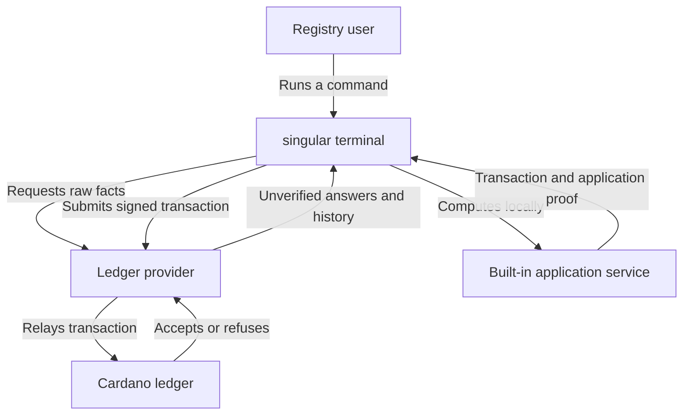

# Registry commands through a ledger provider

As a registry user, I want each command to obtain ledger facts from a hosted
provider, so that my machine needs neither a node nor a local chain index.
This is the proposed contract for [the provider interface ticket](https://github.com/lambdasistemi/singular/issues/383),
under [the Koios demonstration](https://github.com/lambdasistemi/singular/issues/371).
It is an intake proposal. No implementation or behavioral acceptance is claimed.

## The user's stories

As a requester or folder, I run create, insert, update, terminate, fold and
reject with the same ledger-provider capabilities. Preview and inspect need
no signing key. An unverified fact may help build a transaction; the ledger
still checks its inputs, signatures and application proof when it is submitted.
Inspect displays the verdict of the facts it used.

As an integrator, I receive a receipt identifying the network, session,
session binding and verdict of every consumed fact. Koios declares Unbound:
several calls in one session do not promise an atomic ledger snapshot. A tip
response is an unverified observation and never manufactures a bound chainpoint.

As a provider maintainer, I supply raw outputs, protocol parameters, generic
asset history and submission results in my own effect monad. I do not know
which asset is a registry. Evaluation, pinned time conversion, bounded
confirmation, registry interpretation and application proofs belong to singular.

As a folder using a just-confirmed booking, I wait until the provider exposes
that exact output before opening the build session for its fold. A status
answer alone does not establish output visibility. A bound or timeout expires
with a named result, preserving submission history without resubmitting.

## The terminal and its trust boundary

The executable is a [Lockness terminal](https://github.com/lambdasistemi/lockness/blob/eeb378174b68ba31105a4fed776dc51e28fb9528/docs/concepts.md).
Its application service computes locally. The ledger provider supplies raw
facts and untrusted reconstruction material. Demo 1 has no anchor.

History contains full transaction CBOR and resolved spent outputs, with
reference-output dependencies available where interpretation needs them.
It is reconstruction material, never Evidenced or Verified history. The
existing local application-root check remains mandatory; agreement with a
provider's state output does not authenticate either side against the ledger.

## What every implementation must preserve

One built transaction consumes one session. Each fact used for input selection,
fees, collateral, script context and command output is recorded once with that
session's binding and its verifier verdict. Confirmation may acquire later
sessions because it observes progress after submission. It never supplies
another session's facts to the already prepared transaction.

Demo 1 uses the uninhabited NoWitness type. Its only verifier returns
Unverified with the reason "no verifier configured". The abstract Verified
result type is available for future parameters; no concrete verifier, witness
decoder, CSMT check, anchor client or key policy is shipped. Replay's root check
must never upgrade a ledger fact's verdict.

The new capabilities are polymorphic in the witness and effect types. A pure
state fixture must exercise every provider operation, including acquisition,
composed queries, history and submission. Transport exceptions, retries and
rate limits belong inside the adapter's effect, outside the capability types.

## Model authority and correspondence

The frozen intake base is commit `19b970ca788aa319accb31baabc033b5476a2909`.
The [constitution](https://github.com/lambdasistemi/singular/blob/19b970ca788aa319accb31baabc033b5476a2909/.specify/memory/constitution.md) is version 1.12.0.
Lean Model has blob `b548e3e93af7529a968e8cd1b46996d3157baf8b`, Statements
has blob `dbc07cc222e121a9ba9d344c05c53d807b657da9`, and Driver has blob
`fdabc45363b2ec1d693410598cd9cda24d2bcc51` at that commit.

Provider replacement is a representation change. It must preserve
Singular.step, foldBatch, admittedExitStep, admittedTxOfExit, obligations,
spendRefusal and settle, including refusals, token identities, custody,
refund routing, destination datums and required signers. The terminal's
unverified-provider policy is an operator ruling; Lean does not model HTTP,
sessions, witnesses or ledger authentication. Those guarantees are not Lean
theorems. The concrete authenticated trie root remains outside Lean's abstract
FNV root; no byte equality between those two hashes is claimed.

The preservation checks bind existing model-driver scenarios to observed
transactions through the existing conformance translation, including
fold_requires_no_signer, built_transaction_settles,
destination_output_iff_delivers and delivered_datum_follows_request.
Imported or dependency code carries the same correspondence obligation.
Reject's provider migration preserves its current gate, refusals and receipts;
the pre-existing admission discrepancy is escalated outside this ticket and
no Lean-correspondence claim for reject is made here.

## Acceptance and visible limits

Acceptance requires every command and its caller to move onto the new
capabilities, while the node read adapter and in-process indexer are removed
in that same runnable replacement. The [plan](plan.md) records the discovered
deletion extent, endpoint coverage and falsifiable checks.

Recorded preprod reads and development-network responses exercise Koios-shaped
decoding, history and submission paths. Local evaluation and time conversion
must match independently captured node answers for identical transaction
bytes, inputs, parameters, genesis and era history. Recording reads is allowed;
no transaction is sent to a public network and no key or secret is accessed
during this intake.

The exact implementation head must pass `nix develop --quiet -c just ci` and
the development-network journey in CI, with the required controlled faults
observed red and preserved. Every product assertion is described in the public
suite's requirement language, its state computed from receipts. Missing rows
remain visible; harness evidence belongs in its marked appendix.

The live Koios client, retries, Blockfrost, a node instance, ledger verification,
the parked persistent local index and registry reconstruction from history are
outside this ticket. Generic history delivery and exercising the current
replay boundary are inside it. Separate actor directories and reconstruction
without the existing mirror remain the history-reconstruction ticket's work.
The [decisions](decisions.md) record the four epic-owner answers. The existing
reject admission discrepancy remains unresolved outside this migration;
its affected semantic guarantee is not counted as a pass.
