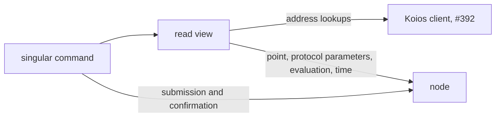

# Koios reads in the singular commands

As an operator presenting Demo 1 on preprod, I run ten `singular` commands in a few minutes, not
half an hour. Today each address lookup asks the node by address and takes about 22 seconds on
preprod; one `insert --preview` took 166 seconds. With `--backend koios`, the commands take their
address lookups from Koios through the shared client merged in #392, and keep everything else on
the node.

## What changes

`--backend` already selects where the commands' address reads come from: `node` (the default) or
`indexer`. This slice adds a third value, `koios`, and two options that go with it:
`--koios-url <url>` and an optional `--koios-token-file <path>`.

| read | under `--backend koios` |
|---|---|
| address lookups (`viewUTxOsAt`) for every command that reads an address | Koios `address_utxos`, decoded by the #392 client |
| point, protocol parameters, evaluation, slot conversion | the node, unchanged |
| submission and confirmation | the node, unchanged |

The default stays `node`. The token is read from its file by the #392 client's rules and never
printed. A Koios failure is the client's named failure, surfaced by the command, never an empty
answer.

## The two moments

The node view is taken at the node's tip, and Koios answers at its own tip. This is the interim
already accepted for the indexer backend (#376): the command may read the two sources at different
blocks. It stays safe because the ledger refuses a transaction built on a coin that is gone, and the
command reports that refusal by name. This slice keeps that interim and states it in the docs. It
adds one check of its own: when Koios's tip is behind the node's view point by more than a stated
bound, the command refuses by name before building anything.

## Boundary with #383

#383's provider switch will replace this backend selection. This slice keeps the selection in one
seam, the command composition that already chooses between node and indexer, so the switch can
absorb it. There is one Koios client and one set of decoders, the #392 ones.

## Acceptance

| truth | evidence |
|---|---|
| The devnet journey runs with `--backend koios` against a local Koios-shaped server whose answers come from the devnet node | the journey's koios run in the hosted `demo1-cli` job |
| A read-only `insert --preview` on preprod with Koios reads completes in seconds | a measured time against the 166 seconds of the node backend; no preprod transaction, no new registry |
| Addresses with no outputs are an empty answer; an unreachable or failing Koios is a named failure | tests in the off-chain suite |
| Koios behind the node beyond the stated bound is a named refusal | a test with a lagging fake Koios |
| Every new option is printed by `--help` and documented | the CLI flags check |

## Gate

Every command of every hosted CI job at the pushed head, with the journey's koios run added to the
`demo1-cli` job in this ticket, plus a repository-wide search showing that nothing renamed still
appears under its old name.
