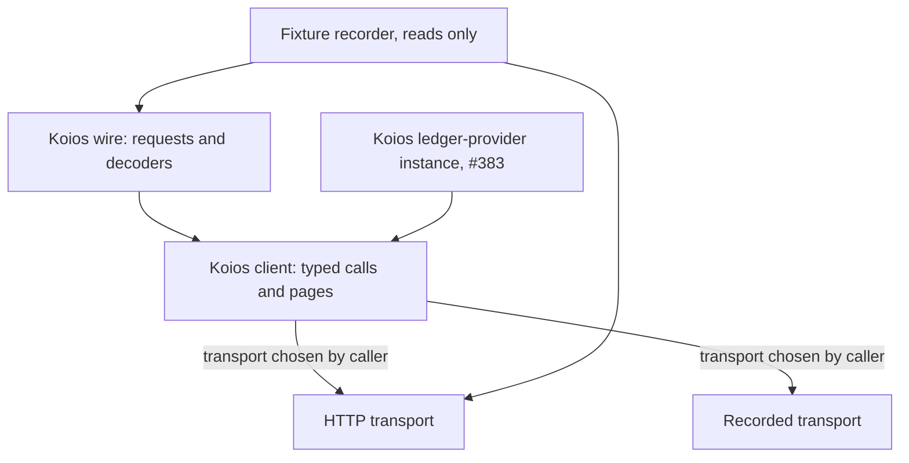

# Live Koios client: plan

As a maintainer, I want the Koios transport and decoding written once, so that
the recorded instance from #383 and the live instance run the same requests, pages
and decoders. Read the [stories](spec.md) first. Delivery base: main
`32bba1adc232fb3da5e84ea52e51ab95f670e8f1` (2026-10-07).

## Remaining delivery

As a user, I need public preview receipts to expose the session and facts they
actually consumed. The transport, decoders and provider composition below are
already on main. The remaining [tasks](tasks.md) run serially: repair the missing
create-preview evidence, retain its regression check, and record a current public
read-only smoke with successful inspect, create, insert, update and terminate
previews. Existing fake-server controls and final CI remain required.

The old GO-2 registry currently refuses history decoding, and its previous
update/terminate runs found no holding. Neither is successful preview evidence.
Use an existing compatible public registry with an active holding; do not create
one through public submissions under this read-only ticket. This is an evidence
dependency, not authorization to widen the work into demo recovery.

## Module boundary

As a provider author on
[#383](https://github.com/lambdasistemi/singular/issues/383), I import a
Koios client that knows nothing of registries or of the ledger-provider
interface, and I choose its transport.

| Module | Component | Responsibility | Effects |
| --- | --- | --- | --- |
| `Singular.Provider.Koios.Wire` | main library | One request description per call; decoders from Koios answers to Conway ledger types; the decoding failure with the position that failed | none |
| `Singular.Provider.Koios.Client` | main library | A transport record polymorphic in `m` carrying one request to one raw answer; typed calls built from it; pagination with its refusals; the named client failure | only the transport's |
| `Singular.Provider.Koios.Recorded` | main library | A transport answering from a recorded fixture directory; an unrecorded request is a named failure | reads its fixture directory |
| `Singular.Provider.Koios.Http` | new public sublibrary `koios-http` | The live transport: base URL, token file, timeout, bounded retry with backoff, rate-limit waits | HTTP |

The main library gains no HTTP dependency. `koios-http` depends on the main
library and on `http-client`, `http-client-tls` and `retry`, all already in
the build plan. Pagination sits above the transport, so recorded fixtures
exercise it as live traffic does. Retry and rate-limit handling sit inside the
HTTP transport, so a recorded replay never sleeps.

Proposed for the epic owner's ruling: #383 slice 3 builds its recorded Koios
instance on `Client` over `Recorded`, and its CI loopback facade on `Client`
over `Http` pointed at the loopback URL. Then there is one Koios client and
one decoder set in the tree.

## Calls and pages

As a reviewer, I need every call to name its pagination and its unknown case.

| Call | Method and body | Paged | Unknown or missing becomes |
| --- | --- | --- | --- |
| tip | GET | no | empty answer refused by name |
| address_utxos | POST address list, extended | yes, ordered by output reference | — honest empty is allowed |
| asset_utxos | POST policy-and-name list, extended | yes, ordered by output reference | — honest empty is allowed |
| asset_txs | GET policy, name, history | yes, ordered by block height then transaction | — honest empty is allowed |
| tx_info | POST transaction hashes with inputs, scripts and bytecode | no, request batched | a requested hash absent from the answer |
| tx_cbor | POST transaction hashes | no, request batched | a requested hash absent from the answer |
| epoch_params | GET current epoch | no | empty answer refused by name |
| submittx | POST raw CBOR | no | server refusal text kept as the refusal |
| tx_status | POST transaction hashes | no | absent hash means not yet seen |
| account_info | POST the script credential's stake address | no | absent or unrecognised status refused by name, never false |

Pages use Koios's offset and limit parameters with an explicit order. The page
size defaults to Koios's maximum of 1000 rows. Reading stops at the first page
shorter than the limit. The configured page ceiling bounds the number of pages.

## Failure model

As a user, I need a short list of reasons a call can stop.

| Failure | Raised when | Retried first |
| --- | --- | --- |
| unreachable | connection, DNS or TLS failure | yes |
| timed out | no complete answer within the request timeout | yes |
| rate limited | the server keeps answering 429 past the retry bound, or asks for a wait longer than the ceiling | yes, waiting as asked |
| server failing | 5xx past the retry bound | yes |
| refused by the server | any other 4xx, including a rejected token | no |
| incomplete page | cut-off body, page over the limit, total changing between pages, page ceiling reached | a cut-off body only |
| unknown fact | a requested transaction, registration or tip absent from the answer | no |
| undecodable | an answer that does not decode, with the position that failed | no |
| token file unreadable | configuration, before any request | no |

Submission is retried only on unreachable and timed out, because resending the
same signed bytes cannot apply them twice. A 400 at submission is the
server's refusal of that transaction, not a client failure, and is returned as
the refusal text.

## Fixtures and the fake server

As a CI reviewer, I need recorded answers I can trust and failures I can
trigger.

- A recorder executable in `koios-http` takes a list of read requests and a
  target directory. Its request type has no submission case, so it cannot
  submit. It writes each answer with the request, the schema revision from
  Koios's published OpenAPI document, the time and a SHA-256.
- Fixtures live under `offchain/test/fixtures/koios/preprod/`. They are
  recorded again when the schema revision changes; the revision check is a
  test.
- Decoder tests replay every fixture through `Recorded`, one per call above.
- A fake server in the test suite listens on loopback with scripted answers:
  a 429 with a requested wait then success; 429 forever; an answer slower
  than the timeout; a body cut mid-array; a missing middle page; 503 then
  success; 401. Each test asserts the named failure or the exact attempt
  count the server counted.

## Slices

As the epic owner, I want the part #383 imports to land first.

| Slice | Runnable outcome | Depends on |
| --- | --- | --- |
| Koios client and transport | `Wire`, `Client`, `Recorded`, `Http`, the recorder and the preprod fixtures; fake-server failure tests; a read-only probe command prints decoded facts or a named failure from any Koios URL | main only |
| Live provider | #383's Koios instance runs over the HTTP transport; `--koios-url` and `--koios-token-file` on registry commands; `registry inspect` and the `--preview` forms run on preprod with unverified facts and unbound sessions; the recorded preprod run in the pull request | #383 slice 3 merged |

The first slice adds no interface type and touches no existing command. The
second implements #383's interfaces only.

## Gate

The gate is the hosted CI command set at the pushed head, including
`(cd offchain && nix run --quiet .#lint)`, `nix build --quiet .#build-gate`,
`nix build --quiet .#component-build` in `offchain/`,
`nix run --quiet .#inventory-check`, `nix run --quiet .#docs-check` and
`nix develop --quiet -c just ci`. The epic owner completes the remaining tasks
serially, with no audit seat, as explicitly requested by the operator on
2026-10-07. Required hosted checks must pass before merge.
