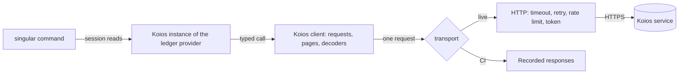

# Live Koios client: stories and requirements

Issue [#389](https://github.com/lambdasistemi/singular/issues/389), child of epic
[#371](https://github.com/lambdasistemi/singular/issues/371). Read the
[plan](plan.md) for the module boundary and slices, and the
[decisions](decisions.md) for the choices that need a ruling.

## User stories

As a `singular` user on preprod, I run registry commands with only
`singular`, a wallet and a Koios URL. Reads finish in seconds. Every fact a
command uses is reported unverified, and its session is reported unbound.

As a user with a Koios account, I give `singular` my bearer token in a file.
The token never appears on the command line, in a receipt or in a log.

As a user on a busy public endpoint, I see a command either finish or stop
with a named reason: rate limited, timed out, unreachable, refused by the
server, an incomplete page, or a response that does not decode. A command
never continues on half an answer presented as a whole one.

As a provider author working on
[#383](https://github.com/lambdasistemi/singular/issues/383), I build the
recorded Koios instance on the same request descriptions, pagination and
decoders as the live client. A recorded fixture and a live response pass
through the same code.

As a reviewer, I see the live client shown against public preprod Koios with
reads only, and I see each failure mode produced on demand by a local fake
server, never waited for on the public service.

## What the client does

The ledger-provider instance belongs to #383. This ticket supplies everything
under it: the typed calls, the pagination, the decoders into Conway ledger
types, and the live HTTP transport.

## Requirements

### Calls the client supports

The client issues these Koios calls and decodes each answer into Conway ledger
types: `tip`, `address_utxos`, `asset_utxos`, `asset_txs`, `tx_info`,
`tx_cbor`, `epoch_params`, `submittx`, `tx_status`, and the script credential
registration lookup through `account_info`.

| Call | Decoded into |
| --- | --- |
| tip | slot, block hash, block height, epoch |
| address_utxos, asset_utxos | exact output references with their complete Conway outputs: address, value with full policy-and-name assets, datum hash or inline datum bytes, reference script bytes |
| asset_txs | the transactions that moved an asset, in a stable order, every page |
| tx_info | resolved spent, reference and created outputs of named transactions |
| tx_cbor | complete raw transaction bytes, decodable as a Conway transaction |
| epoch_params | Conway protocol parameters, including cost models |
| submittx | the accepted transaction id, or the server's refusal text |
| tx_status | confirmation count, or not yet seen |
| account_info | registered, not registered, or a named unknown, never a silent false |

### Live transport

- The base URL is configurable. Preprod has no implicit default that could
  point a command at the wrong network.
- An optional bearer token is read from a file named by an option. A missing
  or unreadable file is a named configuration refusal before any request.
- Every request has a timeout.
- Transient failures are retried a bounded number of times with growing
  delays: connection failures, timeouts, server errors, and rate-limit
  answers. A rate-limit answer's requested wait is respected within the
  bound.
- A refusal that retrying cannot change, such as a bad request or a rejected
  token, is not retried.
- A transaction refused by the server at submission is reported with the
  server's reason and never retried.

### Pagination

- Paged calls are requested in a stable order with an explicit page size and
  are read until the last page.
- A page that is cut off, a page larger than requested, a total that changes
  between pages, or more pages than the configured ceiling is a named refusal.
  It is never a shorter answer.

### Named failures

Every way a call can fail ends in one named failure that carries the call,
the attempt count and the evidence: unreachable, timed out, rate limited,
refused by the server, server failing, incomplete page, unknown fact, or
undecodable answer with the position that failed. An honestly empty answer,
such as an address with no outputs, is distinct from all of them.

### Fixtures and fake server

- Fixtures are recorded from public preprod Koios with read calls only. The
  recorder cannot issue a submission. Each fixture records its request, the
  Koios schema revision, the time and a content hash.
- CI never reaches the network. Recorded fixtures replay through the same
  decoders the live client uses.
- A local fake server produces rate limiting, timeouts, cut-off pages,
  server errors and refused tokens. Each is shown to end in its named failure
  or in a bounded number of retries.

### Live acceptance on preprod

- `singular registry inspect` and every `--preview` form run against public
  preprod Koios with no node, and their receipts report each fact as
  unverified and each session as unbound.
- The pull request records one read-only preprod run: the commands, the Koios
  URL, the schema revision, the duration of each call, and the phase log of
  `registry insert --preview`.

## Out of scope

Submitting transactions on preprod, which the demo does under #371.
Blockfrost. Ledger verification. A node instance. Any new ledger-provider
interface type: the live client only implements #383's interfaces.
