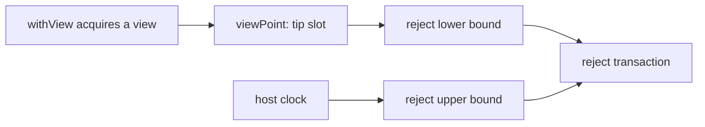

# Reject lower bound: plan

As a maintainer, I want the reject fixed with the smallest change, its rule held
by a test, and every other builder checked against the same rule. Read the
[stories](spec.md) first. Base: main `22637d46`.

## Where the bound comes from

As a folder, I need the bound read from the chain state the command acquired,
because that is the state the node judges against.

The view already carries its tip: `viewPoint` is the chain point it was acquired
at, and `cpSlot` is that point's slot
(`offchain/node-internal/Singular/Registry/Provider.hs`). No interface changes.

## Module rows

| Module | Change |
| --- | --- |
| `Singular.Registry.TxBuilder.Reject` | `rejectValidity` takes the lower bound from the view's tip slot. The upper bound keeps its fallbacks and stays strictly after the lower bound. |
| off-chain test suite | One test of the rule "lower bound at or before the view's tip" on the reject builder, over a view whose tip lags the host clock. |
| other builders | Changed only where the audit finds a violation small enough for this ticket. |
| development-network genesis and CI workflow | One run with an active-slot coefficient below one, unless split into its own ticket. |

## Function rows

| Function | Signature | Change |
| --- | --- | --- |
| `rejectValidity` | `View IO -> IO (SlotNo, SlotNo)` | Signature unchanged; the lower bound becomes the view's tip slot. |

## Builders to audit

The starting points found at intake. The commit owner confirms each, adds any
missed, and writes the verdicts in the builder audit page, `builder-audit.md`.

| Builder | Where the interval is set | Starting observation |
| --- | --- | --- |
| reject | `TxBuilder/Reject.hs`, `rejectValidity` | lower bound from the host clock: the bug |
| retract | `TxBuilder/Retract.hs`, `retractRequestAtTipImpl` | lower bound is the later of a caller-given tip and the phase-two opening slot |
| reclaim command | `cli/src/Singular/CLI/Reclaim.hs` | passes the view's tip to the retract builder |
| retract without a tip | `retractRequestImpl` (tip 0), used by the repair journey and the e2e cage tests | lower bound is the phase-two opening slot alone |
| fold | `TxBuilder/ConnectedFold.hs` | upper bound only |
| update | `TxBuilder/Update/Build.hs` | upper bound only |
| booking | `TxBuilder/Edges.hs`, `TxBuilder/Request.hs` | host clock stamps the request datum; no validity bound |
| boot, register | `TxBuilder/Boot.hs`, `TxBuilder/Register.hs` | to check |
| repair journey | `journey/repair/Main.hs` | sets its own interval |

## Slice

One slice, one commit owner, one commit per task in [tasks](tasks.md). The
release-PR investigation and the CI realism check report their verdicts before
any code for them is written; a verdict that needs more than this ticket becomes
its own bug.

## Live boundary

No preprod writes and no new registry. The fix is proved on the development
network and by the unit test; the stale preprod request is rejected by the
operator after merge.
