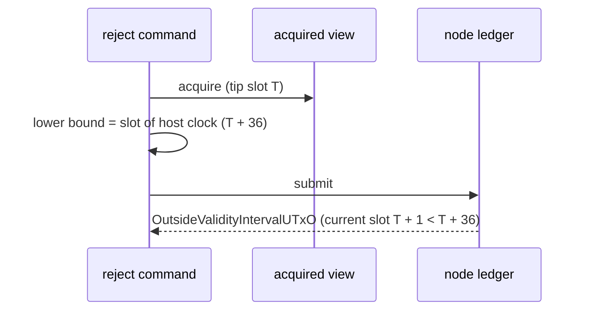

# Reject lower bound: stories and requirements

Issue [#395](https://github.com/lambdasistemi/singular/issues/395), child of epic
[#301](https://github.com/lambdasistemi/singular/issues/301). Read the
[plan](plan.md) for the module rows and the slice, and the [tasks](tasks.md)
for the commit boundaries. Base: main `22637d46`.

## User stories

As a folder on preprod, I run `singular registry reject` on a pending request
and the node accepts the transaction. Today the node refuses it with
`OutsideValidityIntervalUTxO`, because its lower validity bound is taken from
the host clock, which runs ahead of the slot of the last block.

As a maintainer, I see a test fail whenever any builder sets a lower validity
bound ahead of the tip slot of the view it was built from.

As a maintainer, I see one CI development-network run produce blocks sparsely,
as preprod does, so a bug that confuses the host clock with the last block
fails in CI and not first on preprod.

## The bug

The ledger judges the lower bound against its current slot, which is the last
block's slot plus one. On preprod a block arrives about every twenty seconds,
so the host clock is usually ahead of that slot.

## Requirements

### Reject takes its lower bound from the view

The reject transaction's lower validity bound is the tip slot of the view it was
built from, never a slot derived from the host clock.

Admissibility does not depend on that bound. The model reads no time for a
reject: `exitAdmission` answers `none` for `.reject`
(`lean/Singular/Model.lean`, `exitAdmission`), and the validator property
`prop_reject_admitted_for_every_validity_range` (`onchain/validators/cage.props.ak`)
admits a reject under every validity range. So a reject built at the tip is
admitted in every window, and the claim in the issue that the tip is already
past the retract deadline is not needed for correctness.

The reject's upper bound stays strictly after its lower bound.

### No builder sets a lower bound ahead of its view's tip

For every transaction builder that sets a lower validity bound, the bound is at
or before the tip slot of the view the transaction was built from. A builder
whose rules require a later lower bound refuses with a named reason instead of
building a transaction the node will refuse.

A test exercises this for the reject builder with a view whose tip slot lags
the host clock, and fails on the base commit `22637d46`.

### Every builder audited

Each builder's validity interval is listed with its source location and its
verdict against the rule above: reject, retract and reclaim, fold, booking,
update, boot, register and the repair journey. A further violation is fixed in
this ticket, or filed as its own bug when the fix is larger than this ticket.

### Sparse blocks in CI

One CI development-network run uses an active-slot coefficient below one, so
blocks arrive sparsely. If that needs more than a genesis configuration change
and one CI job, it is split into its own ticket, and this ticket links it.

### The release-PR conformance failure

The intermittent release-PR failure "reject-before-deadline-consumer-requirement
record 2 does not agree with the model" (job 111713723071) is investigated. The
finding states whether it shares this cause, with the evidence that settles it.
A different cause is filed as its own bug.

## Success

- On a view whose tip lags the host clock, the built reject's lower bound equals
  the tip slot; the same test fails on `22637d46`.
- The builder audit table is complete, each row with file and line.
- CI carries a sparse-block development-network run, or a linked ticket does.
- The release-PR failure has a stated verdict with evidence.
- The full `just ci` passes, and the PR CI is green on the exact head.
