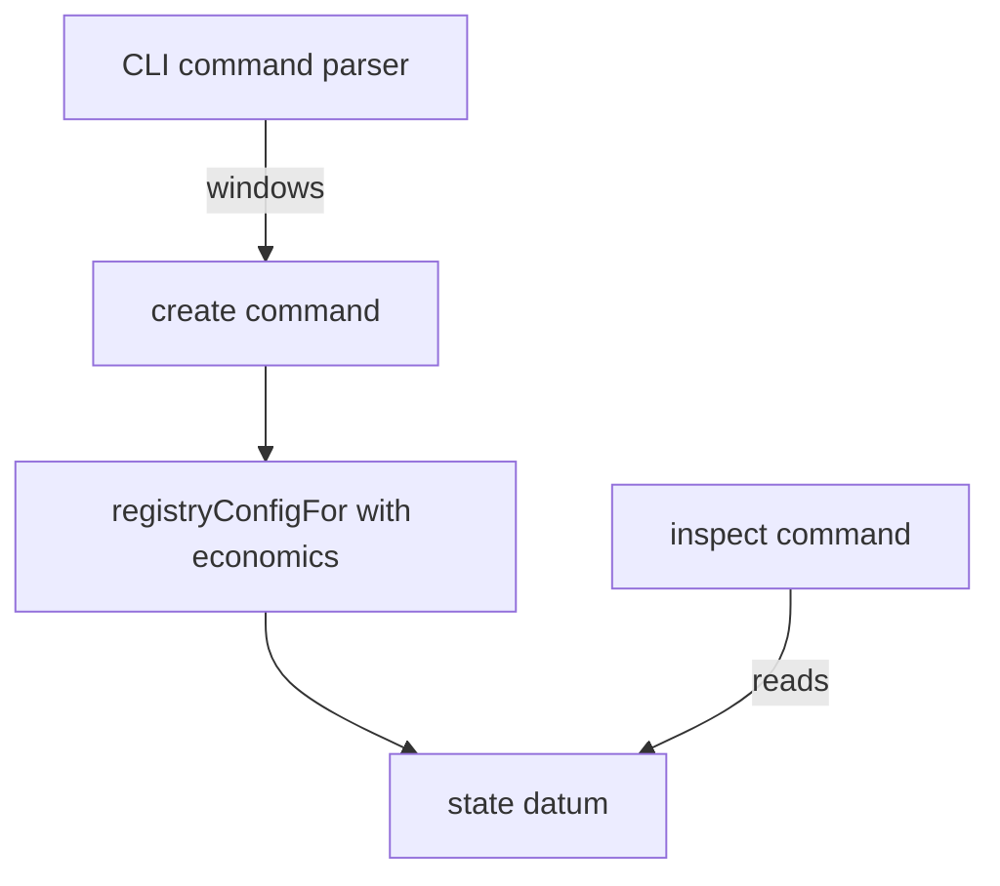

# Registry windows at create: plan

As a maintainer, I want the windows to enter at one place, `create`, and to be
read back from the chain everywhere else. Read the [stories](spec.md) first.
Base: main `9a95502d`.

## Module rows

As a creator, I need the flags to reach the state datum without any other
command learning about them.

| Module | Change |
| --- | --- |
| `Singular.CLI.Command` | `create` parses `--process-time` and `--retract-time`, refusing non-positive and non-integer values at parse. |
| `Singular.CLI.Registry` | the fixed `economics` becomes defaults (600 000 and 300 000 ms); `registryConfigFor` takes the windows. |
| `Singular.CLI.Create` | passes the parsed windows; the receipt reports them. |
| `Singular.CLI.Inspect` | reports both windows from the state datum, if not already. |
| journeys, controls, tests, docs | choose short CI windows explicitly (45 000 and 15 000 ms), with at least three times measured fold preparation beyond the client guard; compute window waits from receipt/inspect readback; defaults and preprod stay unchanged, and docs state lifetime-fixed windows. |

## Function rows

| Function | Change |
| --- | --- |
| `registryConfigFor` | gains the registry economics, or the two windows, as an argument instead of reading the fixed `economics`. |

## Slice

One slice, one commit owner, one commit per task in [tasks](tasks.md).

## Live boundary

No preprod writes and no new registry from this lane. The operator creates the
new preprod registry with longer windows after merge.
