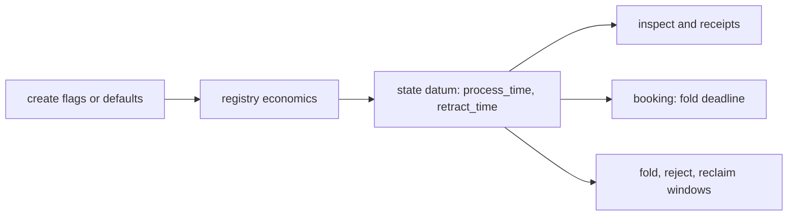

# Registry windows at create: stories and requirements

Issue [#401](https://github.com/lambdasistemi/singular/issues/401), child of epic
[#301](https://github.com/lambdasistemi/singular/issues/301). Read the
[plan](plan.md) for the module rows and the [tasks](tasks.md) for the commit
boundaries. Base: main `9a95502d`.

## User stories

As a registry creator on preprod, I choose how long a booked request waits for
its fold (the processing window) and how long its owner may then reclaim it
(the retract window), so a slow network or slow reads do not make every fold
expire.

As a registry creator, I see both windows in the `create` receipt and in
`inspect`, and I read in the documentation that they are fixed for the life of
the registry.

As a maintainer, I see a development-network journey create a registry with
explicit windows, read them back, and find each booking's fold deadline at the
booking's submission time plus the chosen processing window.

## Where the windows live

The windows are written once into the state datum at creation and the validator
keeps them unchanged afterwards. Every later command reads them from the datum,
so only `create` takes them as input. The model carries them as configuration
(`processTime`, `retractTime` in `lean/Singular/Model.lean`); this ticket
changes no model rule.

## Requirements

### Create takes both windows

`singular registry create` accepts `--process-time MS` and `--retract-time MS`,
both optional. A value that is not a positive integer number of milliseconds is
refused at parse, before anything is built or signed.

### Defaults for a public network

Without the flags, a registry is created with a processing window of 600 000 ms
and a retract window of 300 000 ms (ten and five minutes).

### The windows are shown

The `create` receipt and `inspect` report both windows as stored in the state
datum.

### CI journeys use short windows

Development-network CI journeys, controls and the attach take create their
throwaway registries with short windows through the new flags. The bounded
devnet probe measured fold build phases of 535 ms on the node backend and
558 ms on the indexer backend, and invocation-to-sign preparation of 1 147 ms
and 1 322 ms. CI uses `--process-time 45000 --retract-time 15000`: after the
client's thirty-second fold guard, fifteen seconds remain, more than three
times the measured preparation. Twenty seconds cannot clear that guard;
forty seconds leaves less than the observed journey's 6 431 ms of intervening
commands plus three times 1 322 ms, so forty-five seconds is the first safe
five-second increment for this probe. CI checks its own fold build phases
against that preparation margin. These measurements describe this devnet
probe, not a guarantee for every loaded runner.

Every request-window wait is computed from the actual registry windows and
booking deadlines read through inspect or receipts; there are no fixed
hundred-second waits. The dedicated defaults readback creates and inspects a
registry without booking a request, so it never waits out the ten-minute
processing window. Defaults and existing preprod registries remain unchanged:
new registry defaults are 600 000 and 300 000 ms, and an existing registry
keeps the windows in its datum. Documentation states the defaults and that
the windows are fixed for the life of a registry. The expected Demo 1 duration
reduction from about fifty minutes to ten to fifteen minutes awaits exact-head
CI measurement.

## Success

- A journey creates a registry with explicit windows, reads them back through
  `inspect`, and a booking's fold deadline equals its submission time plus the
  chosen processing window.
- Non-positive and non-integer values are refused at parse.
- The defaults are documented; CI callers choose their short windows
  explicitly and compute window waits from readback.
- PR CI is green on the exact head.
