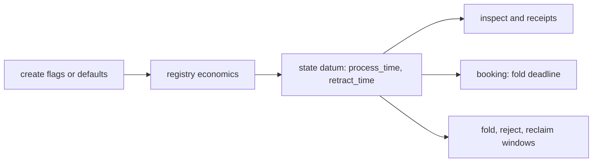

# Registry windows at create: stories and requirements

Issue [#401](https://github.com/lambdasistemi/singular/issues/401), child of epic
[#301](https://github.com/lambdasistemi/singular/issues/301). Read the
[plan](plan.md) for the module rows and the [tasks](tasks.md) for the commit
boundaries. Base: main `9a95502d`.

## User stories

As a registry creator on preprod, I choose how long a booked request waits for
its fold (the processing window) and how long its owner may then reclaim it
(the retract window), so a slow network or slow reads do not make every fold
expire.

As a registry creator, I see both windows in the `create` receipt and in
`inspect`, and I read in the documentation that they are fixed for the life of
the registry.

As a maintainer, I see a development-network journey create a registry with
explicit windows, read them back, and find each booking's fold deadline at the
booking's submission time plus the chosen processing window.

## Where the windows live

The windows are written once into the state datum at creation and the validator
keeps them unchanged afterwards. Every later command reads them from the datum,
so only `create` takes them as input. The model carries them as configuration
(`processTime`, `retractTime` in `lean/Singular/Model.lean`); this ticket
changes no model rule.

## Requirements

### Create takes both windows

`singular registry create` accepts `--process-time MS` and `--retract-time MS`,
both optional. A value that is not a positive integer number of milliseconds is
refused at parse, before anything is built or signed.

### Defaults for a public network

Without the flags, a registry is created with a processing window of 600 000 ms
and a retract window of 300 000 ms (ten and five minutes).

### The windows are shown

The `create` receipt and `inspect` report both windows as stored in the state
datum.

### Journeys keep their timing

Development-network journeys, controls and tests that relied on the old 120 000
and 30 000 ms windows pass those values explicitly through the new flags, so
their timing and CI duration are unchanged. Documentation that states the
windows is updated to the new defaults and says they are fixed for the life of
a registry.

## Success

- A journey creates a registry with explicit windows, reads them back through
  `inspect`, and a booking's fold deadline equals its submission time plus the
  chosen processing window.
- Non-positive and non-integer values are refused at parse.
- The defaults are documented; nothing in the tree still assumes the old
  defaults without passing them.
- PR CI is green on the exact head.
