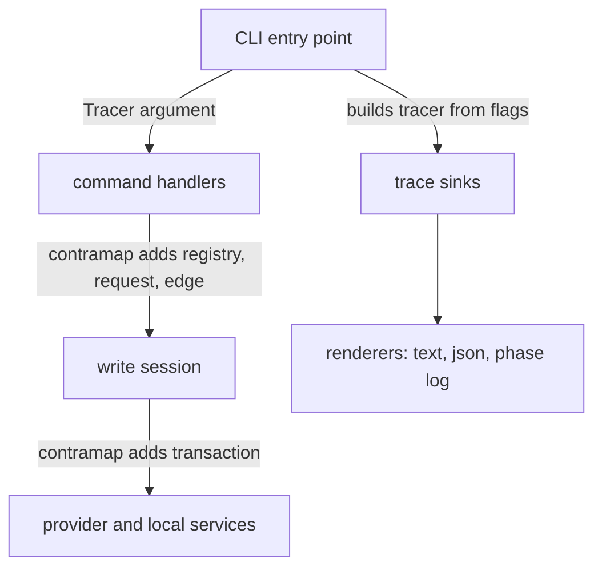

# Protocol narration: plan

As a maintainer, I want one typed event stream, threaded as an argument from
the command-line entry point, with every output a renderer of it. Read the
[stories](spec.md) first. Base: main `2cafe6b2`.

## Strategy

Follow the repository's tracing practice: `contra-tracer` with typed events,
built with `contra-tracer-contrib` (already pinned in `offchain/cabal.project`).
The ad hoc phase log is removed in the same change that threads the tracer:
`PhaseLog`, `phaseLogFromEnv`, `logPhase`, `timedPhase` and `queryPhase` are
deleted, and each of their call sites traces a typed event instead. Combinators
missing from `contra-tracer-contrib`, such as a Unix socket sink, are added
there by pull request, not written in this repository.

This ticket changes no model rule, no transaction, no receipt field and no
exit code. Edge names in events are the receipt's edge names.

## Module rows

| Module | Responsibility |
| --- | --- |
| provider-level events, in `local-services` | the `how` event type for reads, views, evaluation, horizon waits and body builds; shared by `lib`, `node-internal` and `koios-http`, which depend on `local-services`. |
| `Singular.Registry.PhaseLog`, `Singular.Registry.Node.PhaseLog` | deleted; their call sites trace provider-level events through a tracer argument. |
| `lib` builders and the Koios runtime | take a tracer argument where they read `phaseLogFromEnv` today (`TxBuilder/Edges.hs`, `OpenDatum/Update.hs`, `Provider/Koios/Runtime.hs`). |
| `Singular.CLI.Session` | the transaction-level events (build, sign, submit, confirm, refusal kinds), with the journal written beside them unchanged. |
| command handlers (`Create`, `Entry`, `Fold`, `Reject`, `Reclaim`, `Inspect`) | the registry, request and edge events, adding their context by `contramap`. |
| a CLI trace module | the event types above the provider level, the tracing controls, sink construction, and the three renderers: indented text, json lines, and the byte-compatible `SINGULAR_LOG` phase log. Only this module and the entry point read `SINGULAR_LOG`. |
| `Singular.CLI.Command` | parses `--trace`, `--trace-to` (repeatable) and `--trace-format` for every command; refuses unknown values at parse. |
| `contra-tracer-contrib` | gains a Unix socket sink (and any other missing general combinator) by its own pull request; this repository bumps the pin. |
| `tools/demo1_cli_journey.sh` | runs the commands with `--trace how --trace-to stderr`; keeps its phase-log assertions. |
| `docs/singular-node.md` | documents the flags and the stream; settings table rows for `tools/cli_flags_check.sh`. |

## Data rows

| Abstraction | Fields and invariants |
| --- | --- |
| trace level | `off`, `what`, `how`; `how` includes every `what` event. |
| trace sink | `stderr`, `file:PATH`, `socket:PATH`; each with its own format. |
| protocol scope | registry (state output, root, pending count), request (output reference, key, edge, deadline), edge (name), transaction (id); an event's scope path is added by the enclosing scopes, outermost first. |
| step event | a `what` action or verdict, or a `how` mechanic, with elapsed time where it is timed; a failure carries its outcome and its type or tag, never free error text, key material or credentials. |
| refusal kind | client, local script evaluation, ledger rejection, provider transport; disjoint. |

## Function rows

| Function | Change |
| --- | --- |
| command handlers and `withWrite`, `withSession`, `withReads`, `submitBuilt` | gain a tracer argument of their level's event. |
| `loggedProvider`, `newIORuntime`, and the builders that read `phaseLogFromEnv` | take a tracer argument instead of a phase-log handle or an environment read. |
| text renderer | a pure function from events to indented lines. |
| phase-log renderer | a pure function from provider and transaction events to the existing phase-log JSON objects. |

## Slices

One commit owner for the ticket, one commit per task in [tasks](tasks.md).
The persistent auditor reviews each task's commit.

- **Narration**, tasks one to five: everything except the socket sink. It is
  pushed and merged first, because the Demo 1 recording on 8 October needs it.
- **Socket sink**, task six: the `contra-tracer-contrib` pull request, the pin
  bump, `socket:PATH`, and the test that reads the socket.

## Live boundary

No preprod writes and no new registry from this lane. Devnet journeys in CI
exercise the commands; the Demo 1 recording itself is made by the operator.
