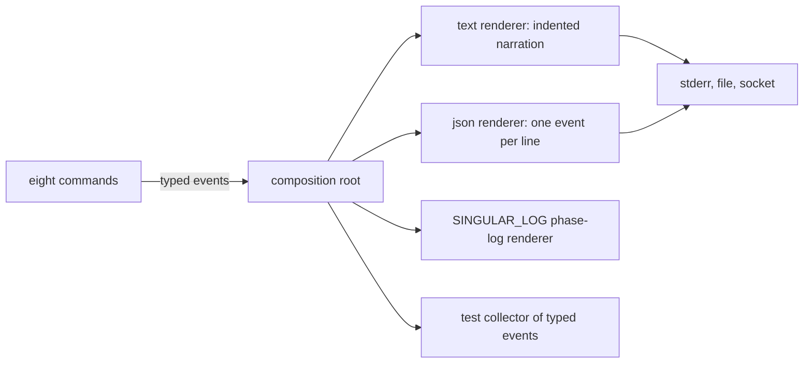

# Protocol narration: stories and requirements

Issue [#416](https://github.com/lambdasistemi/singular/issues/416), child of epic
[#301](https://github.com/lambdasistemi/singular/issues/301). Read the
[plan](plan.md) for the module rows and the [tasks](tasks.md) for the commit
boundaries. Base: main `2cafe6b2`.

## User stories

As someone watching a `singular` command, I see what it is doing at the
protocol level while it does it: the registry it reads, the request it books,
folds, rejects or reclaims, the edge and key involved, the transaction it
submits and the block that confirms it. Each step appears as it happens,
indented under the protocol action it serves, with its elapsed time.

As an operator recording Demo 1, I run every command with
`--trace how --trace-to stderr` and the recording shows the protocol actions
and the mechanics under each, while stdout still carries only the receipt.

As a machine consumer, I ask for the same events as JSON lines on a file or a
Unix socket, one typed event per line, and the existing `SINGULAR_LOG` phase
log keeps its exact format for the scripts that already read it.

As someone reading a failure, I see where the refusal happened: the client
refused before building, a script failed during local evaluation, the ledger
rejected the submitted transaction, or the provider's transport failed and no
ledger judged anything.

## One event stream

Every output is a renderer of one stream of typed events. No call site writes
a log line, reads an environment variable or decides where output goes; only
the command-line entry point builds the tracer.

## Requirements

### Typed events per protocol level

Events are typed per level, in the protocol's own vocabulary: registry,
request, edge, transaction, and provider reads. Each function that reports
takes a tracer of its own level's event; the enclosing scope adds the context
it knows (which registry, which request, which edge). Edge names are the ones
the receipt already prints, which are the model's edge names. No event carries
key material, provider credentials, or free error text; a failure carries its
outcome and its type or tag.

### What and how

`what` events are protocol actions and verdicts: the registry and its root,
the request with its key, edge and deadline, the transaction id, the result.
`how` events are the mechanics under an action: each read and its source, the
build, the evaluation verdict with units, signing, submission, the
confirmation wait. Every `how` step and every timed `what` step reports its
elapsed time.

### Tracing controls on every command

All eight commands (create, insert, update, terminate, fold, reclaim, reject,
inspect) accept:

| flag | values | default |
|---|---|---|
| `--trace LEVEL` | `off`, `what`, `how` | `what` when stderr is a terminal, `off` otherwise |
| `--trace-to SINK`, repeatable | `stderr`, `file:PATH`, `socket:PATH` | `stderr` |
| `--trace-format FORMAT` | `text`, `json` | `text` for stderr, `json` for file and socket |

`json` is JSON Lines: one typed event per line, each line a complete JSON
object terminated by a newline, flushed as the event happens, and decodable
back to the typed event. Several sinks run at once from the same stream.
Tracing never writes to
stdout: the receipt on stdout is byte-identical whatever the tracing flags.
An unknown level, sink or format is refused at parse.

### Indented text

The text renderer indents by protocol nesting: a registry contains its
requests, a request its edge, an edge its transaction, and each `how` step
sits under the `what` it serves. Rendering is a pure function of the events,
tested as such, indentation included.

### The phase log keeps its format

`SINGULAR_LOG=PATH` keeps producing the same JSON lines as today (the #363
phase log: `ts`, `phase`, `duration_ms`, `outcome`, `error_class` and the
per-phase fields), now as one renderer of the typed stream at the entry
point. The environment variable is read only there.

### Refusals named where they happen

Client refusal, local script evaluation failure, ledger rejection and provider
transport failure are distinct events and render as distinct lines. The
stream attributes a failure by the typed failure the client holds. Classifying
a Koios HTTP 400 that carries a submit-relay connection error as a transport
failure is issue [#415](https://github.com/lambdasistemi/singular/issues/415);
once it lands, the stream shows it as transport with no change here.

### The stream agrees with the receipt

For every command, the key, edge, request, transaction id and verdict in the
typed events equal those in the receipt, and a test fails when they disagree.

## Success

- Each of the eight commands emits its protocol steps at `what` and its
  mechanics at `how`, collected as typed events in tests and compared with the
  receipt.
- The text renderer's output, indentation included, is checked as a pure
  function; the receipt on stdout is unchanged under every tracing flag.
- The existing phase-log tests and the Demo 1 journey's phase-log assertions
  pass unchanged.
- A test reads the socket sink and asserts the typed events it decodes.
- The Demo 1 journey runs with `--trace how --trace-to stderr`.
- `docs/singular-node.md` documents the three flags and the stream.
- PR CI is green on the exact head.
