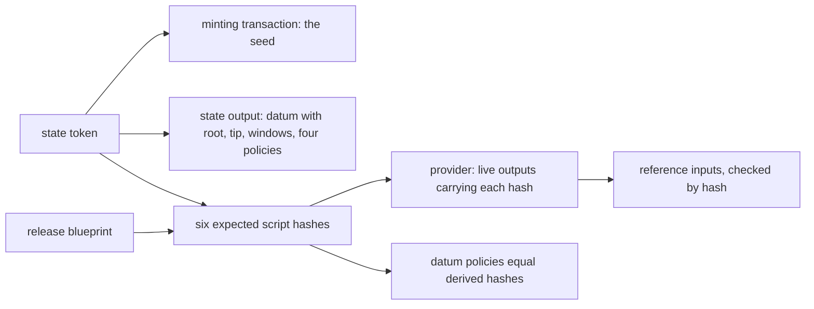

# A registry joined from its state token: stories and requirements

Issue [#437](https://github.com/lambdasistemi/singular/issues/437), child of epic
[#301](https://github.com/lambdasistemi/singular/issues/301). It absorbs
[#439](https://github.com/lambdasistemi/singular/issues/439) (the provider cannot find outputs by
reference-script hash) and [#406](https://github.com/lambdasistemi/singular/issues/406) (create
checks publication funding one script at a time). Read the [plan](plan.md) for the slices, the
[modules model](modules-model.md), [data model](data-model.md) and
[functions model](functions-model.md) for the changed rows, and the [tasks](tasks.md) for the
commit boundaries. PR1 base: main `5c4c3dd048fd0f29a1b5c2cac0c5035e07f163ed`.
The operator's 2026-10-07 cut ships token-only commands and Bob's connected journey first.
Issue #437 remains open for PR2; the preserved plans and unfinished work are follow-up scope.

## User stories

As Carol, a registry creator, I run `create` from an empty directory. It prints the state token. I
publish nothing else and keep no file that anyone else needs.

As Bob, a registrant, I start in an empty directory with the release, my wallet and a Koios URL.
I receive the state token and run any existing command with `--state-token`. It works,
or it refuses by name. I copy nothing from Carol's disk.

As Bob, I book, inspect and fold using public registry inputs and my own actor context. My process
receives no Alice directory or files. The hosted two-actor journey must establish the connected
steps, and its deliberate-open control must reject an attempt to open any Alice file.

## Where the registry's facts come from

The registry is the state token plus the release. The state script is the same for every registry
of a release. The request, three witness and application scripts are the release's scripts applied
to `statePolicy ‖ tokenName`. The windows and the tip are the registry's own rules, read from the
datum. Reference outputs are a convenience: any unspent output whose reference script hashes to an
expected hash serves, whoever made it and wherever it sits.

## Requirements

### Identity from the state token

- **Every command except `create` takes the state token.** It is given as
  `--state-token POLICY.NAME`, or read from `SINGULAR_STATE_TOKEN`.
- **One resolver runs before anything is built or written.** It refuses, by these names and in
  this order:
  1. `state-token-foreign-release`: the policy is not this release's state script hash.
  2. `state-token-not-found`: the provider has no record of the asset.
  3. `state-token-burned`: the supply is not one.
  4. `state-token-seed-mismatch`: the minting transaction spends no input whose hash is the token
     name.
  5. `state-output-missing`: no output holds the token at the state address with a state datum.
  6. `registry-pin-mismatch <field>`: one of the datum's application, active, absent or terminal
     policies differs from the hash derived from the release and the token.
  7. `network-mismatch`: the provider's network differs from the release's addresses.
- **Nothing per-registry is read from disk.** The actor's directory holds only the actor's own
  in-flight submissions: the journal, the saved submission bodies, the lock and, during `create`,
  the pending identity. `registry.json` is neither written nor read. There is no join command: an
  empty directory is a valid start.
- **`create` prints the state token** and writes no identity file. Printing a usable page command
  follows when PR2 delivers that command.

### Reference outputs found by hash

- **The provider answers an existence query:** "live outputs carrying reference script H". Each
  answer item carries the output reference and the exact output. A Koios answer is unverified and
  unbound. An empty answer means "not found by this provider", never "not on chain".
- **The command computes each candidate's script hash itself,** from the output, and never trusts
  a provider-supplied hash. A candidate that is spent, or whose script hash differs, is discarded.
- **A command looks up only the scripts its own transaction runs.** The sources are tried in order:
  the provider query, then the actor's own wallet for roles the provider did not supply.
  The wallet is not consulted when the provider supplies every needed role. With no needed roles,
  discovery reads nothing. Within the first source supplying a role, the lowest valid output
  reference wins.
- **When no source finds a carrier,** the command refuses
  `reference-missing <role> <hash>: not found by this provider or wallet`. The message names
  the remedy, `singular registry publish-references`.
- **`create`'s order is unchanged.** It publishes the state reference only if none is found, then
  boots, then publishes the request, witness and application references to the creator's wallet.
  The boot runs the state script from whichever reference was found. The funding for every
  publication is checked before the boot.

### Follow-up on the same issue

PR2 delivers reference publication and retirement commands, automatic publication, protection of
ordinary funding through a closed wallet-output interface, narrowed fund inputs, and the registry
page with tagged release-archive evidence. It also owes independently derived action identity in
the conformance report under the operator's A-013 ruling. These are unmet follow-up requirements,
not PR1 claims. Their accepted rulings and preserved work remain authoritative; this cut does not
waive them or close the issue.

### Changed public promise

The saved-application-selector refusal promise is retired by the operator's 2026-10-07 ruling:
"Retired: a registry is joined from its state token alone; there is no saved selector file to
change." The suite records that reason in its description language and keeps the promise's history
visible. Its last receipts are not reused and its state is not carried into another row. There is
no replacement row; token-only requirements, including the foreign-release refusal, retain their
own evidence.

The same day's reference-search ruling removes caller-supplied reference hints and their flag,
parsing, warning, search source and tests. Discovery uses the provider and then the actor's wallet.
The future page's provider-found reference information remains a separate PR2 requirement.

## Existing registries

Registries made by earlier releases keep their references at their creator's wallet and their
scripts from their own release. This release refuses them by name (`state-token-foreign-release`,
or otherwise `reference-missing`). They stay operable with the release that made them, through
their published identity record. There is no migration and no `registry.json` fallback.

## Limits

- **Missing carriers.** PR1 retains the named missing-reference refusal. Its diagnostic names the
  planned publication command; that command and restoration journey are still PR2 requirements.
- **Verification boundary.** The resolver checks the token against Koios
  answers, which are unverified under the Lockness rules
  ([lockness#39](https://github.com/lambdasistemi/lockness/issues/39)). Writes are protected by the
  ledger revalidating every reference input. Nothing binds "the registry I meant" to a token, so a
  genuine copycat registry of the same release passes every check.
- **Existence only.** An empty provider answer is not proof that no carrier exists.
- **A carrier spent mid-flight** between an actor's lookup and that actor's submission makes the
  submission fail on a missing input. Rerunning looks the references up again.
- **`create` is not resumable,** as today. An abort after a publication leaves that output at the
  creator's wallet, where the creator can spend it back.

## Model and constitution

PR1 binds Lean tree `16ee2d4a4233130460b7e36daffbe6f2b8b9a8ef` and constitution 1.13.0 at
the exact base above. There is no Lean change. Reference scripts, reference outputs and registry
files are not modelled.
`Singular.Reachable.initial` admits any `Config`, as genesis does, and the pin re-derivation is an
off-chain admission check outside the law, as `checkPins` is today. There is no constitution
amendment and no on-chain change: the blueprint and `onchain/script-identity.json` are unchanged.
The inherited #419 model carries each request's datum value, builds folds from public inputs
through `Singular.buildFold`, and refuses a destination with a foreign or missing carrier even
at a zero floor. Token-only identity does not weaken those transaction or settlement obligations.
Focused provider/resolver/funding checks establish their selected cases only. Acceptance of Bob's
journey requires exact-head hosted transactions and the file-open control, with receipt-computed
public state and every uncovered requirement visible.
