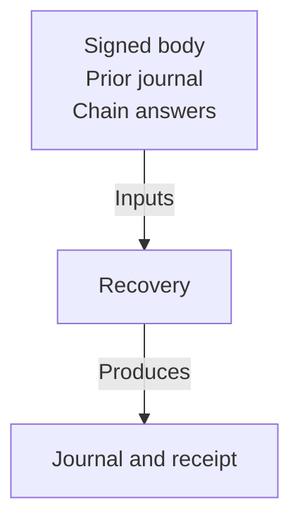

# Recorded answers remain distinguishable from recovery results

As a maintainer, I want test inputs tied to their producer and results read from the implementation, so a shared constant cannot make broken recovery appear correct.

## Evidence relationships

The original signed body and journal prefix are immutable inputs. The provider view supplies the chain answer. The observed phases and receipt fields are outputs of recovery, never supplied as expected output by the provider.

| Abstraction | Fields and relationships | Validation |
| --- | --- | --- |
| recorded-provider-answer | Existing provider representation, chain point, output references and available history; producer provenance | Decode using the existing provider; distinguish positive, live-input and undetermined evidence |
| recorded-signed-transaction | Existing body bytes, derived id, inputs, validity bounds and prepared expectation | Body/id binding through existing `boundBody`; no typed identity standing in for the producer |
| recovery-input-journal | Existing ordered `JournalEntry` values recording the interruption point | Original byte prefix retained; journal cases remain distinct |
| recovery-result | Existing `Reconciliation`, `Recovery`, serialized receipt fields and appended journal phases | Actual result supplies the observation; repeat execution cannot duplicate terminal effects |
| controlled-fault | A named altered subject or answer and its immutable original | Prove the alteration applied and the intended assertion detects it; setup errors remain separate |

## State constraints

Reuse existing types without new production fields. Exclusion requires a live spent input and reached finite upper validity bound. Missing output alone stays undetermined; an unbounded transaction stays unresolved. Repeated observation preserves previous receipts and body bytes. Distinct transactions and chain answers must stay distinguishable, with more than one identity where the assertion depends on identity or extent.

A fixture seeded at an interrupted state demonstrates recovery from that state only. It never establishes the missing prior chain journey. State/root behavior remains bound to the unchanged Lean revision in [the specification](spec.md).
