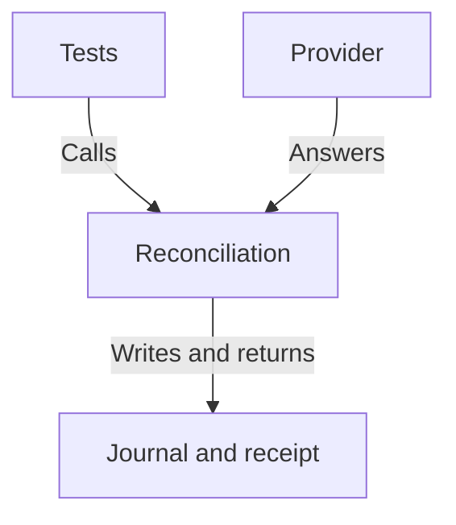

# Recovery tests exercise existing command responsibilities

As a maintainer, I want one test component to exercise the CLI recovery composition, so a helper-only green cannot stand in for journal and receipt behavior.

## Responsibilities and direction

The tests supply provider answers and inspect what production reconciliation writes and returns. They own no competing recovery implementation or expected registry law.

| Component | Responsibility | Permitted dependency |
| --- | --- | --- |
| recorded-recovery-tests | Four recovery stories, repeated reads, saved evidence and real fault controls | Existing CLI/session/reconciliation exports and existing test facilities |
| recorded-recovery-fixtures | Producer-bound chain answers and signed evidence used by the tests | Recorded artifacts and documented provenance |
| existing-cli-reconciliation | Inclusion, rollback, exclusion and observation from acquired public reads | Existing provider, journal and public-history capabilities; unchanged |
| packaged-unit-registration | Discover and tag the new module in the existing suite | Existing Hspec runner and closed area vocabulary |

## Placement decision

Use `Singular.CLI.RecoverySpec` under the existing test tree; keep recovery-specific support there. Reuse existing recorded-provider facilities rather than adding a live-node abstraction. A new shared responsibility or production seam requires a revised mandate before implementation.

[The data model](data-model.md) owns evidence relationships. [The function model](functions-model.md) owns signature-level bindings. Neither adds production behavior in this slice.
