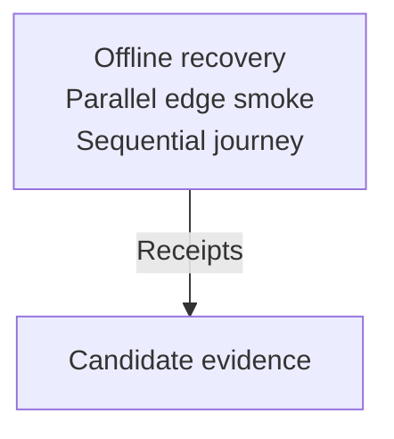

# CI stays bounded as the registry grows

As a maintainer, I want each shared recovery failure checked offline and each new edge checked in parallel, so adding registry behavior does not add serial block waits. As a CLI user, I want an uncertain submission reconciled without resending it or inventing state.

## Stories and acceptance

The first slice checks lost acknowledgement, interruption after confirmation, expiry and rollback against recorded provider answers. Each check executes the production journal/reconciliation composition, reads its resulting journal and receipt fields, and detects a relevant controlled fault. Positive inclusion, live-input exclusion and undetermined evidence remain distinct. A repeated recovery neither resends nor duplicates an observation or terminal phase. An unresolved next write preserves its transaction identity and public outcome.

The second slice checks evidence mutations offline. Original recorded evidence passes; altered evidence is rejected for the relevant clause; missing or empty extent fails closed. It establishes evidence judgement, not chain execution.

The final slice gives each chain-bound edge its own parallel hosted part and retains one sequential journey. Each node part has six minutes of test execution after cached setup, with setup/build measured separately and a whole-job timeout. It waits for the sibling recovery/control changes and an accepted job mapping.

Shared client failures, independent chain smokes and the connected journey contribute different evidence. None substitutes for the others.

## Invariants

| Name | Required observable truth | Severity |
| --- | --- | --- |
| recovery-never-resends | Reconciliation and a refused next write never rebuild or resend an unresolved transaction | BLOCKING |
| inclusion-requires-positive-chain-evidence | Saved transaction identity and positive acquired reads support inclusion and observation | BLOCKING |
| recovery-is-idempotent | Repeated recovery records each effect once and reads state through public history | BLOCKING |
| each-recovery-part-runs-alone | Every selected hosted recovery part passes alone; a control detects cross-part state dependence in slice three | BLOCKING |
| expiry-needs-live-input-and-upper-bound | Only a live spent input and reached finite bound permit exclusion | BLOCKING |
| original-evidence-is-preserved | Journal prefix and signed body bytes stay unchanged | BLOCKING |
| every-failure-mode-has-a-real-red | Each failure mode has an executed, discriminating controlled fault | ADVISORY |
| offline-means-no-node-or-block-wait | Recorded answers require neither a node nor block waits | ADVISORY |
| successor-ran-before-removal | A named successor demonstrably runs before its serial predecessor is removed | ADVISORY |
| edge-growth-does-not-extend-other-jobs | New edge jobs add independent parallel execution | ADVISORY |
| bounded-node-run-budget | Exact-head hosted measurements meet the stated execution bound | ADVISORY |

## Behavioral authority and refusal

Constitution 1.12.0 governs. The refreshed base is `0676e5354353b823b40b9cad5cac31a170a8fd08`, whose Lean tree is `042a9798ce44282ddf41f675b226d634b0155d6f`. `Singular.step`, `refusal`, `rootOf` and `admittedExitStep` remain unchanged. Recovery is the accepted client obligation in [the CLI recovery specification](../325-cli-recovery/spec.md); Lean describes registry transitions, not uncertain acknowledgement or provider rollback. This test change creates no new model guarantee.

Unknown, timed out and rolled-back submissions remain unresolved until evidence resolves them. The next write keeps its public `partial` class and transaction identity; an included after-state that cannot be observed retains `stale-state`. No refusal or exit code is renamed. Ambiguous or conflicting model behavior holds affected acceptance and returns a concrete story to the user.

## Evidence limits and delivery

Recorded-provider tests establish client recovery over those recorded answers. They do not establish node rollback, signatures accepted by a ledger, chain finality, or a connected registry lifecycle seeded only as a fixture. Product conformance rows remain receipt-computed with uncovered rows visible; any harness evidence belongs in its appendix. The replacement diff must carry each named successor and its selection/ran-proof.

Cross-wallet execution remains [the sibling fold ticket](https://github.com/lambdasistemi/singular/issues/451). No existing node scenario is removed in the first slice. Until CI reshaping lands, never-sent, whole-journal, rollback and trie-capability retain their named hosted gaps. Slices one and two may ship separately; the whole ticket remains open until its final acceptance is established.
