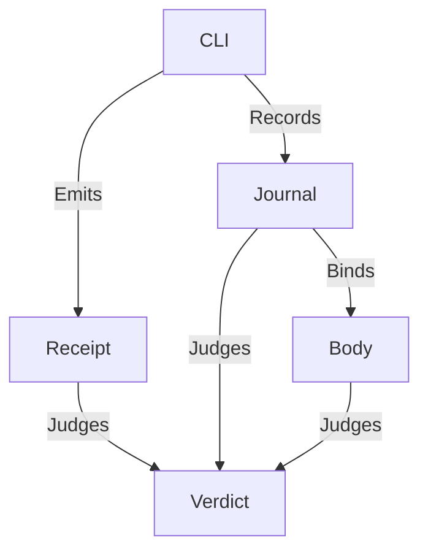

# Recovery evidence

As a reviewer, I want verdicts traceable to the commands that produced them, so that a refusal is never inferred from an exit code alone.

## Records

Existing records remain authoritative: a command receipt and stderr, the command's observed exit, prepared transaction bodies, journal events, root snapshots, selected-part clause counts and the discovered hold list. The setup produces the prerequisite holding through ordinary commands on the same registry and node. It is not a typed final-state fixture.

## Relationships

The diagram shows evidence sources feeding a computed verdict. Failure output presents those actual sources and does not manufacture a refusal name. Selection and nonempty clause counts continue to establish that the requested part ran.

## Validation

A successful cross-wallet part must retain all existing positive and altered-evidence checks. Empty, missing or malformed evidence cannot count as recovery, and a setup error stays distinct from a product refusal. The expected root, transaction identity and payments are obtained from the producing commands and ledger evidence rather than typed into the fixture.
