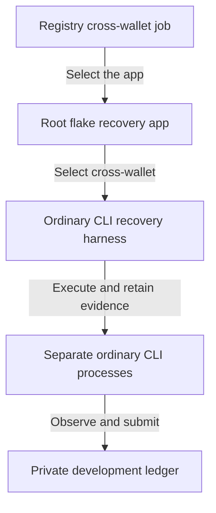

# Recovery components

As a maintainer, I want each recovery component to have one clear responsibility, so that selecting a scenario cannot hide a missing prerequisite.

## Responsibilities

The job selects the existing part mechanism through a distinct root app. The harness owns its connected setup, scenario execution and evidence-derived verdicts. The CLI and ledger continue to own product behavior.

| Component | Changed responsibility |
|---|---|
| tools/cli_recovery_controls.sh | Establish the cross-wallet part's prerequisite independently; expose failed command evidence; preserve the existing assertions and ran-proof. |
| flake.nix | Expose a distinct cli-recovery-cross-wallet app selecting cross-wallet through recoveryApp. |
| .github/workflows/registry.yml | Run the selected app as its own hosted Registry job; retain its genuine receipts, journal and bodies on success and failure, bound to candidate SHA and run ID. |

## Boundaries

No implementation moves into the specification or a second acceptance oracle. The harness remains a consumer of ordinary CLI processes and real ledger observations. The data and function models describe the changed surface only; product modules, validators and dependencies remain governed by the bound Lean revision.
