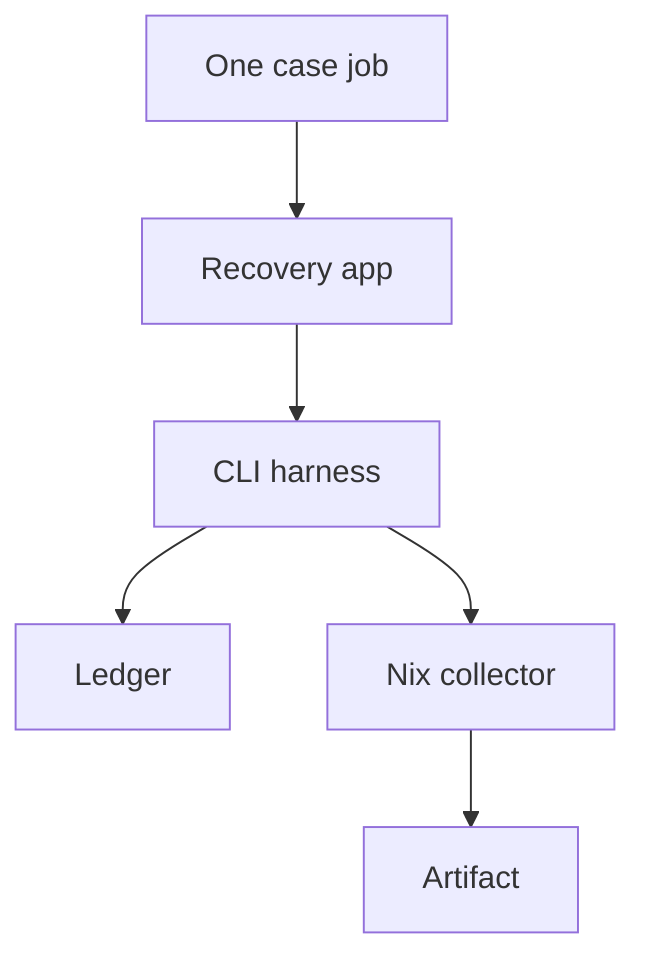

# Recovery components

As a maintainer, I want execution, case discovery and collection to have clear boundaries, so that the matrix cannot omit a required case or depend on ambient tools.

## Responsibilities

Each job selects one case through the existing part mechanism. The harness owns ordinary setup, unchanged predicates, actual execution and timing. The packaged collector retains original evidence with declared tools; the CLI and ledger continue to own product behavior.

| Component | Responsibility |
|---|---|
| tools/cli_recovery_controls.sh | Discover the complete case extent; execute a selected case with its own prerequisite, unchanged predicates/mutants, ran-proof and measured duration. |
| flake.nix | Expose source-bound case discovery, selected-case execution and a writeShellApplication collector with explicit runtimeInputs. |
| .github/workflows/registry.yml | Discover the nonempty matrix, run every case with 30-minute timeout, call the Nix collector and upload each candidate/run/part artifact on success or failure. |

## Boundaries

The three-file production fence is unchanged. Product CLI, validators, Lean, conformance and checkwrapper stay untouched. One discovery authority binds matrix cases to harness execution; duplicated or manually enumerated case counts must not hide uncovered source holds. The union of case artifacts establishes complete coverage, not a single case's receipt.
