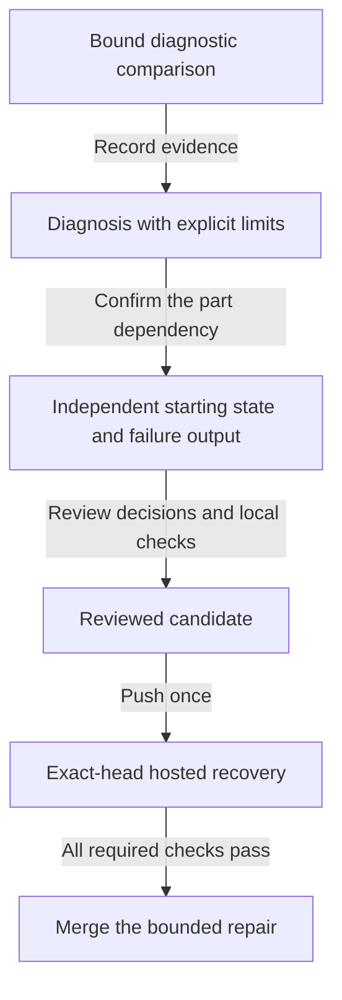

# Deliver the independent recovery part

As a contributor, I want a bounded repair with retained failure evidence, so that reviewers can distinguish the selected-part defect from an unidentified historical refusal.

## Evidence and sequence

The authorized main diagnostic at 25c79a018c5526f0f08cce8074cc5d86013811d8 reached every fold hold, but each next update refused because no live output held its key. That prerequisite belonged to the skipped killed part. The comparison uses exactly one cross-wallet run at that revision and one at the frozen public-fold-inputs revision 7ea7f609f760449e305628fdebe06ad68892eb01. Its final diagnosis must be recorded before implementation.

The flow keeps diagnosis, local checks, hosted behavioral evidence and merge as distinct decisions. Implementation starts at main after the formatting repair, 0676e5354353b823b40b9cad5cac31a170a8fd08.

## Decisions

| Chosen | Alternative | Reason |
|---|---|---|
| Establish this part's own reachable prerequisite | Select another recovery part as a dependency | A selected recovery part must run alone. |
| Show the failed command's actual evidence | Infer a refusal from exit 10 | Several client refusals share that exit. |
| Hosted CI carries repaired development-ledger evidence | Repeat local recovery campaigns | The diagnosis allowance is one pinned run per revision. |
| Preserve the existing recovery assertions | Weaken them to make a missing fixture pass | A missing starting state does not establish recovery. |

## Verification and delivery

The existing main run is the defect's executable RED witness. The selected hosted command is nix run --quiet .#cli-recovery-cross-wallet, added by this change. Whole-repository lint, touched-file formatting and specification presentation run locally; required hosted checks must pass on the exact pushed head. The owner and persistent auditor review the diagnosis/RED bundle, each changed acceptance line and the pre-push decision. There is no additional local development-ledger run.

The PR records the exact model binding, implementation entry points, observed receipts and the unresolved historical refusal. It remains draft until evidence and finalization permit readiness. Merge uses a merge commit after the merge guard confirms the head and required checks.

The hosted job uploads a named evidence artifact on success and failure. Candidate SHA and workflow run ID bind the retained receipts, journal and bodies to their producer, so offline checks can consume genuine recorded evidence. Missing records remain visible as missing evidence.
