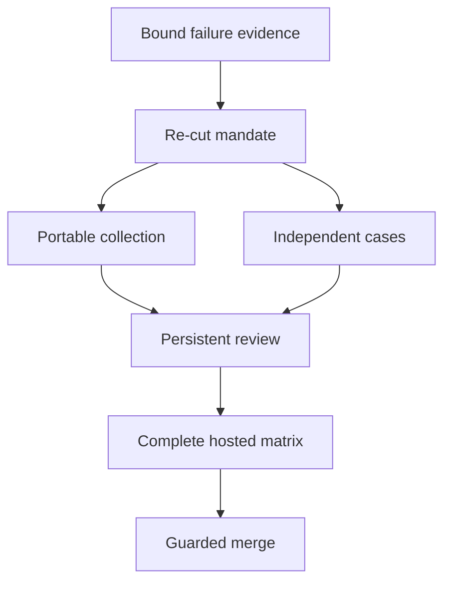

# Deliver independent recovery cases

As a contributor, I want a bounded re-cut of the execution and evidence boundaries, so that complete hosted results can support acceptance.

## Bound evidence

The two authorized diagnostics at 25c79a01 and 7ea7f609 reached all holds but refused every next update because key 0x6b0d belonged to a skipped part. Their immutable receipts are the initial RED. Candidate 6013 then established five holdings and completed four following updates on hosted CI, but cancellation left an incomplete scenario. Its collector exited 127 because the runner lacked awk.

The flow separates the new mandate, source decisions, pure collection checks, complete hosted behavior and delivery. The existing owner and persistent auditor continue with fresh checkpoints.

## Decisions

| Chosen | Reason |
|---|---|
| Collection through a Nix app with explicit runtime tools | A local host's PATH did not establish the runner environment. |
| One matrix part per discovered hold plus the lost answer | The aggregate exceeded 30 minutes while mutation work grew with the shared journal. |
| Every part owns its prerequisite and artifact | Neither setup nor evidence may depend on a sibling case. |
| Complete discovered extent checked across the matrix | A passing subset cannot hide an uncovered case. |
| Keep predicates, mutants and 30-minute limit | Cancellation and budget pressure do not authorize weaker expectations. |

## Verification and delivery

No additional local node run is authorized. The collection control consumes the retained genuine diagnostics under empty ambient PATH; proof binds collector revision separately from the records' producer. The matrix's behavior is hosted-only on the next exact head. Each case reports actual wall duration of its node-backed harness invocation, including setup and clause work and excluding collection/upload; the recorded timing boundary must be explicit.

Before every further push run root just lint, conformance hlint-check and format-check, and offchain lint, each with its own exit 0 receipt. Specification presentation and exact-head required hosted checks must pass. Each new checkpoint gets one initial review; a second collection or case-split review block returns to the epic. No new seats or fresh inspector are authorized.

The PR remains draft until complete evidence and mechanical finalization permit readiness. Actual delivery still requires the authorized guarded merge commit and its recorded SHA. Historical and shared-directory limits remain explicit.
