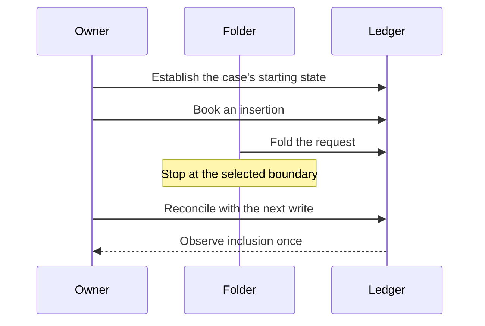

# Recover another wallet's fold

As a registry operator, I want every recovery case to run independently with trustworthy evidence, so that a passing matrix demonstrates recovery without another case's setup.

## User stories

A requester books an insertion. Another funded wallet folds it in the same registry directory. When that process stops at a declared hold or loses its submission answer, the requester's next ordinary write reconciles the fold once and proceeds. Every case uses its own private development ledger and ordinary prerequisite insertion.

The sequence shows one connected case. The matrix covers every source-declared fold hold and the separate lost-answer case; a subset does not establish the complete scenario.

## Requirements

| Requirement | Meaning | Severity |
|---|---|---|
| independent case state | Every selected case establishes its own holding through real ordinary CLI commands. | BLOCKING |
| complete recovery extent | The complete matrix covers every discovered fold hold and the lost answer, preserving existing receipt, journal, root, signer-witness and no-resubmission expectations and their negative controls. | BLOCKING |
| visible command failure | Failed commands expose actual receipt reasons or explicit receipt absence, preserving their outcomes. | ADVISORY |
| selected case execution | Existing CLI_RECOVERY_PARTS and ran-proof reject unknown or empty execution; every hosted case reports measured node-backed execution time and fits the unchanged 30-minute job. | BLOCKING |
| portable evidence collection | A Nix app declares every tool it executes and succeeds under empty ambient PATH on real captured records. | BLOCKING |
| retained case evidence | Every case uploads genuine original receipts, journal and bodies on success and failure with candidate, run and part identity, file hashes and measured excluded extent. | BLOCKING |

## Model and limits

Lean authority for the rebased re-cut is accepted main 5c4c3dd048fd0f29a1b5c2cac0c5035e07f163ed (constitution 1.13.0): Singular.Request, refusal, step and txOf in lean/Singular/Model.lean; Singular.Statements.fold_requires_no_signer in Statements.lean. A payment-key witness is distinct from required signers. This binding includes the request-carried datum and public fold inputs accepted in #419; this ticket changes neither. Historical diagnostics and the 6013 reviews retain their original model bindings. Product code, signer requirements, refusal names, deadlines and expected recovery behavior are unchanged.

A-003 re-cuts the collector and case scheduling after candidate6013's hosted cancellation and missing-awk failure. Its partial artifact11486780028 is labelled salvage, never gate evidence. Historical fold exit 10 remains unreproduced/unidentified; shared-directory controls establish no public-only fold from a separate directory. Consumer conformance and uncovered rows remain receipt-derived and unchanged.
