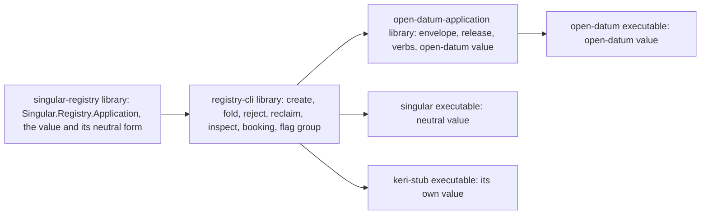

# Plan: six ordered slices, one pull request

Base `e3c9ab01` (the #505 merge). Branch `feat/528-registry-cli-split`, worktree `/code/singular-issue-528`. The branch is a stack of patches, one per slice, no journey commits. Hosted CI at the exact head is the gate; each slice's candidate gate is the table in the gate record, run once per checkpoint.

## Strategy

Code moves; behaviour does not change except where this plan names it. Today twelve command-line modules and two library modules (`Singular.Registry.StateToken`, `Singular.Registry.Config.Application`) import the open-datum package, and `Singular.CLI.Fold` calls the open-datum release rules. The split introduces one value, the **application value**, that carries everything the registry needs to know of an application. Each executable composes its value and hands it to the library; no registry code names an application.

Dependency direction is the control: nothing on the left of an arrow depends on anything to its right, so `registry-cli`, `singular` and `keri-stub` cannot import the open-datum package.

## Slices

Each slice is bisect-safe: it builds, passes its candidate gate and leaves every hosted journey green.

1. **application-value-seam.** Add `Singular.Registry.Application` (the value, the pin and the neutral value) to the registry library. `StateToken` and `Config.Application` take the value instead of the `Application` enumeration. Move `Singular.Application.OpenDatum.*` into the new library `open-datum-application` (module names unchanged); add the open-datum value. The command line still composes the open-datum value, so every receipt is unchanged. RED: the boundary control, scoped to the registry library, lists the two importing modules at base.
2. **commands-through-the-value.** `Create`, `Registry`, `Fold`, `FoldRules`, `Live`, `Reconcile`, `Inspect`, `Preview` take the value; the open-datum knowledge they hold (envelope check, holding lookup, release, decode, pin title) is reached only through it. The neutral value gives the behaviours of A-001: `create` pins a hash, `fold` refuses a termination naming the application executable, `inspect` prints raw datums, `reconcile` matches by the datum hash. RED: boundary control scoped to the command-line modules, plus neutral-value specs.
3. **registry-cli-library.** Move `cli/src` into the public sublibrary `registry-cli` (module names unchanged); `singular` and `cage-tests` depend on it. The entry commands (`Entry`, `Plan`, `InsertEnvelope`, the verbs of the parser) are not moved yet. RED: build graph control: `cage-tests` no longer lists `cli/src` among its source directories.
4. **open-datum-executable.** The open-datum verbs leave `singular` for the `open-datum` executable (`create`, `insert`, `update`, `terminate`, `fold`, `inspect`), parsed with the registry library's flag group. `singular` composes the neutral value and refuses `insert`, `update`, `terminate` as unknown commands. Demo 1 scripts, control journeys, the release archive, the documented-flags table and the docs change binaries in this slice, because they cannot be green between. RED: refusal control for the three removed verbs; boundary control scoped to everything including `Main`.
5. **booking-refusal.** The library's booking call refuses, before signing and in preview alike, a request whose key's current leaf the edge rules out (#486). RED: spec registering an active key on the base returns a booking.
6. **keri-stub.** The `keri-stub` executable (register, convict, status) with its own approval policy, built on `registry-cli` and the registry library only; the `keri-stub-check` flake app and the `keri-stub` job in `registry.yml`. RED: the job's command on the base has no executable to run.

Slices 1 to 4 are mechanical in intent. Slices 5 and 6 add behaviour and evidence. Slice 6 is its own pull request, cut from the merge of slices 1 to 5 (desk ruling at plan review): slices 1 to 5 are the exclusive window, the stub is additive and takes no window.

## Order against the live lanes

The desk orders merges. This ticket plans for the exclusive window: it builds on `e3c9ab01`, rebases at a slice boundary after each merge the desk announces (#485 first), and rebases once more in its slot. Touched-file overlap with #485 (PR 525: `Command`, `Create`, `Entry`, `Fold`, `Inspect`, `Preview`, `Reclaim`, `Reject`, the cabal file), #471 (PR 516: moves library modules into `kernel`, `surface`, `history`, `harness` components) and #381 (PR 433, stacked on #485) is expected; none lands inside this ticket's scope.

## Constraints

- No Lean, Aiken, blueprint, script-identity or `lean/` change. The `keri-stub` policy is a script built by the stub itself (an always-succeeding minting policy), not a new on-chain validator.
- Every new component is classified in `offchain/nix/component-inventory.nix`, whose carrier (`component-build`) fails on an unclassified component.
- No new cabal package: new components live in `offchain/singular-registry.cabal`, so the conformance flake's rewrite of the `  .` line in `offchain/cabal.project` is not triggered. A slice that needs a second package stops and asks (it then replaces that rewrite).
- Hosted jobs run in parallel; no local rerun of the hosted job list. The candidate gate selects with the suite's area tags.
- Narration clips of a changed docs page are regenerated per the documentation skill's standing authorization.

## Temporary arrow

From slice 3 until slice 4, `registry-cli` still holds the entry commands and depends on `open-datum-application`. Slice 4 moves those commands into `open-datum-application`, which depends on `registry-cli`, and removes the arrow. The boundary control's scope widens slice by slice and covers every component, `Main` included, at slice 4.
