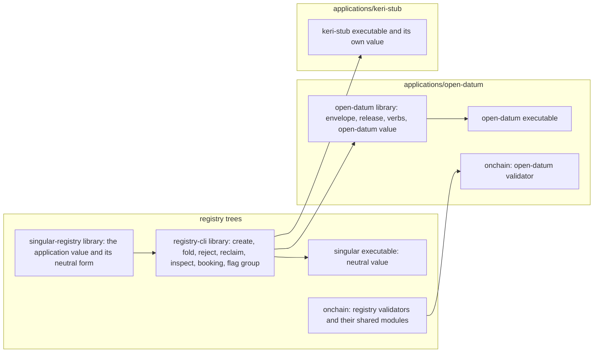

# Plan: seven ordered slices, six in one pull request

Base `e3c9ab01` (the #505 merge), rebased on `7d76efb0` at the desk's release of 2026-10-10. Branch `feat/528-registry-cli-split`, worktree `/code/singular-issue-528`. The branch is a stack of patches, one per slice, no journey commits. Hosted CI at the exact head is the gate; each slice's candidate gate is the table in the gate record, run once per checkpoint.

## Strategy

Code moves; behaviour does not change except where this plan names it. Today twelve command-line modules and two library modules (`Singular.Registry.StateToken`, `Singular.Registry.Config.Application`) import the open-datum package, and `Singular.CLI.Fold` calls the open-datum release rules. The split introduces one value, the **application value**, that carries everything the registry needs to know of an application. Each executable composes its value and hands it to the library; no registry code names an application.

The operator's amendment of 2026-10-10 adds a second cut, by tree. The registry trees (`offchain/`, `onchain/`) hold the registry only. Each application owns one top-level tree, on-chain and off-chain alike.

Dependency direction is the control: an arrow leaves the registry trees for an application only as a dependency of the application on the registry. Nothing in the registry trees names an application, and neither application references the other's tree.

## Slices

Each slice is bisect-safe: it builds, passes its candidate gate and leaves every hosted journey green. Slices 1 to 3 are done at the time of the amendment.

1. **application-value-seam.** Add `Singular.Registry.Application` (the value, the pin and the neutral value) to the registry library. `StateToken` and `Config.Application` take the value instead of the `Application` enumeration. Move `Singular.Application.OpenDatum.*` into the new library `open-datum-application` (module names unchanged); add the open-datum value. The command line still composes the open-datum value, so every receipt is unchanged. RED: the boundary control, scoped to the registry library, lists the two importing modules at base.
2. **commands-through-the-value.** `Create`, `Registry`, `Fold`, `FoldRules`, `Live`, `Reconcile`, `Inspect`, `Preview` take the value; the open-datum knowledge they hold (envelope check, holding lookup, release, decode, pin title) is reached only through it. The neutral value gives the behaviours of A-001: `create` pins a hash, `fold` refuses a termination naming the application executable, `inspect` prints raw datums, `reconcile` matches by the datum hash. RED: boundary control scoped to the command-line modules, plus neutral-value specs.
3. **registry-cli-library.** Move `cli/src` into the public sublibrary `registry-cli` (module names unchanged); `singular` and `cage-tests` depend on it. The entry commands (`Entry`, `Plan`, `InsertEnvelope`, the verbs of the parser) are not moved yet. RED: build graph control: `cage-tests` no longer lists `cli/src` among its source directories.
4. **open-datum-executable.** The open-datum code leaves the registry's cabal package for the package `open-datum` at `applications/open-datum/offchain/`, with its own project and flake depending on the registry packages: the library (`Singular.Application.OpenDatum.*`, the value, the entry commands, the verbs and their parser, the recognised open-datum script generated from the application's identity record), the executable `open-datum` (`create`, `insert`, `update`, `terminate`, `fold`, `inspect`, parsed with the registry library's flag group), the application's specs, and the negative host `singular-negative` that crafts open-datum shapes. `offchain/open-datum`, `offchain/negative` and the `open-datum-application` sublibrary disappear, and the registry's generated list of known scripts stops naming the open-datum hash. `singular` composes the neutral value and refuses `insert`, `update`, `terminate` as unknown commands. The application's flake reads the deployment blueprint from the registry's project, which still holds the open-datum validator at this slice. Demo 1 scripts, control journeys, the release archive, the documented-flags table and the docs change binaries in this slice, because they cannot be green between. RED: refusal control for the three removed verbs; the separation control, scoped to `offchain/` and to the application's package.
5. **application-onchain-tree.** The open-datum validator (`open_datum`), its module `application/envelope` and their tests move from `onchain/` into the Aiken project `applications/open-datum/onchain/`. The registry modules those files import move from `onchain/validators/` to `onchain/lib/` with their module names unchanged, where an Aiken dependent can import them; the application's project depends on the registry's. The open approval policy `open` stays with the registry (see the classification in the modules model). The open datum's deployment blueprint becomes the registry's blueprint plus the open-datum validators, produced from the application's tree, so the `--blueprint` input of every executable is unchanged; the registry's identity records split with it. RED: the hash comparison control fails while the application's project is empty, and the separation control, now scoped to `onchain/`, lists the open-datum modules there at the slice's base. If the separated project cannot reproduce a hash, the slice stops with a question and changes no identity; slices 4, 6 and 7 do not wait for it.
6. **booking-refusal.** The library's booking call refuses, before signing and in preview alike, a request whose key's current leaf the edge rules out (#486). RED: spec registering an active key on the base returns a booking.
7. **keri-stub.** The `keri-stub` executable (register, convict, status) with its own approval policy, born in `applications/keri-stub/` under the same rules, built on `registry-cli` and the registry library only; the `keri-stub-check` flake app and the `keri-stub` job in `registry.yml`. RED: the job's command on the base has no executable to run.

Slices 1 to 5 are mechanical in intent. Slices 6 and 7 add behaviour and evidence. Slice 7 is its own pull request, cut from the merge of slices 1 to 6 (desk ruling at plan review): slices 1 to 6 are the exclusive window, the stub is additive and takes no window.

## Order against the live lanes

The desk granted this ticket the exclusive merge window on 2026-10-10: no other lane merges until this pull request merges. The branch is rebased on `7d76efb0` (the #358 slice 2 merge). Touched-file overlap with #471 (PR 516: moves library modules into `kernel`, `surface`, `history`, `harness` components) and #381 (PR 433) is expected; none lands inside this ticket's scope. The negative host of #358 moves with slice 4 because it crafts open-datum shapes; the desk is told.

## Constraints

- No Lean change and no validator logic change. Validator sources move between projects; every hash stays byte-identical, which a control compares. The `keri-stub` policy is a script built by the stub itself (an always-succeeding minting policy), not a new on-chain validator.
- Every new component is classified in `offchain/nix/component-inventory.nix` (registry components) or the application's own inventory entry, whose carrier fails on an unclassified component.
- Application packages live in their own trees, `open-datum` (slice 4) and `keri-stub` (slice 7), with their own flake and project. The conformance flake builds the registry and application packages together without the registry tree naming the application.
- Hosted jobs run in parallel; no local rerun of the hosted job list. The candidate gate selects with the suite's area tags.
- Narration clips of a changed docs page are regenerated per the documentation skill's standing authorization.

## Temporary arrow

From slice 3 until slice 4, `registry-cli` still holds the entry commands and depends on `open-datum-application`, inside the registry's cabal package. Slice 4 moves those commands and the library into the application's package, which depends on `registry-cli`, and removes the arrow. The separation control covers every component of `offchain/`, `Main` included, at slice 4, and `onchain/` at slice 5.
