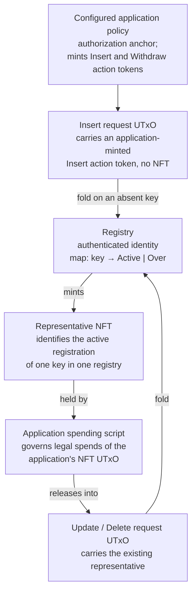
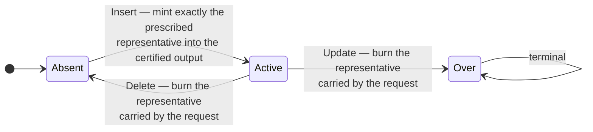
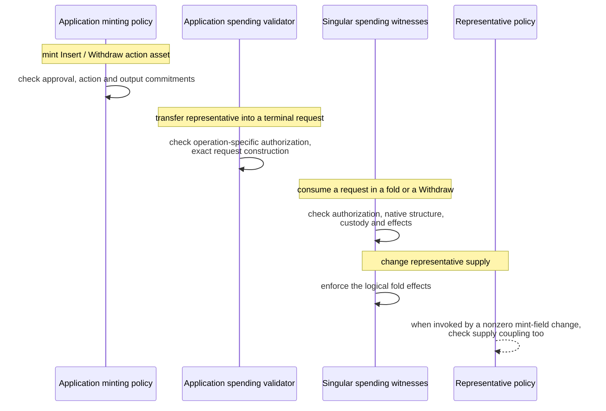

# Singular protocol specification — draft

This specification derives from the [overview](../../docs/overview.md), [lifecycle](../../docs/lifecycle.md) and [certification design](../../docs/certification.md), with a bounded [prior-art comparison](../../docs/prior-art.md) and an illustrative [naming walkthrough](../../docs/naming-demo.md). It records required behavior, not an implemented wire protocol. **MUST** and **MUST NOT** express requirements of the intended protocol. The open decisions at the end prevent treating this as a complete implementation contract.

## Purpose and scope

Singular is a permissionless registry on Cardano for unique identities and independent application state. It uses an authenticated MPF map and representative NFTs. This specification covers registry operations, native requests, certification and custody. It does not select an implementation language, a certificate encoding, a generic application plugin, a KERI integration or a shared-library API.

## Entities and terminology

A registry has an authenticated identity and a map from keys to payload-free `Active` or `Over` values. An absent key has no entry. A representative NFT identifies the active registration of a key within its registry. An Insert request UTxO carries an application-minted Insert action token; Update/Delete requests carry the existing representative. Any additional Update/Delete request-token construction remains open. A configured application policy provides the application authorization anchor, including accepted approval for Insert. The application spending script governs legal spends of the application's NFT UTxO.

Registry identity, representative policy, request-token issuance, application authorization policy and application spending script are distinct semantic roles. Their actual script hashes may coincide if an implementation shares a script; this specification neither requires nor forbids that sharing.

The design interface target is one application-specific parameter: the configured application policy ID. Registry identity and native policy settings are separate protocol configuration; Insert initial state and destination are approved per-request values. Sufficiency of this interface for a concrete protocol is not yet proved. The application policy mints Insert and Withdraw action tokens directly. Singular recognizes the configured policy ID and recomputes their action-bound asset names; no second mandatory native request policy/token is required for these actions.

**Withdraw** cancels a pending Insert; it is neither registry Delete nor a staking-reward withdrawal/plugin invocation. Registry **Update** means retirement. An **application update** means an application-defined state transition and is not a registry operation.

## Required behavior

### Registry transitions and representative supply

A successful fold MUST apply only these transitions and their coupled representative effects:

| Operation | Required prior state | Resulting state | Representative effect |
| --- | --- | --- | --- |
| Insert | Absent | `Active` | Mint exactly the registry-prescribed unique representative into the certified application output |
| Update | `Active` | `Over` | Burn the existing representative carried by the request |
| Delete | `Active` | Absent | Burn the existing representative carried by the request |

`Over` MUST be terminal. An `Over` key MUST have no live representative. Delete MUST permit a later Insert for that key, subject to approval valid for that registration and absence at that later fold. No alternative Update pair is supported.

`Active` MUST denote an outstanding representative, including while that representative is in a pending request. It MUST NOT assert an application's usability or local business state. The registry values MUST contain no application payload.

### Native request construction

Insert and Withdraw MUST use action tokens minted under the configured application policy. The application's minting policy MUST enforce the required approval and certified request construction when minting an action asset. The releasing application spending validator MUST enforce the exact output binding/custody when creating an Update/Delete request. Singular's spending witnesses MUST check applicable native structure, operation, binding and custody when consuming requests; for action assets, they MUST recognize the configured policy ID and recompute the expected action-bound name. Tokens issued by an arbitrary substitute policy MUST NOT be accepted. Any additional Update/Delete request token and its issuer remain a construction detail under the open decision on action encoding and token lifecycle.

Creating an output at Singular's address MUST NOT be treated as execution of its spending validator or proof of request admission. Malformed outsider outputs may exist at the address; Singular MUST refuse to process them as valid requests. No additional creation-time native request policy is assumed.

Action-token asset names MUST hash an unambiguous canonical encoding with domain separation between Insert and Withdraw. The specific hash function and binary schema remain open.

The application constructs the transaction; the configured application policy ID is its authorization anchor. Request creation MUST be supportable without observing the mutable registry UTxO. This requirement does not prohibit application inputs, transaction-context checks or authenticated registry configuration.

### Insert approval at request minting

Minting an Insert request token MUST require accepted application certification of the exact proposal. Native format validity alone MUST NOT authorize Insert. The certification MUST bind:

- target registry, Insert operation and key;
- configured application policy identity and evidence;
- initial application state/datum;
- destination application spending script and address constraints;
- representative identity/quantity as prescribed by registry rules and any other declared output value/effect constraints.

The application policy ID MUST be an authenticated Singular parameter bound to the registry's rules. A requester MUST NOT gain approval by choosing an arbitrary self-issued policy. The certification mechanism MUST prevent substitution of any bound field after approval.

Approval MUST be established when the Insert request token is minted; this requirement is not deferred to folding. The configured application policy MUST mint the Insert action token directly. Its asset name MUST commit to the Insert tag, registry, key, initial application datum, destination and declared required effects. Singular MUST recompute and match this name when consuming the request. Certification MUST NOT be treated as a reservation of the key or a guarantee of inclusion/order.

The application's minting policy MUST enforce the initial request output constraints in the creating transaction. Singular recognition authenticates the configured issuer, not the correctness of arbitrary application code. Claims about approved application semantics are conditional on the configured policy and application spending script implementing their declared contracts.

Declared required effects MUST be explicit native output parameters supported by the eventual schema: representative identity/quantity, destination, datum and supported value constraints. They MUST NOT imply an unspecified universal transaction-predicate language. Applications needing additional fresh observations or effects at folding are outside demonstrated precertification coverage unless the native contract explicitly supports them.

### Insert pending, completion and withdrawal

A pending Insert request MUST contain no representative NFT. A representative for its requested key may already exist elsewhere: admission of an Insert request does not assert absence.

Successful folding MUST check absence in the applicable successive registry state and MUST produce exactly the representative output specified by the certified proposal, including its destination and initial state. Registry insertion and representative creation MUST occur atomically in that folding transaction. The fold MUST NOT accept Insert for an occupied key.

Insert requests MUST support withdrawal before successful folding. Withdrawal MUST NOT change registry state or mint a representative. Cancellation authorization MUST originate from a separate Withdraw action token minted by the configured application policy. Its asset name MUST commit to the Withdraw tag, registry, exact pending Insert UTxO and required refund terms/effects. Singular MUST check the configured policy and this exact action binding when consuming the pending Insert. An Insert action token alone MUST NOT authorize Withdraw.

The application's approval conditions, precise refund economics and token disposal remain open under the decisions on action encoding and on Withdraw economics. No representative minting or registry transition is permitted during Withdraw. The protocol MUST NOT interpret withdrawal availability as arbitrary access to deposits or arbitrary cancellation authority.

### Update and Delete application authorization

An Update/Delete request MUST carry the existing authentic representative for its exact registry/key, at the Singular request address. An additional request token, if any, is a construction detail under the open decision on action encoding and token lifecycle.

The application spending validator MUST authorize transfer from application custody into that exact request, including operation, registry/key and destination. The application remains responsible for the legality of the release under its own rules. Mere NFT spendability MUST NOT be treated as blanket authorization of any registry operation.

The application spending validator MUST enforce the request format, exact binding and custody in the release transaction. Singular MUST check the native conditions when consuming the request. Neither transfer to the address nor movement of an existing token alone invokes a receiving or minting policy. No second application attestation token is required solely to repeat a valid operation-specific release authorization. The application MUST NOT be able to bypass Singular's representative supply or request custody requirements.

### Update and Delete custody and completion

Pending Update/Delete requests MUST retain their representative until valid completion. They MUST NOT support ordinary withdrawal, rejection or sweep that releases it.

Valid completion MUST consume the request, burn its representative and apply its specified registry transition atomically. A pending representative MUST NOT also remain available for independent application rotation. A completed request MUST NOT be accepted again; the concrete request-token lifecycle must satisfy this requirement.

### Folding and actor permissions

A fold MUST apply requests against successive authenticated map states, including Insert absence and Update/Delete existing-value checks. Singular's own fold logic MUST recognize authorization and check explicit native output requirements without a mandatory arbitrary application-validation callback. This is not a guarantee that every application fits or that no application policy executes in the folding transaction. A nonzero net burn of an application action asset invokes that policy. Whether its burn branch avoids repeating costly semantic checks depends on the unresolved disposal contract; no performance improvement is established here.

Singular MUST impose no native owner, privileged requester or privileged folder gate. Anyone MAY submit a transaction satisfying the applicable protocol requirements. This does not remove application validation or establish inclusion fairness.

### Replay and reincarnation

The custody rules MUST prevent two simultaneous pending Update/Delete requests from holding the same authentic representative. Consuming a request UTxO MUST prevent consuming that same UTxO again.

Approval from a previous registration MUST NOT authorize a later incarnation outside its certified scope. If approval was limited to the previous incarnation, the later registration needs fresh approval; deliberately reusable approval is not ruled out if the application protocol selects and bounds it. A concrete scope/incarnation-binding rule is required under the open decision on incarnation scope. UTxO single-spend alone MUST NOT be presented as establishing this broader property.

### Executing witnesses and net minting

Every native transition, supply and custody obligation MUST have an executing ledger witness. The concrete division of checks among Singular's request/registry spending validators and representative policy remains the open decision on transaction shapes and libraries; it MUST NOT rely on an unexecuted receiving validator or an assumed per-operation policy invocation.

| Boundary | Required executing witness |
| --- | --- |
| Mint Insert/Withdraw action asset | Configured application minting policy checks approval and action/output commitments |
| Transfer representative into terminal request | Releasing application spending validator checks operation-specific authorization and exact request construction |
| Consume request in fold or Withdraw | Singular spending witnesses check applicable authorization, native structure, custody and effects |
| Change representative supply | Native spending witnesses enforce logical fold effects; representative policy also checks supply coupling when invoked |

The mint field records net quantities by asset. If a future construction reuses a representative asset identity across Delete/reinsert and combines those operations, their negative/positive quantities may cancel. The protocol MUST still enforce each logical transition and its custody effects through executing witnesses; it MUST NOT assume the representative policy necessarily runs for an empty net mint field. Fresh identities or batch restrictions are possible construction choices, not adopted requirements.

Moving an existing action token MUST NOT be treated as re-execution of its minting policy. Its certified scope, custody and disposal rules MUST account for later movement or reuse. This includes the distinction between a currently consumed request and an authorization that may intentionally permit repeated use within a specified scope.

## Acceptance scenarios

These scenarios are specification obligations. **They have not been executed as tests or proved.** The branch's Markdown checks do not validate them. The last column names the sections above that govern each scenario.

| Scenario | Required outcome | Governing sections |
| --- | --- | --- |
| Approved Insert, absent key, correct initial output | Fold creates one representative and an `Active` entry together | Transitions and supply; Insert approval; Insert pending |
| Well-formed Insert with no accepted application approval | Configured application policy refuses approval; no valid Insert authorization | Request construction; Insert approval |
| Requester supplies its own unaccepted certification policy | Singular refuses to recognize/admit its token as Insert authorization | Insert approval |
| Registry, key, operation, initial datum or destination changed after certification | Altered proposal/output cannot be accepted using that approval | Insert approval; Insert pending |
| Two certified pending Inserts target one key | Only an Insert seeing absence may succeed; certification reserves neither request's place | Insert pending; Folding and permissions |
| Withdraw action token binds exact pending Insert and required effects | Consume that Insert with no representative mint or registry mutation; concrete refund/disposal cases await the action-encoding and Withdraw-economics decisions | Request construction; Insert pending |
| Insert token alone or a Withdraw token for a different pending Insert is supplied to cancel | Withdrawal refuses the mismatched authorization | Request construction; Insert pending |
| Application performs a legal local state transition | Existing representative can move to its successor application UTxO without registry Update | Transitions and supply; Update/Delete authorization |
| Application authorizes Delete, transaction substitutes Update | Exact-release authorization fails | Update/Delete authorization |
| Valid Update/Delete request is formed without reading mutable registry | Releasing application validator approves exact request construction; Singular checks native conditions at later consumption | Request construction; Update/Delete authorization |
| A third party tries to withdraw the NFT from pending Update/Delete | Custody refuses the escape | Update/Delete custody |
| Update completes | Representative burned; key becomes terminal `Over` | Transitions and supply; Update/Delete custody |
| Delete completes, then a new approved Insert is folded | Representative burned at Delete; new representative created only on the later absent-key Insert | Transitions and supply; Insert pending; Replay |
| A request names the right key but carries another registry's representative | Native binding rejects it | Request construction; Update/Delete authorization |
| A completed request or approval outside its certified incarnation/scope is replayed | Rejected; approval reuse within its intended scope and its concrete binding await the action-encoding and incarnation-scope decisions | Update/Delete custody; Replay |
| A valid transaction is submitted by an unrelated folder | No privileged actor gate rejects it | Folding and permissions |
| Outsider sends malformed output to Singular's address | Output creation does not imply admission; later native processing rejects the malformed request | Request construction; Executing witnesses |
| Configured application policy approves behavior contrary to its claimed semantics | Native issuer recognition alone is not proof of those semantics; application conformance fails its own contract | Insert approval |
| Folding has a nonzero net burn of an application action asset | Its minting policy executes; disposal/burn-branch conformance awaits the action-encoding decision | Folding and permissions; Executing witnesses |
| Existing action token is moved without net minting | No mint-policy re-execution is assumed; scope/custody requirements still hold | Replay; Executing witnesses |
| Proposed same-asset Delete+Insert fold has zero net minting | Executing spending witnesses enforce logical transitions/custody, or the selected construction rejects that batch; mint-policy invocation is not assumed | Transitions and supply; Executing witnesses; incarnation-scope and transaction-shape decisions |

A concrete protocol must also demonstrate conservation of representative supply and custody across every allowed transaction shape, including attempts to bypass request creation or to mint/burn outside the coupled registry transitions.

## Illustrative naming-demo obligations

These obligations derive from the proposed [naming walkthrough](../../docs/naming-demo.md). They make the minimal demo recognizable; they are not new Singular application-authorization or naming-schema rules. The demo is not implemented, and its application choices require the naming-profile decision before executable conformance can be assessed.

| Demo action | Intended observable behavior | Governing sections |
| --- | --- | --- |
| Register a name with address A | Approved Insert creates the certified NFT output and an Active key; pending approval does not reserve the key | Transitions and supply through Insert pending |
| Attempt the same occupied name | No second active representative is created for that registry/key | Transitions and supply; Insert pending |
| Resolve a registered name | Authenticate Active registration, its representative and current application UTxO; return the address from the application's datum | Transitions and supply; Update/Delete authorization |
| Resolve while representative is in a pending terminal request | Report pending rather than return that request as a usable application output | Transitions and supply; Update/Delete custody |
| Resolve an absent or Over key | No current application address is returned | Transitions and supply |
| Change address A to B with application approval | Application UTxO changes while preserving the representative; no registry Update, mint or burn | Transitions and supply; Update/Delete authorization |
| Use an unauthenticated datum or an unauthorized address change | Resolver refuses the forged state or application validator refuses the spend, respectively | Insert approval (application trust boundary); Update/Delete authorization |

The resolver's ledger authentication, application authorization and name normalization remain demo choices. Neither a trusted indexer nor application correctness is established merely by these stories. Liveness, inclusion fairness and race-free user ordering are not guaranteed.

## Open decisions

| Decision | Required ruling | Constraint on its resolution |
| --- | --- | --- |
| Configuration binding | Registry identity/configuration and policy binding, including hash dependencies | Use the configured application policy ID as authorization anchor; target one application-specific parameter without claiming proved sufficiency; no global allowlist or specific hash-cycle solution is selected |
| Action encoding and token lifecycle | Canonical action encoding/hash, token lifecycle and optional Update/Delete token construction | Insert/Withdraw are direct application-policy action assets; bind actions and parameters unambiguously with domain separation; specify reuse/disposal, application burn-policy behavior and existing-token movement; prevent acceptance beyond certified scope |
| Withdraw economics | Withdraw approval conditions, refund economics and disposal | Separate application-policy Withdraw asset binds exact pending Insert and required effects; preserve deposits and registration attempts; Insert approval alone cannot cancel |
| Incarnation scope | Representative identity and approval replay protection across Delete/reinsert | Preserve key reuse and any deliberately authorized certificate reuse while rejecting approval outside its certified scope; choose and specify an effective fence and account for asset-identity reuse/netting |
| Batching | Batch selection, failure presentation and limits | Preserve sequential MPF semantics; do not assume automatic skipping of failing requests or a measured capacity advantage |
| Transaction shapes and libraries | Concrete transaction shapes and reusable library interfaces | Assign each check to an executing witness, including net-zero batches; establish native supply/custody invariants; old MPFS proofs are not proof of Singular's protocol |
| Naming profile | Illustrative naming-demo profile | Select normalization, application authorization, datum/address schema, ledger-resolution method and economics without turning them into Singular protocol rules |

Resolving these decisions, implementing the protocol, proving its properties and verifying its ledger behavior are subsequent work. No mandatory general-purpose application callback or KERI lifecycle mapping is introduced here.
